<div style="color: red; text-align: center;font-size: 40px;">
    <strong>Universidad Peruana de Ciencias Aplicadas</strong>
</div>

<div style="text-align: center;">
  
</div>

<div style="text-align: center;">


# Ingeniería de Software
## Aplicaciones Web  
### Ciclo 2024-02  
#### Sección: WX53  
**Docente**: Alberto Wilmer Sanchez Seña  
**Startup**: HealMe  
**Producto**: HealMe App  
**Grupo de Trabajo**: Grupo 4  
**Nombre del Equipo**: Equipo Dinamita  

### Team Members  
| Nombre                     | Código de alumno   |
|----------------------------|--------------------|
| Alonso Garay, Diego Jesus   | U20221D014         |
| Cisneros Salas, Luis Angel  | U20211B198         |
| Alcántara Cruz, Rodrigo Alonso | U202216698    |

---
</div>

### Registro de versiones del informe  

| Fecha       | Versión  | Autor                      | Descripción de modificación                                           |
|-------------|----------|----------------------------|------------------------------------------------------------------------|
| 20/08/2024  | 1.0      |  Rodrigo Alcántara              | Creación de nuestro repositorio e inicio en Capítulo 1                 |
| 27/08/2024  | 1.1      |  Diego Alonso             | Actualización del informe needfinding, user persona, as-is scenario mapping                             |
| 28/08/2024  | 1.2      |  Diego Alonso | Elaboración de User Stories, Product Backlog e Impact Mapping          |
| 30/08/2024  | 1.3      |  Rodrigo Alcántara             | Elaboracion del Landing Page          |
| 01/09/2024  | 1.4      |  Luis Cisneros             | Elaboración de los diagramas C4 y mejora de los User Stories           |
| 05/09/2024  | 1.5      |   Luis Cisneros              | Incorporación del diagrama de clases y modelado del diseño de base de datos |
| 05/09/2024  | 1.6    |Luis Cisneros                 | Landing Page UI Design,Landing Page Wireframe,Landing Page Mock-up,Web Applications UX/UI Design,Web Applications Wireframes,Web Applications Wireflow Diagrams,Web Applications Mock-ups,Web Applications User Flow Diagrams,Web Applications Prototyping|
| 23/09/2024  | 1.7      |   Diego Alonso              | Se agregó las ultimas funcionalidades de la aplicación |
| 24/09/2024  | 1.8      |   Rodrigo Alcántara              | Correccion de la documentacion y elaboracion de la primera version de la aplicacion web |
| 24/09/2024  | 1.9      |   Luis Cisneros              | Elaboracion del log in, register y correcion de diagramas c4 |

---

### Project Report Collaboration Insights  
**URL de la organización en GitHub del proyecto**: https://github.com/HealMe-Team

---

### TB1  
#### Integrante Tareas Asignadas  

| Integrante                        | Tareas Asignadas                                                                 |
|-----------------------------------|----------------------------------------------------------------------------------|
| Diego Alonso, Rodrigo Alcántara, Luis Cisneros          | Elaboración de entrevistas, diagrama de clases y base de datos, colaboración general |
|Diego Alonso | Empathy maps, As-Is y To-Be Scenario Mapping, Ubiquitous Language |
|  Rodrigo Alcántara,          | Startup Profile, Solution Profile, Lean UX, Segmentos Objetivo, Landing Page      |
| Diego Alonso          | User Stories, Product Backlog e Impact Mapping |
|    Luis Cisneros    | Landing Page UI Design,Landing Page Wireframe,Landing Page Mock-up,Web Applications UX/UI Design,Web Applications Wireframes,Web Applications Wireflow Diagrams,Web Applications Mock-ups,Web Applications User Flow Diagrams,Web Applications Prototyping|
|   Luis Cisneros      | Competidores, Analisis competitivo, diseño de entrevistas, Software Architecture Context Diagram, Software Architecture Container Diagram
|  Rodrigo Alcántara   | Diseño de la landing page y desarrollo de la interfaz                             |


## Student Outcome ABET – EAC - Student Outcome 5  
**Criterio**: La capacidad de funcionar efectivamente en un
equipo cuyos miembros juntos proporcionan liderazgo, crean un entorno de
colaboración e inclusivo, establecen objetivos, planifican tareas y cumplen objetivos.

| Criterio específico | Acciones realizadas y Conclusiones |
| -------------------- | ---------------------------------- |
| **Trabaja en equipo para proporcionar liderazgo en forma conjunta** | **Alonso Garay, Diego Jesus**: TB1: Completé el capítulo 3, luego elaboré los 7 últimos puntos del capítulo V. TP1: Realicé entrevistas con el equipo e implementé funcionalidades de rutas para la aplicación web. **Conclusión**: Es fundamental trabajar con tiempo para evitar inconvenientes. <br><br> **Cisneros Salas, Luis Angel**: TB1: Realicé el diseño de la Landing Page (UI Design, Wireframe, Mock-up), diseño UX/UI de aplicaciones web, Wireframes, Diagramas de flujo, Mock-ups, Prototipos. TP1: Implementé las funcionalidades de login y registro, y corregí los diagramas. **Conclusión**: La coordinación del equipo fue un reto, ya que asegurar que todos estuvieran alineados con los plazos fue complicado. Además, las constantes iteraciones de los diseños y prototipos también representaron un desafío.<br><br> **Alcántara Cruz, Rodrigo Alonso**: TB1: Completé los últimos puntos del capítulo 1, desarrollé la Landing Page basada en los diseños del equipo, comencé los 8 primeros puntos del capítulo V. Creé el repositorio, invité al equipo, elegí la IDE y lenguajes. TP1: Creé la primera versión de la aplicación web y corregí la documentación. **Conclusión**: La comunicación y organización son clave para un trabajo en equipo eficaz y para presentar un mejor producto. |
| **Crea un entorno colaborativo e inclusivo, establece metas, planifica tareas y cumple objetivos** | **Alonso Garay, Diego Jesus**: TB1: Completé el capítulo 3 y los 7 últimos puntos del capítulo V. **Conclusión**: Es esencial fomentar un trabajo colaborativo, apoyándonos como equipo. <br><br> **Cisneros Salas, Luis Angel**: TB1: Realicé el diseño de la Landing Page (UI Design, Wireframe, Mock-up), diseño UX/UI de aplicaciones web, Wireframes, Diagramas de flujo, Mock-ups, Prototipos. **Conclusión**: El trabajo en equipo requiere establecer objetivos claros y tener control sobre los avances. <br><br> **Alcántara Cruz, Rodrigo Alonso**: TB1: Completé los últimos puntos del capítulo 1, desarrollé la Landing Page basada en los diseños del equipo, comencé los 8 primeros puntos del capítulo V. Creé el repositorio, invité al equipo, elegí la IDE y los lenguajes. **Conclusión**: El trabajo en equipo ofrece varias formas de resolver problemas, y fomentar un buen ambiente mejora la calidad del trabajo. |


### TP1  
#### Integrante Tareas Asignadas  

| Integrante                        | Tareas Asignadas                                                                 |
|-----------------------------------|----------------------------------------------------------------------------------|
| Diego Alonso, Rodrigo Alcántara, Luis Cisneros          | Elaboración de entrevistas, colaboración general |
|Diego Alonso | Implementar funcionalidades de la aplicacion web |
|  Rodrigo Alcántara,          | Elaboracion de la primera version de la aplicacion web y correcion de la documentacion     |
| Luis Cisneros          | Elaboracion de los diagramas c4 , log in y register de los 2 segmentos |


<div style="text-align: center; font-size: 32px;">
    <strong>HealMe</strong>
</div>

### Contenido:

Capítulo I: Introducción

1.1. Startup Profile

1.1.1. Descripción de la Startup 

1.1.2. Perfiles de integrantes del equipo

1.2. Solution Profile

1.2.1. Antecedentes y problemática

1.2.2. Lean UX Process

1.2.2.1. Lean UX Problem Statements

1.2.2.2. Lean UX Assumptions

1.2.2.3. Lean UX Hypothesis Statements

1.2.2.4. Lean UX Canvas

1.3. Segmentos objetivo

Capítulo II: Requirements Elicitation & Analysis

2.1. Competidores

2.1.1. Análisis competitivo

2.1.2. Estrategias y tácticas frente a competidores

2.2. Entrevistas

2.2.1. Diseño de entrevistas

2.2.2. Registro de entrevistas

2.2.3. Análisis de entrevistas

2.3. Needfinding

2.3.1. User Personas

2.3.2. User Task Matrix

2.3.3. User Journey Mapping

2.3.4. Empathy Mapping

2.3.5. As-Is Scenario Mapping

2.4. Ubiquitous Language

Capítulo III: Requirements Specification

3.1. To-Be Scenario Mapping

3.2. User Stories

3.3. Impact Mapping

3.4. Product Backlog


Capítulo IV: Product Design

4.1. Style Guidelines

4.1.1. General Style Guidelines

4.1.2. Web Style Guidelines

4.2. Information Architecture

4.2.1. Organization Systems

4.2.2. Labeling Systems

4.2.3. SEO Tags and Meta Tags

4.2.4. Searching Systems

4.2.5. Navigation Systems

4.3. Landing Page UI Design

4.3.1. Landing Page Wireframe

4.3.2. Landing Page Mock-up

4.4. Web Applications UX/UI Design

4.4.1. Web Applications Wireframes

4.4.2. Web Applications Wireflow Diagrams

4.4.3. Web Applications Mock-ups

4.4.4. Web Applications User Flow Diagrams

4.5. Web Applications Prototyping

4.6. Domain-Driven Software Architecture

4.6.1. Software Architecture Context Diagram

4.6.2. Software Architecture Container Diagrams

4.6.3. Software Architecture Components Diagrams

4.7. Software Object-Oriented Design

4.7.1. Class Diagrams

4.7.2. Class Dictionary

4.8. Database Design

4.8.1. Database Diagram

Capítulo V: Product Implementation, Validation & Deployment

5.1. Software Configuration Management

5.1.1. Software Development Environment Configuration

5.1.2. Source Code Management

5.1.3. Source Code Style Guide & Conventions

5.1.4. Software Deployment Configuration

5.2. Landing Page, Services & Applications Implementation

5.2.1. Sprint n

5.2.1.1. Sprint Planning n

5.2.1.2. Sprint Backlog n

5.2.1.3. Development Evidence for Sprint Review

5.2.1.4. Testing Suite Evidence for Sprint Review

5.2.1.5. Execution Evidence for Sprint Review

5.2.1.6. Services Documentation Evidence for Sprint Review

5.2.1.7. Software Deployment Evidence for Sprint Review

5.2.1.8. Team Collaboration Insights during Sprint


## Capítulo I: Introducción
1.1. Startup Profile  
1.1.1. Descripción de la Startup 

Nuestra startup se especializa en ofrecer una solución digital diseñada para turistas y viajeros que requieren acceso inmediato a servicios médicos en una ciudad o país que no conocen por eso hemos decidido crear "HEALME". Nuestra startup permite a los usuarios buscar, comparar y reservar citas médicas en una amplia variedad de especialidades y centros de salud locales. La plataforma facilita el acceso a la atención médica en destinos desconocidos, asegurando que los viajeros puedan recibir el cuidado necesario sin complicaciones.

<div >
    <strong>Misión:</strong>
</div>

Nuestra misión es proporcionar a los turistas una herramienta confiable y eficiente para acceder a servicios médicos de calidad en cualquier lugar del mundo. Nos comprometemos a simplificar el proceso de búsqueda y reserva de citas médicas, ofreciendo transparencia en precios y ubicación, y garantizando que los viajeros puedan cuidar de su salud sin estrés, sin importar dónde se encuentren.


<div >
    <strong>Visión:</strong>
</div>

Nos visualizamos como la plataforma líder global en la gestión de citas médicas para viajeros, reconocida por su capacidad para conectar a turistas con centros de salud locales de manera rápida, segura y transparente. Aspiramos a ser la primera opción para cualquier viajero que necesite acceso inmediato a atención médica en una ciudad desconocida, promoviendo una experiencia de viaje más segura y tranquila.

1.1.2. Perfiles de integrantes del equipo  

|Descripción del integrante|Perfil del integrante del equipo|
| :--------| :--------: |
|Mi nombre es **Luis Angel Cisneros Salas** y tengo 20 años. Soy estudiante de la carrera de Ingeniería de Software en la UPC (Universidad Peruana de Ciencias Aplicadas), y actualmente estoy en el quinto ciclo. Gracias a los cursos que he llevado en los últimos ciclos, así como al aprendizaje extracurricular, he adquirido los conocimientos y habilidades necesarios para desarrollarme eficazmente en los proyectos y propuestas de trabajo que ofrecemos. Además, destaco por mi capacidad de empatía, compañerismo y mi rápida adaptación a los cambios, lo cual me permite avanzar de manera colaborativa en los sprints y apoyar a mis compañeros en lo que sea necesario.|
|Mi nombre es **Diego Jesus Alonso Garay** y tengo 21 años. Soy estudiante de la carrera de Ingeniería de Software en la Universidad Peruana de Ciencias Aplicadas (UPC) y actualmente estoy en el quinto ciclo. Me considero una persona intuitiva y busco siempre ver el lado positivo de las cosas, pero siempre con los pies sobre la tierra. Tengo conocimiento en el uso de programas de edición como Photoshop y también sobre el uso básico de lenguajes de programación. Por lo general siempre busco dar lo necesario para realizar un buen trabajo, y en este curso estaré al pendiente de cualquier responsabilidad para realizar correctamente el presente proyecto.|
|Mi nombre es **Rodrigo Alonso Alcantara Cruz** y tengo 19 años. Soy estudiante de la carrera de Ingeniería de Software en la Universidad Peruana de Ciencias Aplicadas (UPC) actualmente estoy en el quinto ciclo. Considero que soy una persona que busca el aprendizaje continuo y siempre intento resolver los problemas de forma rapida y eficaz. Tengo conocimiento en lenguajes de programación. Por lo general siempre intento mejorar mi metodo de estudio para poder expandir mi conocimiento.| 

1.2. Solution Profile

1.2.1. Antecedentes y problemática  
Para elaborar este punto del proyecto utilizaremos la tecnica de the 5 'W's y 2 'H's-Who, What, Where,When, Why, How & How Much

<div >
    <strong>Who (Quiénes):</strong>
</div>

Usuarios Objetivos: Turistas, viajeros de negocios y nómadas digitales que necesitan acceso a servicios médicos en destinos desconocidos.

Proveedores de Servicios: Hospitales, clínicas, centros médicos y especialistas locales que ofrecen citas o examenes médicos.

<div >
    <strong>What (Qué):</strong>
</div>

Qué Ofrecemos: Una plataforma web intuitiva que permite a los usuarios buscar, comparar y reservar citas médicas en una amplia variedad de especialidades y centros de salud locales.

Funcionalidades Clave:

Búsqueda de proveedores médicos por ubicación y especialidad.

Comparación de precios de consultas y exámenes médicos.

Sistema de reservas online en tiempo real.

Reseñas y valoraciones de otros usuarios para guiar las decisiones.

<div >
    <strong>Where (Dónde):</strong>
</div>

Ubicación de Uso: La plataforma está diseñada para ser utilizada en cualquier parte del mundo, principalmente en destinos turísticos o ciudades con gran afluencia de viajeros.

Proveedores Locales: Hospitales, clínicas y centros médicos ubicados en las principales ciudades y destinos turísticos.

<div >
    <strong>When (Cuándo):</strong>
</div>

Cuándo Usar la Plataforma:

Antes de viajar, para planificar y reservar citas médicas necesarias.

Durante el viaje, para acceder a servicios médicos de emergencia o de rutina en un entorno desconocido.

Disponibilidad: La plataforma está disponible 24/7, permitiendo a los usuarios hacer reservas en cualquier momento.

<div >
    <strong>Why (Por qué):</strong>
</div>

Problema que Soluciona: La dificultad de acceder a servicios médicos confiables y transparentes en términos de precios cuando se está en un destino desconocido.

Beneficios:

Reducción del estrés asociado con encontrar atención médica en un lugar desconocido.

Transparencia en los costos, lo que permite a los usuarios tomar decisiones informadas.

Conveniencia y ahorro de tiempo al poder hacer todo desde una única plataforma.

<div >
    <strong>How (Cómo):</strong>
</div>

Cómo Funciona:
Los usuarios ingresan a la plataforma desde cualquier dispositivo con acceso a internet.

Seleccionan la ubicación, especialidad médica, y comparan opciones disponibles.

Reservan su cita directamente a través de la plataforma, recibiendo confirmación inmediata.

Integración con Proveedores: La plataforma está integrada con los sistemas de los centros médicos locales para reflejar disponibilidad en tiempo real.

<div >
    <strong>How Much (Cuánto):</strong>
</div>

Modelo de Negocio:

Para Usuarios: La plataforma puede ofrecer servicios básicos gratuitos con la opción de planes premium que incluyan características adicionales como asistencia personalizada, traducción de idiomas o seguros de cancelación de citas.

Para Proveedores: Los centros médicos podrían pagar una tarifa por aparecer en la plataforma o una comisión por cada cita reservada a través de la misma.

Costos para el Usuario: Transparencia total en los costos de las consultas y exámenes médicos antes de la reserva, con la posibilidad de comparar entre diferentes proveedores.

1.2.2. Lean UX Process

1.2.2.1. Lean UX Problem Statements

Problem 1: los pacientes enfrentan largos tiempos de espera y procedimientos complicados al programar citas

Problem 2: El acceso a diferentes proveedores de atención médica obliga a los pacientes a visitar varios sitios web o realizar varias llamadas para agendar una cita.

Problem 3: Los precios de los test clínicos resultan en costos inesperados para los pacientes que no pueden comparar los precios de diferentes médicos.

1.2.2.2. Lean UX Assumptions

Assumption 1: los pacientes necesitan una plataforma centralizada que les permite reservar citas con varios profesionales de la salud sin tener que navegar por varios sitios web.

Assumption 2: La fijación de precios transparente para el tratamiento aumenta la satisfacción del paciente y la confianza en la plataforma.

Assumption 3: Cada vez un número mayor de pacientes, especialmente viajeros o turistas, utilizan servicios que facilitan el acceso rápido a citas médicas en lugares desconocidos.


1.2.2.3. Lean UX Hypothesis Statements

Hypothesis 1: Si creamos una aplicación web que logre centralizar la reserva de citas médicas, los pacientes podrán encontrar más fácil y rápido el agendar citas.

Hypothesis 2:Si proporcionamos precios transparentes para los servicios médicos en nuestra plataforma, los pacientes se sentirán más seguros en sus elecciones de salud y serán más propensos a reservar a través de nuestra aplicación.

Hypothesis 3:Si ofrecemos la opción de reservar citas basadas en la ubicación con precios transparentes, los viajeros y turistas serán más propensos a utilizar nuestra plataforma cuando busquen servicios médicos en ciudades desconocidas.

1.2.2.4. Lean UX Canvas

link [Figma](https://www.figma.com/design/s37bCHKy5eBk1Sln8afpiZ/Lean-UX-Canvas-2.0-(Community)?node-id=0-1&t=9bCVqEUJRZ9nI6oy-1)
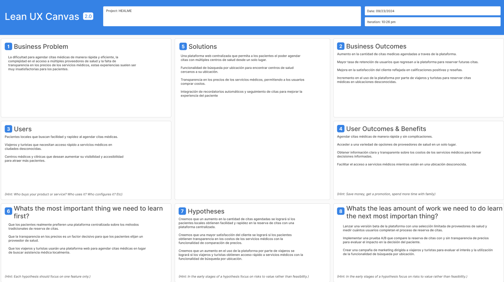

## Business problem
¿Qué problema de negocio hemos identificado que necesita ayuda?

La dificultad para agendar citas médicas de manera rápida y eficiente, la complejidad en el acceso a múltiples proveedores de salud y la falta de transparencia en los precios de los servicios médicos, estas experiencias suelen ser muy insatisfactorias para los pacientes.

## Solution ideas

Una plataforma web centralizada que permita a los pacientes el poder agendar citas con múltiples centros de salud desde un solo lugar.

Funcionalidad de búsqueda por ubicación para encontrar centros de salud cercanos a su ubicación.

Transparencia en los precios de los servicios médicos, permitiendo a los usuarios comprar costos.

Integración de recordatorios automáticos y seguimiento de citas para mejorar la experiencia del paciente 

## Business outcomes

Aumento en la cantidad de citas medicas agendadas a traves de la plataforma

Mayor tasa de retención de usuarios que regresan a la plataforma para reservar futuras citas 

Mejora en la satisfacción del cliente reflejada en calificaciones positivas y reseñas

Incremento en el uso de la plataforma por parte de viajeros y turistas para reservar citas médicas en ubicaciones desconocidas.

## Users and costumers:

Pacientes locales que buscan facilidad y rapidez al agendar citas médicas.

Viajeros y turistas que necesitan acceso rápido a servicios médicos en ciudades desconocidas.

Centros médicos y clínicas que desean aumentar su visibilidad y accesibilidad para atraer más pacientes.

## User Benefits

Agendar citas médicas de manera rápida y sin complicaciones.

Acceder a una variedad de opciones de proveedores de salud en un solo lugar.

Obtener información clara y transparente sobre los costos de los servicios médicos para tomar decisiones informadas.

Facilitar el acceso a servicios médicos mientras están en una ubicación desconocida.

## Hypotheses

Creemos que un aumento en la cantidad de citas agendadas se logrará si los pacientes locales obtienen facilidad y rapidez en la reserva de citas con una plataforma centralizada.

Creemos que una mayor satisfacción del cliente se logrará si los pacientes obtienen transparencia en los costos de los servicios médicos con la funcionalidad de comparación de precios.

Creemos que un aumento en el uso de la plataforma por parte de viajeros se logrará si los viajeros y turistas obtienen acceso rápido a servicios médicos con la funcionalidad de búsqueda por ubicación.

## Whats the most important thing we need to learn first?

Que los pacientes realmente prefieren una plataforma centralizada sobre los métodos tradicionales de reserva de citas.

Que la transparencia en los precios es un factor decisivo para que los pacientes elijan un proveedor de salud.

Que los viajeros y turistas usarán una plataforma web para agendar citas médicas en lugar de buscar asistencia médica localmente.

## Whats the leas amount of work we need to do learn the next most importan thing?

Lanzar una versión beta de la plataforma con una selección limitada de proveedores de salud y medir cuántos usuarios completan el proceso de reserva de citas.

Implementar una prueba A/B que compare la reserva de citas con y sin transparencia de precios para evaluar el impacto en la decisión del paciente.

Crear una campaña de marketing dirigida a viajeros y turistas para evaluar el interés y la utilización de la funcionalidad de búsqueda por ubicación.


1.3. Segmentos objetivo

Viajeros/Turistas: Personas que se encuentran en una ciudad o país diferente y necesitan acceso rápido a servicios médicos sin conocimiento previo del área. Las características clave para este segmento incluyen la búsqueda basada en la ubicación y la transparencia en los precios para ayudarles a tomar decisiones informadas rápidamente.

Centros medicos /doctores : Centros medicos y profesionales de salud los cuales busquen obtener mas pacientes para atender, pues a la hora que turistas busquen centros medicos no logren encontrar uno optimo para ellos haciendo que varios centros medicos y doctores no puedan encontrar pacientes


## Capítulo II: Requirements Elicitation & Analysis

2.1. Competidores

En el contexto de un mercado peruano en constante cambio y evolución, la gestión eficiente de los procesos en HealMe es una necesidad primordial en el sector sanitario. HealMe enfrenta el desafío urgente de comprender y abordar a sus competidores para asegurar una posición sólida y garantizar la satisfacción de sus usuarios.

**1. Thaniy**
Thaniy es una asociación sin fines de lucro fundada por profesionales de la salud peruanos para mejorar el acceso a servicios médicos en Perú. A través de un sistema informático, Thaniy conecta a los peruanos con atención médica sin costos adicionales. 


**2. HelpMed**
HelpMed es una empresa con años de experiencia en el mercado y con enfoque a responder rápidamente a emergencias médicas prehospitalarias. Su equipo está compuesto por médicos generales y especialistas, licenciados y paramédicos.


**3. Sanna**
Sanna es una de las redes privadas de salud más grandes de Perú, con una amplia capacidad de atención a nivel nacional. Su infraestructura abarca clínicas, centros clínicos y una variedad de servicios de asistencia médica, como ambulancias, nutricionistas, entre otros. Entre algunos de los servicios que ofrecen se encuentran la opción de solicitar un medico a domicilio y realizar una teleconsulta médica.


**4. Sanitas**
Es un servicio de salud privado brindado EPS que complementa la cobertura de EsSalud. Entre uno de los servicios que ofrece se encuentra la teleconsulta y una cobertura de salud internacional.


2.1.1. Análisis competitivo

<table>
    <thead>
        <tr>
            <th colspan="7">Competitive Analysis Landscape</th>
        </tr>
        <tr>
            <td colspan="3"><b>¿Por qué llevar a cabo este análisis?</b></td>
            <td colspan="4">Este análisis nos permitirá reconocer a las compañias competidoras y sus respectivos servicios similares a HealMe y resaltar las funcionalidades y carencias que estas mismas posean para comparar con nuestra propuesta. </td>
        </tr>
        <tr class="nombres-competidores">
        <td style="font-weight: bold; text-align:center;" colspan="2">Punto de análisis</td>
        <td style="font-weight: bold;">HealMe</td>
        <td style="font-weight: bold;">Thaniy</td>
        <td style="font-weight: bold;">HelpMed</td>
        <td style="font-weight: bold;">Sanna</td>
        <td style="font-weight: bold;">Sanitas</td>
        </tr>
        <tr class="logos-competidores">
        <td style="font-weight: bold; text-align:center;" colspan="2">Logo</td>
        <td>Logo de HealMe</td>
        <td></td>
        <td></td>
        <td></td>
        <td></td>
        </tr>
    </thead>
    <tbody>
    <tr>
        <td rowspan="2" style="font-weight: bold;">Perfil</td>
        <td style="font-weight: bold;">Overview</td>
        <td>HealMe es una plataforma digital diseñada para turistas y viajeros que necesitan acceso rápido a servicios médicos en destinos desconocidos. La aplicación permite a los usuarios buscar, comparar y reservar citas médicas en una amplia variedad de especialidades y centros de salud locales. Su misión es facilitar la atención médica al ofrecer transparencia en precios y ubicación. HealMe se posiciona como la solución global para la gestión de citas médicas durante los viajes, integrando funcionalidades como reseñas de usuarios, precios de consultas y recomendaciones para destinos con condiciones especiales.</td>
        <td>Thaniy es una asociación sin fines de lucro creada por profesionales de la salud peruanos para mejorar el acceso a servicios médicos en Perú. Utiliza un sistema informático para conectar a los peruanos con atención médica de manera gratuita, sin costos adicionales. Thaniy se enfoca en ofrecer una plataforma accesible y eficiente para facilitar el acceso a la salud en todo el país</td>
        <td>HelpMed es una empresa con años de experiencia en el mercado y con enfoque a responder rápidamente a emergencias médicas prehospitalarias. Su equipo está compuesto por médicos generales y especialistas, licenciados y paramédicos.</td>
        <td>Sanna es una de las redes privadas de salud más grandes de Perú, con una amplia capacidad de atención a nivel nacional. Su infraestructura abarca clínicas, centros clínicos y una variedad de servicios de asistencia médica, como ambulancias, nutricionistas, entre otros. Entre algunos de los servicios que ofrecen se encuentran la opción de solicitar un medico a domicilio y realizar una teleconsulta médica.</td>
        <td>Es un servicio de salud privado brindado EPS que complementa la cobertura de EsSalud. Entre uno de los servicios que ofrece se encuentra la teleconsulta y una cobertura de salud internacional.</td>
    </tr>
    <tr>
        <td style="font-weight: bold;">Ventaja competitiva ¿Que valor ofrece a los clientes?</td>
        <td>HealMe conecta a turistas con centros de salud cercanos, ofreciendo una plataforma fácil de usar para visualizar ubicación, costos y reseñas. Además, proporciona consejos personalizados basados en condiciones climáticas y tiene un enfoque transaccional eficiente con comisiones, beneficiando tanto a usuarios como a centros de salud.</td>
        <td>Thaniy ofrece atención médica a domicilio sin costos adicionales, gracias a su red de médicos y cirujanos voluntarios. Su enfoque sin fines de lucro permite brindar un servicio accesible para aquellos que no pueden cubrir gastos médicos, aunque no está asociado con centros de salud específicos.</td>
        <td>HelpMed destaca por su rápida respuesta en emergencias médicas prehospitalarias, con una flota de vehículos y equipos especializados para atención urgente, incluyendo servicios médicos y pediátricos a domicilio. Sin embargo, su presencia aún es limitada en algunas áreas del país.</td>
        <td>Sanna cuenta con una extensa red de centros de salud y ofrece servicios como teleconsultas y atención a domicilio. No obstante, puede ser menos ágil en la programación de consultas. Su capacidad de ofrecer atención médica variada es un punto fuerte, aunque la experiencia puede ser lenta.</td>
        <td>Sanitas ofrece una cobertura extensa en clínicas y hospitales, además de incluir servicios de teleconsulta y seguro para medicamentos según el plan. Su asociación con varias clínicas permite una cobertura más amplia y accesible. Sin embargo, su alto costo y posibles dificultades para hacer valer el seguro es uno de sus puntos debiles.</td>
    </tr>
    <tr>
        <td rowspan="2" style="font-weight: bold;">Plan de Marketing</td>
        <td style="font-weight: bold;">Mercado Objetivo</td>
        <td><ul>
            <li>Turistas y viajeros peruanos que requieran atención médica en areas desconocidas</li>
            <li>Extranjeros en Perú que no estan familiarizados con el sistema de salud local</li>
            </ul></td>
        <td><ul>
            <li>Pacientes que requieran atención a domicilio</li>
            <li>Profesionales ocupados</li>
            <li>Pacientes que necesiten una consulta rapida en linea</li>
            </ul></td>
        <td><ul>
            <li>Personas en situaciones de emergencia médica</li>
            <li>Usuarios que Necesitan Servicios Médicos a Domicilio</li>
            </ul></td>
        <td><ul>
            <li>Pacientes que Buscan Atención Médica Variada</li>
            <li>Usuarios de Teleconsultas</li>
            </ul></td>
        <td><ul>
            <li>Usuarios de EPS</li>
            <li>Personas que Necesitan Seguro para Medicamentos o cobertura internacional</li>
            </ul></td>
    </tr>
    <tr>
        <td style="font-weight: bold;">Estrategias de Marketing</td>
        <td><ul>
            <li>Tiktok Ads</li>
            <li>Facebook Ads</li>
            <li>Marketing de contenidos</li>
            <li>Email Marketing</li>
            <li>SEM (Search Engine Marketing)</li>
            <li>Colaboraciones con Influencers y Bloggers de Viajes</li>
            <li>Publicidad en Plataformas de Turismo y Viajes</li>
            </ul></td>
        <td><ul>
            <li>Marketing de redes sociales</li>
            <li>Marketing de contenidos</li>
            <li>Email Marketing</li>
            </ul></td>
        <td><ul>
            <li>Email Marketing</li>
            <li>Marketing de contenidos</li>
            <li>Social Ads</li>
            <li>Publicidad en medios locales</li>
            </ul></td>
        <td><ul>
            <li>Social Ads</li>
            <li>SEO</li>
            <li>Email Marketing</li>
            <li>Marketing de contenidos</li>
            </ul></td>
        <td><ul>
            <li>Social Ads</li>
            <li>SEO</li>
            <li>Email Marketing</li>
            <li>Marketing de contenidos</li>
            <li>Colaboración con influencers</li>
            <li>Publicidad en medios de comunicacion</li>
            </ul></td>
    </tr>
    <tr>
        <td rowspan="3" style="font-weight: bold;">Perfil de producto</td>
        <td style="font-weight: bold;">Productos & Servicios</td>
        <td><ul>
            <li>Consulta Médica en Centros de Salud Cercanos
</li>
            <li>Exámenes Médicos en Centros de Salud Cercanos
</li>
            <li>Reservas de Citas Médicas en Línea
</li>
<li>Información sobre Ubicación y Costos de Servicios Médicos
</li>   
            <li>Reseñas y Valoraciones de Centros de Salud
</li>
            <li>Consejos Médicos Personalizados Basados en Condiciones Climáticas
</li>
            </ul></td>
        <td><ul>
            <li>Atención médica a domicilio</li>
            <li>Consulta Médica General y Especializada a Domicilio</li>
            <li>Servicios de Emergencia Médica a Domicilio
            <li>Orientación y Apoyo Médico General</li>
            </ul></td>
        <td><ul>
            <li>Atención Médica de Emergencia Prehospitalaria
</li>
            <li>Servicio de Ambulancias para Emergencias y Eventos
</li>
            <li>Consulta Médica a Domicilio
</li>
            <li>Consulta Pediátrica a Domicilio
</li>
            <li>Servicios de Primeros Auxilios
</li>
            </ul></td>
        <td><ul>
            <li>Consultas Médicas en Clínicas y Centros Clínicos
</li>
            <li>Servicios de Atención a Domicilio
</li>
            <li>Teleconsultas Médicas
</li>
            <li>Atención de Urgencias y Emergencias
</li>
            <li>Servicios de Ambulancias
</li>
            <li>Consultas con Especialistas y Nutricionistas
</li>
            </ul></td>
        <td><ul>
            <li>Cobertura Médica en Clínicas Privadas y Asociadas
</li>
            <li>Teleconsultas Médicas
</li>
            <li>Seguros para Medicamentos
</li>
            <li>Servicios de Atención Médica en Clínicas
</li>
            <li>Cobertura Internacional de Salud
</li>
            </ul></td>
    </tr>
    <tr>
        <td style="font-weight: bold;">Precios & Costos</td>
        <td>HealMe funcionará con un modelo transaccional, cobrando al centro de salud un 5% del costo total del servicio por cada cliente que se conecte a través de la plataforma.</td>
        <td>
Thaniy ofrece atención médica en línea a partir de S/ 20, con precios que incrementan según la complejidad del servicio. Además, también disponen de atención médica a domicilio, con tarifas que comienzan en S/ 50. </td>
        <td>HelpMed ofrecen medicos a domicilio desde los S/140, ademas de ofrecer ambulancias a domicilio desde los S/700.</td>
        <td>Sanna ofrece consultas médicas a partir de S/79, además de una variedad de planes de salud que van desde S/95 hasta S/329 al mes.</td>
        <td>Sanitas ofrece seguros médicos privados con precios que van desde S/90 hasta S/410 mensuales.
</td>
    </tr>
    <tr>
        <td style="font-weight: bold;">Canales de distribución (Web y/o Móvil)</td>
        <td>
HealMe contará con una aplicación web en donde el usuario podrá disfrutar de todas sus funcionalidades.</td>
        <td>
Thaniy cuenta con un formulario de contacto en su sitio web para redirigir a sus clientes a su canal de WhatsApp.</td>
        <td>
HelpMed cuenta con un formulario de contacto , numeros de contacto y direcciones de referencia, además de un canal de WhatsApp para atender a todas sus consultas.</td>
        <td>
Sanna de igual manera tiene un formulario de contacto y canales de contacto en su sitio web.</td>
        <td>
Sanitas cuenta con un sitio web que ofrece múltiples canales de contacto, los cuales redirigen a los clientes potenciales hacia medios de comunicación tradicionales para continuar con el proceso de adquisición.</td>
    </tr>
    <tr>
        <td rowspan="4" style="font-weight: bold;">Análisis SWOT</td>
        <td style="font-weight: bold;">Fortalezas</td>
        <td><ul>
            <li>Plataforma que combina salud y turismo, un nicho de mercado poco explotado.
</li>
            <li>Los usuarios pueden visualizar la ubicación, costos, reseñas y reservar citas con anticipación, todo en una misma plataforma</li>
            <li>Amplia accesibilidad con la capacidad de reservar citas y realizar pagos en línea.
</li>
            <li>Provisión de información sobre condiciones climáticas y consejos médicos para turistas.
</li>
            <li>Genera ingresos recurrentes a través de comisiones cobradas a los centros de salud, manteniendo la plataforma accesible para los usuarios.
</li>
            <li>HealMe está diseñada para atender las necesidades específicas de turistas y ciudadanos en Perú, con un conocimiento profundo del mercado local.</li>
            </ul></td>
        <td>
            <ul>
                <li>Cuenta con una red de médicos y especialistas</li>
                <li>Ofrece atención médica a precios muy accesibles</li>
                <li>Especialización en servicios médicos a domicilio</li>
            </ul>
        </td>
        <td><ul>
            <li>Alta capacidad de respuesta en situaciones de emergencia, con una flota de vehículos equipada para primeros auxilios</li>
            <li>Ofrece una gama de servicios que incluye médico a domicilio, pediatra a domicilio, y cobertura para eventos.</li>
            <li>Varios años de experiencia en el mercado</li>
            <li>Equipos médicos y paramédicos entrenados para manejar emergencias prehospitalarias.</li>
            </ul></td>
        <td><ul>
            <li> Cuenta con una extensa red de clínicas y centros médicos en todo el país</li>
            <li> Ofrece desde atención en clínicas hasta teleconsultas y servicios de nutricionistas.</li>
            <li>Puede manejar grandes volúmenes de pacientes debido a su infraestructura y personal médico especializado.</li>
            </ul></td>
        <td><ul>
            <li>Ofrece seguros con cobertura médica internacional, lo que es atractivo para clientes que viajan con frecuencia.</li>
            <li>Amplia red de clínicas privadas asociadas, lo que permite una mayor cobertura de atención.</li>
            <li>Diversos planes de seguros que pueden adaptarse a las necesidades específicas de los usuarios</li>
            </ul></td>
    </tr>
    <tr>
        <td style="font-weight: bold;">Debilidades</td>
        <td><ul>
            <li>Dependencia de la conectividad.
</li>
            <li>Necesidad de establecer relaciones sólidas con centros de salud para garantizar la calidad del servicio.
</li>
            <li>Costos de Adquisición de Usuarios</li>
</li>
            </ul></td>
        <td><ul>
            <li>Limitada Cobertura Geográfica</li>
            <li>No está asociado a centros de salud, lo que limita la variedad de servicios que puede ofrecer.</li>
            <li>Puede tener limitaciones en cuanto a la cantidad de pacientes que pueden atender simultáneamente.</li>
            </ul></td>
        <td><ul>
            <li>Posicionamiento Geográfico Limitado</li>
            <li>Falta de Diversificación en Servicios</li>
            <li>Dependencia de Vehículos y Equipos</li>
            <li>Precios altos para el mercado</li>
            </ul></td>
        <td><ul>
            <li>Lentitud en el Proceso de Consulta</li>
            <li>Servicios en Línea Limitados</li>
            <li>Altos Costos Operativos</li>
            <li>Dependencia de la Infraestructura Física</li>
            </ul></td>
        <td><ul>
            <li>Altos Costos para el Usuario</li>
            <li>Trabas en la Utilización del Seguro</li>
            <li>Dependencia de Clínicas Asociadas</li>
            </ul></td>
    </tr>
    <tr>
        <td style="font-weight: bold;">Oportunidades</td>
        <td><ul>
            <li>Expansión a otros países de América Latina con alta afluencia de turismo.
                <li>Crecimiento en la demanda de servicios médicos a domicilio y telemedicina.
</li>
            <li>Posible colaboración con agencias de viajes y aerolíneas para atraer más usuarios.
</li>
            </ul></td>
        <td><ul>
            <li>Expansión Regional: Ampliar su cobertura a más áreas del país y colaborar con otras organizaciones para aumentar su impacto.</li>
            <li>Formar alianzas con entidades gubernamentales y empresas para obtener más fondos y recursos.</li>
            <li> Integrar herramientas tecnológicas para optimizar la coordinación y la gestión de pacientes.</li>
            </ul></td>
        <td><ul>
            <li>Aumentar su presencia en todo el país para ofrecer servicios de emergencia en más localidades.</li>
            <li> Establecer acuerdos con organizadores de eventos y empresas para ofrecer servicios de emergencia en grandes reuniones y actividades.</li>
            <li>Ampliar su oferta para incluir servicios médicos regulares y programas de salud preventiva.</li>
            </ul></td>
        <td><ul>
            <li>Mejorar y expandir sus servicios en línea, como la telemedicina y la gestión de citas, para atraer a un público más amplio.</li>
            <li>Ampliar su red de clínicas y centros médicos para cubrir más regiones y ofrecer servicios en áreas no atendidas.</li>
            <li>Establecer acuerdos con compañías de seguros para ofrecer paquetes combinados y atraer a más clientes.</li>
            </ul></td>
        <td><ul>
            <li>Ampliar su cobertura a nivel internacional para atraer a clientes que viajan o residen fuera del país.</li>
            <li>Crear nuevos planes de seguros con opciones más flexibles y accesibles para diferentes segmentos de mercado.</li>
            <li>Colaborar con empresas tecnológicas para integrar soluciones avanzadas en sus servicios y mejorar la experiencia del usuario.</li>
            </ul></td>
    </tr>
    <tr>
        <td style="font-weight: bold;">Amenazas</td>
        <td><ul>
            <li>Competencia directa de otras plataformas de salud con modelos similares.
</li>
            <li>Factores económicos o políticos que afecten el turismo y, por ende, la demanda de servicios médicos.</li>
            <li>Posible resistencia de algunos centros de salud a adoptar nuevas tecnologías.
</li>
            </ul></td>
        <td><ul>
            <li>Competencia con Servicios de Salud Establecidos</li>
            <li>Poca Presencia en el Mercado</li>
            <li>Ausencia de Infraestructura Médica</li>
            <li>Falta de Médicos Especializados</li>
            </ul></td>
        <td><ul>
            <li>Altos Costos Operativos</li>
            <li>Desafíos en la Expansión Geográfica</li>
            </ul></td>
        <td><ul>
            <li>Desafíos en la Atención Eficiente</li>
            <li>Costos Operativos Altos</li>
            <li>Competencia con Servicios Digitales</li>
            </ul></td>
        <td><ul>
            <li>Altos Costos para los Usuarios</li>
            <li>Trabas en el Uso de Seguros</li>
            <li>Competencia con Servicios Públicos de Salud:</li>
            <li>Cambios en Políticas de Seguros</li>
            </ul></td>
    </tr>
    </tbody>
</table>

2.1.2. Estrategias y tácticas frente a competidores

2.2. Entrevistas

2.2.1. Diseño de entrevistas

2.2.2. Registro de entrevistas

2.2.3. Análisis de entrevistas

2.3. Needfinding

2.3.1. User Personas

2.3.2. User Task Matrix

2.3.3. User Journey Mapping

2.3.4. Empathy Mapping

2.3.5. As-Is Scenario Mapping

2.4. Ubiquitous Language

## Capítulo III: Requirements Specification

3.1. To-Be Scenario Mapping

El **To-Be Scenario Mapping** describe el escenario actual de cómo los usuarios resuelven sus problemas con nuestra solución, subsanando las ineficiencias y puntos de dolor.

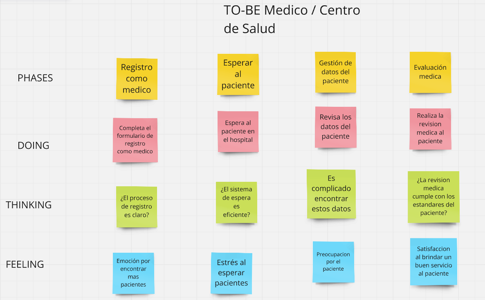
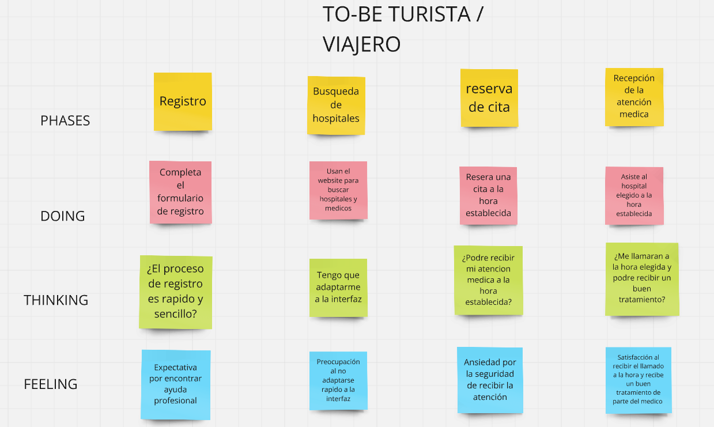

3.2. User Stories

| **Epic ID** | **Título**                                      | **Descripción**                                                                                   |
|-------------|-------------------------------------------------|---------------------------------------------------------------------------------------------------|
| EP-01      | Comprar medicinas en la aplicación              | Implementar la funcionalidad que permita a los usuarios comprar medicinas de manera online.               |
| EP-02      | Elegir el doctor que desea                      | Permitir a los usuarios poder elegir el doctor el cual desee ser medicado.                                |
| EP-03      | Reserva de citas médicas                        | Habilitar la funcionalidad para que los usuarios reserven citas médicas directamente desde la plataforma. |
| EP-04      | Registrarme en la aplicación                    | Permitir a los usuarios Poder registrarse en la aplicación.                                               |
| EP-05      | Elegir el centro medico disponible              | El usuario puede elegir a que centro de salud desea visitar para ser atendido                             |
| EP-06      | Poder ver las citas pendientes de los pacientes              | El Doctor puede visualizar los datos del paciente para su cita como hora, edad, etc.                             |
| EP-07      | Poder visualizar el historial de citas terminadas              | El Doctor puede visualizar las citas que ya han sido terminadas con los datos de los pacientes                             |


| **User Story ID** | **Epic ID** | **Descripción**                                                                                                                                 | **Criterios de Aceptación**                                                                                                                                                                                                                                             |
|-------------------|-------------|-------------------------------------------------------------------------------------------------------------------------------------------------|-------------------------------------------------------------------------------------------------------------------------------------------------------------------------------------------------------------------------------------------------------------------------|
| US-01             | EP-01       | Como usuario, quiero poder buscar y agregar medicinas a mi carrito de compra para poder adquirirlas fácilmente desde la aplicación.               | - El usuario debe poder buscar medicinas por nombre, categoría o síntomas.<br> - El usuario debe poder ver los detalles del producto (nombre, descripción, precio, dosis).<br> - El usuario debe poder agregar la medicina al carrito de compra.<br> - El carrito debe mostrar el total actualizado.   |
| US-02             | EP-01       | Como usuario, quiero poder realizar el pago de las medicinas en línea de manera segura para completar mi compra.                                 | - El usuario puede pagar las medicinas con un botón.<br> - El sistema debe validar la información de pago antes de completar la transacción.<br>|
| US-03             | EP-02       | Como usuario, quiero poder buscar y seleccionar a un doctor.                            | - El usuario debe poder elegir a los doctores que el desee.<br> - El usuario debe poder ver el perfil del doctor, incluyendo sus reseñas y horarios disponibles.<br> - El usuario debe poder seleccionar un doctor y reservar una cita.      |
| US-04             | EP-02       | Como usuario, quiero poder ver el historial de citas                       | - El usuario debe poder visualizar las citas creadas.<br> - El sistema debe permitir al usuario mostrar el historial de citas con datos importantes, como fecha y hora.<br>                                    |
| US-05             | EP-03       | Como usuario, quiero poder reservar una cita médica en la aplicación para poder ser atendido sin tener que llamar al centro médico.             | - El usuario debe poder seleccionar la fecha y la hora para la cita.<br> - El usuario debe recibir una confirmación de la reserva de la cita.<br>                          |
| US-06             | EP-03       | Como usuario, quiero poder ver las reseñas de los centros medicos y de los doctores                                                 | - El usuario debe poder ver reseñas de los centros medicos.<br> - El usuario debe poder visualizar las reseñas de los doctores .<br>     |
| US-07             | EP-04       | Como usuario, quiero poder registrarme en la aplicación utilizando mi correo electrónico y una contraseña segura para acceder a las funcionalidades. | - El usuario debe poder completar un formulario de registro con campos obligatorios (nombre, correo electrónico, contraseña).<br> - La contraseña debe cumplir con requisitos mínimos de seguridad.<br> - El sistema debe enviar un correo de verificación.<br> - El usuario debe recibir confirmación. |
| US-08             | EP-04       | Como usuario, quiero poder iniciar sesión en la aplicación con mi cuenta registrada para acceder a mi perfil y servicios.                        | - El usuario debe poder iniciar sesión utilizando su correo electrónico y contraseña registrados.<br> - El sistema debe validar las credenciales antes de permitir el acceso.<br> - El usuario debe poder recuperar su contraseña mediante un enlace de restablecimiento. |
| US-09             | EP-05       | Como usuario, quiero poder ver una lista de los centros médicos disponibles y elegir uno para mi consulta.                                      | - El usuario debe poder ver una lista de centros médicos con detalles como nombre, dirección, y servicios ofrecidos.<br> - El usuario debe poder filtrar los centros médicos por ubicación, especialidades y calificación.<br> - Debe poder seleccionar un centro médico para ver más detalles y agendar.   |
| US-10             | EP-06       | Como Doctor, quiero poder ver las citas pendientes para poder atender a mis pacientes                                      | - El Doctordebe poder ver una lista donde se visualize las citas programadas .<br> - El usuario debe poder filtrar las citas en base a fechas.<br> |
| US-11             | EP-07       | Como Doctor, quiero poder ver el historial de citas con mis pacientes                                      | - El Doctor debe poder ver una lista del historial de las citas terminadas.<br> - El usuario debe poder filtrar las citas terminadas.<br> - Debe poder ver datos de los pacientes.   |

3.3. Impact Mapping

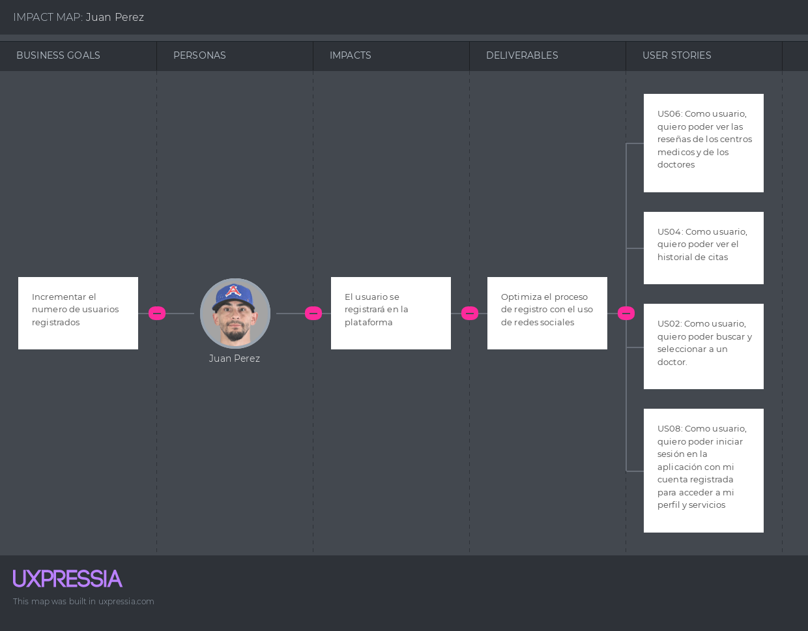
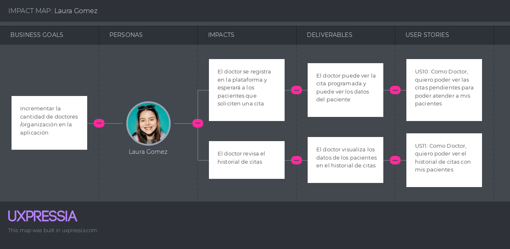

3.4. Product Backlog


| **# Orden** | **User Story ID** | **Título**                            | **Descripción**                                                                                                           | **Story Points** |
|-------------|-------------------|---------------------------------------|---------------------------------------------------------------------------------------------------------------------------|------------------|
| 1           | US-01             | Buscar y agregar medicinas al carrito | Como usuario, quiero poder buscar y agregar medicinas a mi carrito de compra para poder adquirirlas fácilmente desde la aplicación. | 5                |
| 2           | US-02             | Realizar el pago de las medicinas     | Como usuario, quiero poder realizar el pago de las medicinas en línea de manera segura para completar mi compra.           | 5                |
| 3           | US-03             | Buscar y seleccionar un doctor        | Como usuario, quiero poder buscar y seleccionar a un doctor de acuerdo a su especialidad para programar una consulta.      | 3                |
| 4           | US-04             | Ver el historial de citas             | Como usuario, quiero poder ver el historial de citas para tener un registro de mis consultas médicas.                      | 3                |
| 5           | US-05             | Reservar una cita médica              | Como usuario, quiero poder reservar una cita médica en la aplicación para poder ser atendido sin tener que llamar al centro médico. | 5                |
| 6           | US-06             | Ver reseñas de centros y doctores     | Como usuario, quiero poder ver las reseñas de los centros médicos y de los doctores para tomar decisiones informadas al reservar mi cita. | 3                |
| 7           | US-07             | Registrarme en la aplicación          | Como usuario, quiero poder registrarme en la aplicación utilizando mi correo electrónico y una contraseña segura para acceder a las funcionalidades. | 5                |
| 8           | US-08             | Iniciar sesión en la aplicación       | Como usuario, quiero poder iniciar sesión en la aplicación con mi cuenta registrada para acceder a mi perfil y servicios.   | 3                |
| 9           | US-09             | Ver y elegir un centro médico         | Como usuario, quiero poder ver una lista de los centros médicos disponibles y elegir uno para mi consulta.                 | 3                |
| 10          | US-10             | Ver citas pendientes                  | Como doctor, quiero poder ver las citas pendientes para poder atender a mis pacientes.                                     | 2                |
| 11          | US-11             | Ver historial de citas terminadas     | Como doctor, quiero poder ver el historial de citas que he tenido con mis pacientes para llevar un registro.               | 2                |

## Capítulo IV: Product Design

4.1. Style Guidelines

4.1.1. General Style Guidelines

Las **Guías Generales de Estilo** establecen las bases para mantener una apariencia y sensación coherente en toda la plataforma "HEALME". Estas directrices aseguran que todos los elementos visuales y de comunicación estén alineados con la identidad de la marca y proporcionen una experiencia de usuario óptima.

### Elementos Clave:

- **Identidad de Marca:**
  - **Logo:** El logo de HEALME debe ser claro y reconocible, utilizando los colores principales de la marca.
  - **Paleta de Colores:** Se utilizarán tonos verdes claros para títulos importantes, tonos oscuros para los fondos y tonos blancos para el texto, asegurando un contraste adecuado para una lectura fácil.
  


- **Tipografía:**
  - **Fuente Principal:** Utilizar una fuente sans-serif moderna y legible, como **Roboto** o **Open Sans**.
  - **Jerarquía Tipográfica:** Establecer tamaños y pesos de fuente distintos para títulos, subtítulos, cuerpo de texto y elementos destacados.

- **Espaciado y Layout:**
  - **Márgenes y Padding:** Mantener un espaciado consistente entre elementos para una apariencia limpia y ordenada.
  - **Grid System:** Utilizar un sistema de cuadrícula para alinear y organizar el contenido de manera coherente.

- **Iconografía y Gráficos:**
  - **Estilo de Iconos:** Usar iconos simples y lineales que se integren con el diseño general.
  - **Imágenes:** Utilizar imágenes de alta calidad que reflejen la diversidad de los usuarios y proveedores de servicios médicos.

- **Tono y Voz:**
  - **Comunicación:** Mantener un tono profesional, amigable y accesible.
  - **Lenguaje Claro:** Evitar jerga técnica innecesaria y asegurar que la información sea comprensible para todos los usuarios.

4.1.2. Web Style Guidelines

Las **Guías de Estilo Web** se enfocan en los aspectos específicos del diseño para la plataforma digital, asegurando una experiencia de usuario consistente y atractiva.


### Elementos Específicos:

- **Colores:**
  - **Títulos Importantes:** Verde claro (#A8D5BA) para resaltar títulos y llamadas a la acción.
  - **Fondos:** Tonos oscuros (#2C3E50, #34495E) para crear un contraste elegante y profesional.
  - **Texto:** Blanco puro (#FFFFFF) para garantizar legibilidad sobre fondos oscuros.

- **Tipografía Web:**
  - **Fuente Principal:** Roboto, Open Sans o similar para una lectura fluida en pantallas.
  - **Tamaños:**
    - **Título Principal (H1):** 32px
    - **Subtítulos (H2, H3):** 24px, 20px
    - **Cuerpo de Texto:** 16px
    - **Pequeños Detalles:** 14px

- **Botones y Elementos Interactivos:**
  - **Botones Primarios:** Verde claro con texto blanco, borde redondeado.
  - **Botones Secundarios:** Tonos oscuros con texto blanco.
  - **Estados de Botón:** Hover, activo y deshabilitado deben estar claramente diferenciados.

- **Imágenes y Multimedia:**
  - **Formato:** Preferentemente JPEG o PNG para imágenes estáticas, y MP4 para videos.
  - **Optimización:** Comprimir imágenes para mejorar tiempos de carga sin sacrificar calidad.

- **Responsividad:**
  - **Diseño Adaptable:** Asegurar que la plataforma se visualice correctamente en dispositivos móviles, tablets y desktops.
  - **Breakpoints:** Definir puntos de quiebre para ajustar el layout según el tamaño de la pantalla.

- **Accesibilidad:**
  - **Contraste de Colores:** Asegurar que el contraste entre el texto y el fondo cumpla con los estándares de accesibilidad.
  - **Etiquetas Alt:** Incluir descripciones alternativas en todas las imágenes para usuarios con discapacidades visuales.
  - **Navegación con Teclado:** Garantizar que todos los elementos interactivos sean accesibles mediante el teclado.
4.2. Information Architecture
    
  La **Arquitectura de la Información** define cómo se organiza y estructura el contenido dentro de la plataforma "HEALME", facilitando la navegación y el acceso a la información por parte de los usuarios.

4.2.1. Organization Systems

**Sistemas de Organización** determinan la manera en que se agrupan y categorizan los contenidos en la plataforma.

### Estructura Principal:

- **Home/Landing Page:** Introducción a HEALME, características principales, testimonios y llamadas a la acción.
- **Buscar Servicios Médicos:** Herramienta de búsqueda avanzada por ubicación, especialidad y precio.
- **Perfil del Proveedor:** Página individual para cada centro médico con detalles, horarios, precios y reseñas.
- **Reservas/Citas:** Sección para gestionar reservas de citas médicas.
- **Historial Médico:** Registro de citas pasadas y detalles de tratamientos.
- **Sobre Nosotros:** Información sobre la startup, misión, visión y equipo.
- **Contacto y Soporte:** Formulario de contacto, preguntas frecuentes y soporte en línea.
- **Blog/Recursos:** Artículos y recursos relacionados con la salud y viajes.

### Modelos de Organización Utilizados:

- **Jerárquico:** Estructura de árbol donde la información se organiza de lo general a lo específico.
- **Secuencial:** Flujo lógico de pasos para completar tareas, como reservar una cita.
- **Red:** Conexiones entre diferentes secciones para facilitar el acceso rápido a información relacionada.
  
4.2.2. Labeling Systems

**Sistemas de Etiquetado** se refieren a cómo se nombran y categorizan los elementos dentro de la plataforma para asegurar claridad y coherencia.

### Directrices de Etiquetado:

- **Consistencia:** Utilizar términos uniformes en todas las secciones (e.g., "Cita Médica" en lugar de "Reserva" o "Cita").
- **Claridad:** Los nombres deben ser descriptivos y fáciles de entender para los usuarios.
- **Concisión:** Evitar etiquetas largas; mantener los nombres breves pero informativos.
- **Relevancia:** Asegurarse de que las etiquetas reflejen fielmente el contenido o la función correspondiente.

### Ejemplos de Etiquetas:

- **Inicio**
- **Buscar Médicos**
- **Mis Citas**
- **Perfil del Médico**
- **Comparar Precios**
- **Reseñas**
- **Contacto**
- **Soporte**
- **Blog**
- **Acerca de**

4.2.3. SEO Tags and Meta Tags

**Etiquetas SEO y Meta** son fundamentales para mejorar la visibilidad de la plataforma en motores de búsqueda y para proporcionar información esencial a los navegadores y redes sociales.

### Directrices para SEO y Meta Tags:

- **Title Tags:**
  - Descriptivos y únicos para cada página.
  - Incluir palabras clave relevantes (e.g., "Reservar Cita Médica en el Extranjero | HEALME").

- **Meta Descriptions:**
  - Resumen conciso de la página (150-160 caracteres).
  - Incluir palabras clave y un llamado a la acción.

- **Header Tags (H1, H2, H3):**
  - Usar H1 para el título principal de la página.
  - Utilizar H2 y H3 para subtítulos y secciones.

- **Alt Text para Imágenes:**
  - Descripciones claras y precisas de las imágenes.
  - Incluir palabras clave cuando sea relevante.

- **URL Amigables:**
  - URLs cortas y descriptivas (e.g., `healmé.com/buscar-medicos`).

- **Keywords:**
  - Investigación y selección de palabras clave relevantes para cada sección.
  - Integrar de manera natural en el contenido.

- **Open Graph Tags:**
  - Optimizar la apariencia de las páginas cuando se comparten en redes sociales.
  - Incluir título, descripción, imagen y URL.

### Ejemplo de Meta Tags para la Página de Inicio:

```html
<head>
  <title>HEALME | Reserva Citas Médicas en el Extranjero</title>
  <meta name="description" content="HEALME te permite buscar, comparar y reservar citas médicas en cualquier parte del mundo de manera rápida y transparente.">
  <meta property="og:title" content="HEALME | Reserva Citas Médicas en el Extranjero">
  <meta property="og:description" content="Accede a servicios médicos de calidad en tus destinos de viaje con HEALME.">
  <meta property="og:image" content="URL_de_la_imagen">
  <meta property="og:url" content="https://healmé.com">
</head>
```
4.2.4. Searching Systems

4.2.5. Navigation Systems

4.3. Landing Page UI Design


4.3.1. Landing Page Wireframe


4.3.2. Landing Page Mock-up

%20(1).jpg)
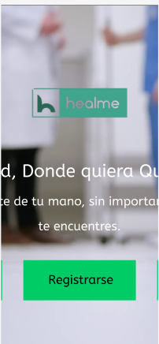
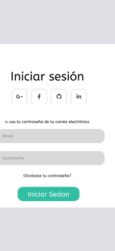
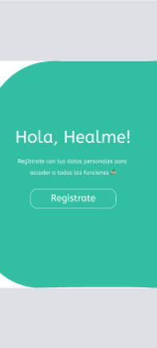
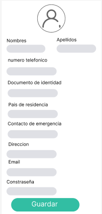
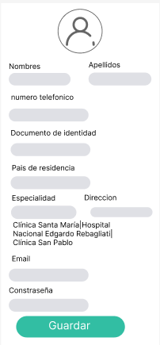

4.4. Web Applications UX/UI Design


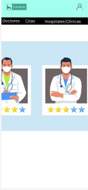
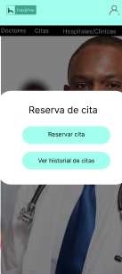
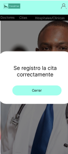

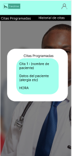
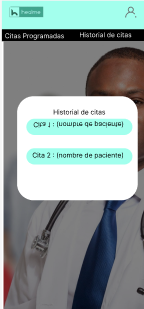


4.4.1. Web Applications Wireframes

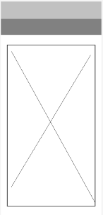
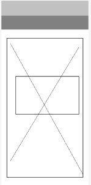
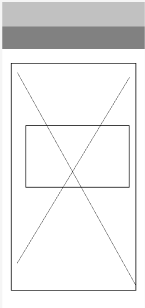
    


4.4.2. Web Applications Wireflow Diagrams

link [lucidchart](https://lucid.app/lucidchart/894ea71f-a5fb-4f49-918a-7a3ba6b6542b/edit?viewport_loc=-1420%2C4811%2C5935%2C2778%2C0_0&invitationId=inv_79013474-b8a7-4bb2-913b-9eedaeeac46f)

## User Goal Log in:
El usuario inicia sesión para poder usar la aplicación
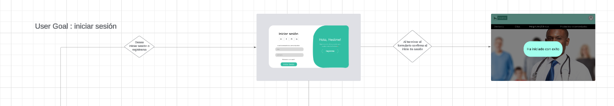

## User Goal Register:
El usuario se registra para poder usar la aplicación
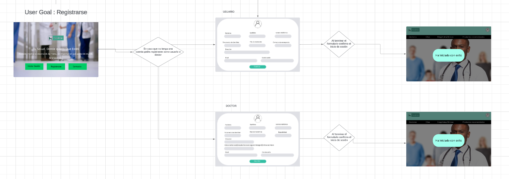

## User Goal Reservar cita:
El usuario Reserva una cita eligiendo el doctor y hospital para poder asistir para que sea atendido
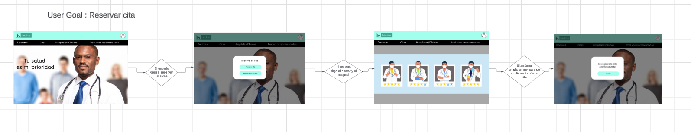

## User Goal ver historial de citas:
El usuario despues de reservar su cita desea revisar el historial de citas para ver que su cita se registro correctamente

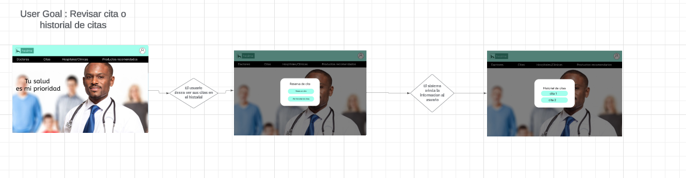

## User Goal ver citas programadas como doctor:
El doctor desea ver las citas programadas del paciente que lo eligió para asi poder prepararse para antenderlo

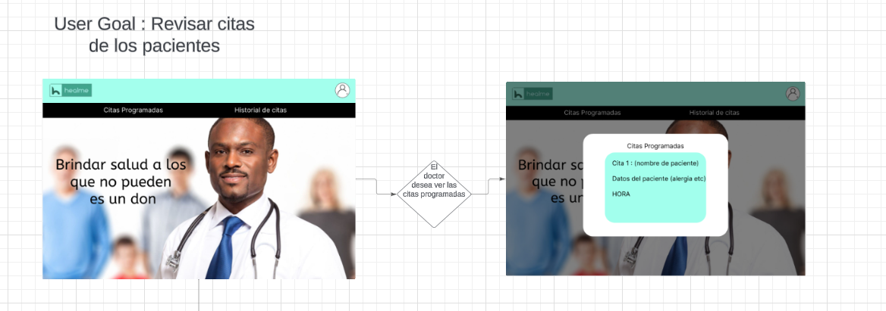

## User Goal ver historial de citas como doctor:
El doctor puede visualizar el historial de citas que atendio a los pacientes

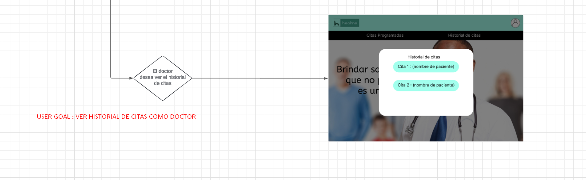

4.4.3. Web Applications Mock-ups


4.4.4. Web Applications User Flow Diagrams

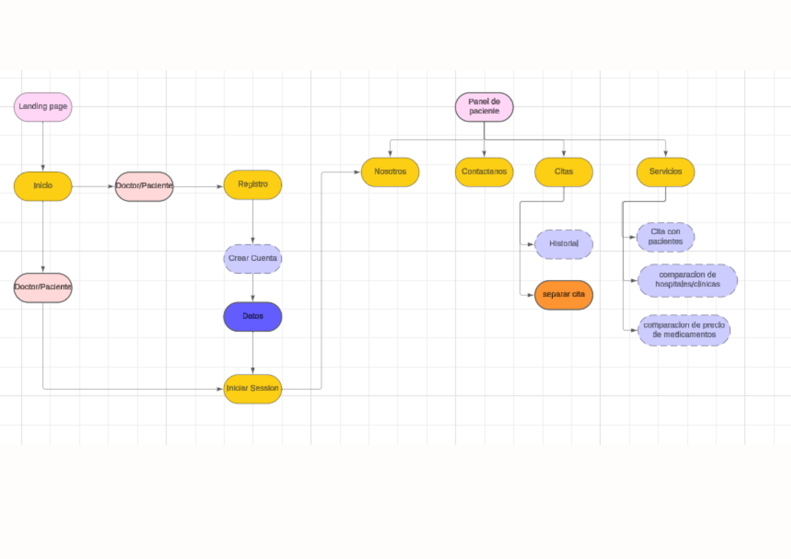

4.5. Web Applications Prototyping


4.6. Domain-Driven Software Architecture

4.6.1. Software Architecture Context Diagram
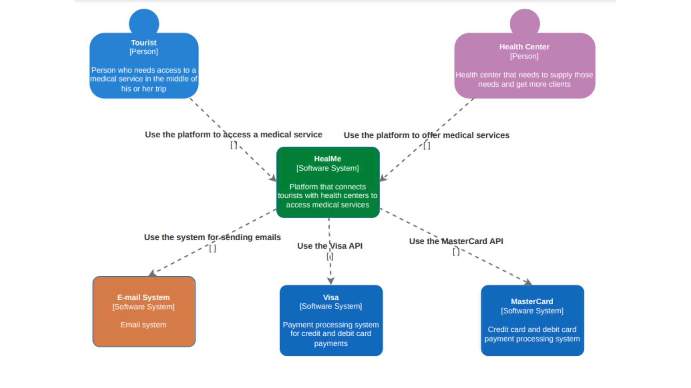
4.6.2. Software Architecture Container Diagrams
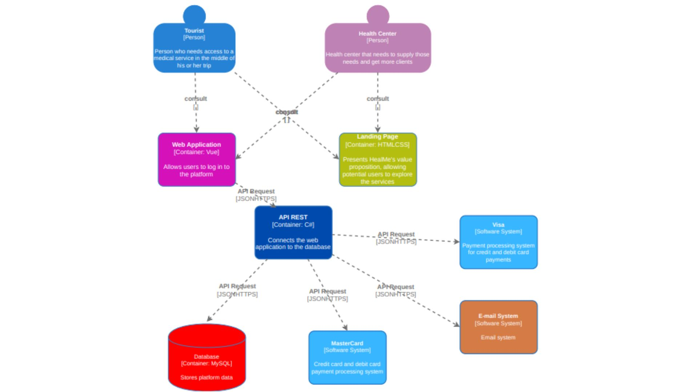
4.6.3. Software Architecture Components Diagrams
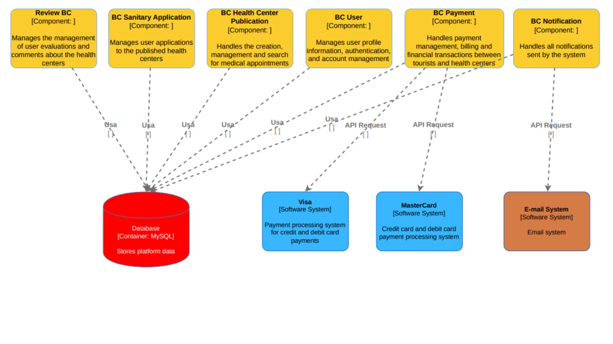
4.7. Software Object-Oriented Design
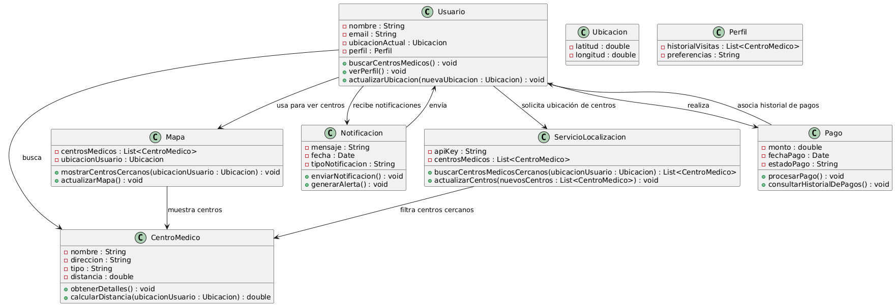
4.7.1. Class Diagrams
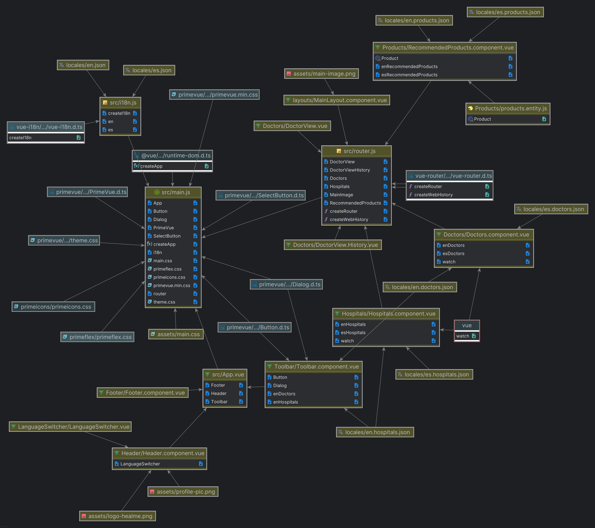
4.7.2. Class Dictionary

1. Componentes Principales (Vue.js)
src/App.vue: Es el componente principal de la aplicación, en el que se integran otros componentes secundarios como:
Footer
Header
Toolbar
Estos subcomponentes se importan en el archivo App.vue, lo que indica que este archivo gestiona la estructura básica de la interfaz.

layouts/MainLayout.component.vue: Probablemente se encarga de definir la estructura global del diseño de la aplicación, utilizando otros componentes como el Toolbar.

Doctors/Doctors.component.vue: Maneja la funcionalidad relacionada con la gestión de doctores, como enDoctors y esDoctors, sugiriendo que admite múltiples idiomas. También hay un observador (watch) para detectar cambios en las propiedades.

Hospitals/Hospitals.component.vue: Similar al de doctores, pero centrado en hospitales. Maneja variables como enHospitals y esHospitals para gestionar datos hospitalarios en diferentes idiomas.

Products/RecommendedProducts.component.vue: Gestiona la lógica para productos recomendados, con soporte multilingüe (enRecommendedProducts, esRecommendedProducts).

2. Archivos de Internacionalización (i18n)
El diagrama muestra un soporte claro para la internacionalización (i18n):

Archivos JSON como locales/en.doctors.json, locales/es.doctors.json, locales/en.hospitals.json, y locales/es.hospitals.json contienen traducciones o datos en diferentes idiomas.
src/i18n.js: Este archivo probablemente inicializa y configura la funcionalidad de i18n en la aplicación, permitiendo la alternancia entre idiomas (en, es).
Los archivos de locales están vinculados a componentes específicos, asegurando que los datos se muestren en el idioma correcto según el contexto.

3. Rutas (Vue Router)
src/router.js: Define las rutas de la aplicación, conectando vistas como:
DoctorView
DoctorViewHistory
Hospitals
MainImage
RecommendedProducts
El archivo gestiona tanto la creación de rutas como el historial de navegación (createRouter, createWebHistory), lo que permite la navegación entre las diferentes vistas de la aplicación.

4. Dependencias y Estilos
assets/main.css: Hoja de estilos CSS que contiene las reglas visuales para el proyecto.
primeicons/primeicons.css: Se refiere a una biblioteca de iconos, probablemente utilizada en los botones o menús de la aplicación.
assets/profile-pic.png y assets/main-image.png: Son recursos de imágenes que probablemente se utilizan en la interfaz de usuario, en componentes como el Header o Footer.
5. Otros Componentes y Elementos Notables
LanguageSwitcher/LanguageSwitcher.vue: Un componente que permite cambiar entre idiomas, haciendo referencia al archivo i18n.js.
Header/Header.component.vue: Se encarga de la cabecera de la aplicación, donde también se incluye el selector de idiomas.
Footer/Footer.component.vue: Define el pie de página de la aplicación, que podría contener enlaces importantes o información de contacto.
Toolbar/Toolbar.component.vue: Un menú o barra de herramientas que incluye botones (Button) y un diálogo (Dialog) para la interacción con los usuarios.
6. Gestión de Vistas y Datos
DoctorView/DoctorViewHistory.vue y DoctorView.vue: Estas vistas están relacionadas con la visualización de información de doctores y su historial.
Hospitals/Hospitals.component.vue: Maneja las vistas y datos relacionados con los hospitales.
RecommendedProducts.component.vue: Se centra en la visualización y recomendación de productos.
Conexiones Generales:
Los componentes están bien estructurados, organizados por funcionalidad (Doctores, Hospitales, Productos).
Se utiliza una clara estructura de rutas y manejo de datos internacionales mediante archivos de locales JSON.
Los componentes comparten estilos comunes mediante archivos CSS y bibliotecas de iconos (primeicons).
4.8. Database Design

4.8.1. Database Diagram
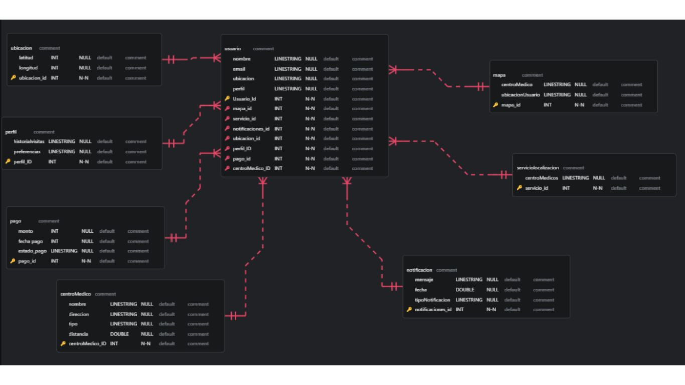
## Capítulo V: Product Implementation, Validation & Deployment

5.1. Software Configuration Management

5.1.1. Software Development Environment Configuration

5.1.2. Source Code Management

5.1.3. Source Code Style Guide & Conventions

5.1.4. Software Deployment Configuration

5.2. Landing Page, Services & Applications Implementation

5.2.1. Sprint n

5.2.1.1. Sprint Planning n

5.2.1.2. Sprint Backlog n

5.2.1.3. Development Evidence for Sprint Review

5.2.1.4. Testing Suite Evidence for Sprint Review

5.2.1.5. Execution Evidence for Sprint Review

5.2.1.6. Services Documentation Evidence for Sprint Review

5.2.1.7. Software Deployment Evidence for Sprint Review

5.2.1.8. Team Collaboration Insights during Sprint
