<div style="color: red; text-align: center;font-size: 40px;">
    <strong>Universidad Peruana de Ciencias Aplicadas</strong>
</div>

<div style="text-align: center;">
  
</div>

<div style="text-align: center;">


# Ingeniería de Software
## Aplicaciones Web  
### Ciclo 2024-02  
#### Sección: WX53  
**Docente**: Alberto Wilmer Sanchez Seña  
**Startup**: HealMe  
**Producto**: HealMe App  
**Grupo de Trabajo**: Grupo 4  
**Nombre del Equipo**: Equipo Dinamita  

### Team Members  
| Nombre                     | Código de alumno   |
|----------------------------|--------------------|
| Alonso Garay, Diego Jesus   | U20221D014         |
| Cisneros Salas, Luis Angel  | U20211B198         |
| Alcántara Cruz, Rodrigo Alonso | U202216698    |

---
</div>

### Registro de versiones del informe  

| Fecha       | Versión  | Autor                      | Descripción de modificación                                           |
|-------------|----------|----------------------------|------------------------------------------------------------------------|
| 20/08/2024  | 1.0      |  Rodrigo Alcántara              | Creación de nuestro repositorio e inicio en Capítulo 1                 |
| 27/08/2024  | 1.1      |  Diego Alonso             | Actualización del informe needfinding, user persona, as-is scenario mapping                             |
| 28/08/2024  | 1.2      |  Diego Alonso | Elaboración de User Stories, Product Backlog e Impact Mapping          |
| 30/08/2024  | 1.3      |  Rodrigo Alcántara             | Elaboracion del Landing Page          |
| 01/09/2024  | 1.4      |  Luis Cisneros             | Elaboración de los diagramas C4 y mejora de los User Stories           |
| 05/09/2024  | 1.5      |   Luis Cisneros              | Incorporación del diagrama de clases y modelado del diseño de base de datos |
| 05/09/2024  | 1.6    |Luis Cisneros                 | Landing Page UI Design,Landing Page Wireframe,Landing Page Mock-up,Web Applications UX/UI Design,Web Applications Wireframes,Web Applications Wireflow Diagrams,Web Applications Mock-ups,Web Applications User Flow Diagrams,Web Applications Prototyping|
| 23/09/2024  | 1.7      |   Diego Alonso              | Se agregó las ultimas funcionalidades de la aplicación |
| 24/09/2024  | 1.8      |   Rodrigo Alcántara              | Correccion de la documentacion y elaboracion de la primera version de la aplicacion web |
| 24/09/2024  | 1.9      |   Luis Cisneros              | Elaboracion del log in, register y correcion de diagramas c4 |

---

### Project Report Collaboration Insights  
**URL de la organización en GitHub del proyecto**: https://github.com/HealMe-Team

---

### TB1  
#### Integrante Tareas Asignadas  

| Integrante                        | Tareas Asignadas                                                                 |
|-----------------------------------|----------------------------------------------------------------------------------|
| Diego Alonso, Rodrigo Alcántara, Luis Cisneros          | Elaboración de entrevistas, diagrama de clases y base de datos, colaboración general |
|Diego Alonso | Empathy maps, As-Is y To-Be Scenario Mapping, Ubiquitous Language |
|  Rodrigo Alcántara,          | Startup Profile, Solution Profile, Lean UX, Segmentos Objetivo, Landing Page      |
| Diego Alonso          | User Stories, Product Backlog e Impact Mapping |
|    Luis Cisneros    | Landing Page UI Design,Landing Page Wireframe,Landing Page Mock-up,Web Applications UX/UI Design,Web Applications Wireframes,Web Applications Wireflow Diagrams,Web Applications Mock-ups,Web Applications User Flow Diagrams,Web Applications Prototyping|
|   Luis Cisneros      | Competidores, Analisis competitivo, diseño de entrevistas, Software Architecture Context Diagram, Software Architecture Container Diagram
|  Rodrigo Alcántara   | Diseño de la landing page y desarrollo de la interfaz                             |


## Student Outcome ABET – EAC - Student Outcome 5  
**Criterio**: La capacidad de funcionar efectivamente en un
equipo cuyos miembros juntos proporcionan liderazgo, crean un entorno de
colaboración e inclusivo, establecen objetivos, planifican tareas y cumplen objetivos.

| Criterio específico | Acciones realizadas y Conclusiones |
| -------------------- | ---------------------------------- |
| **Trabaja en equipo para proporcionar liderazgo en forma conjunta** | **Alonso Garay, Diego Jesus**: TB1: Completé el capítulo 3, luego elaboré los 7 últimos puntos del capítulo V. TP1: Realicé entrevistas con el equipo e implementé funcionalidades de rutas para la aplicación web. **Conclusión**: Es fundamental trabajar con tiempo para evitar inconvenientes. <br><br> **Cisneros Salas, Luis Angel**: TB1: Realicé el diseño de la Landing Page (UI Design, Wireframe, Mock-up), diseño UX/UI de aplicaciones web, Wireframes, Diagramas de flujo, Mock-ups, Prototipos. TP1: Implementé las funcionalidades de login y registro, y corregí los diagramas. **Conclusión**: La coordinación del equipo fue un reto, ya que asegurar que todos estuvieran alineados con los plazos fue complicado. Además, las constantes iteraciones de los diseños y prototipos también representaron un desafío.<br><br> **Alcántara Cruz, Rodrigo Alonso**: TB1: Completé los últimos puntos del capítulo 1, desarrollé la Landing Page basada en los diseños del equipo, comencé los 8 primeros puntos del capítulo V. Creé el repositorio, invité al equipo, elegí la IDE y lenguajes. TP1: Creé la primera versión de la aplicación web y corregí la documentación. **Conclusión**: La comunicación y organización son clave para un trabajo en equipo eficaz y para presentar un mejor producto. |
| **Crea un entorno colaborativo e inclusivo, establece metas, planifica tareas y cumple objetivos** | **Alonso Garay, Diego Jesus**: TB1: Completé el capítulo 3 y los 7 últimos puntos del capítulo V. **Conclusión**: Es esencial fomentar un trabajo colaborativo, apoyándonos como equipo. <br><br> **Cisneros Salas, Luis Angel**: TB1: Realicé el diseño de la Landing Page (UI Design, Wireframe, Mock-up), diseño UX/UI de aplicaciones web, Wireframes, Diagramas de flujo, Mock-ups, Prototipos. **Conclusión**: El trabajo en equipo requiere establecer objetivos claros y tener control sobre los avances. <br><br> **Alcántara Cruz, Rodrigo Alonso**: TB1: Completé los últimos puntos del capítulo 1, desarrollé la Landing Page basada en los diseños del equipo, comencé los 8 primeros puntos del capítulo V. Creé el repositorio, invité al equipo, elegí la IDE y los lenguajes. **Conclusión**: El trabajo en equipo ofrece varias formas de resolver problemas, y fomentar un buen ambiente mejora la calidad del trabajo. |


### TP1  
#### Integrante Tareas Asignadas  

| Integrante                        | Tareas Asignadas                                                                 |
|-----------------------------------|----------------------------------------------------------------------------------|
| Diego Alonso, Rodrigo Alcántara, Luis Cisneros          | Elaboración de entrevistas, colaboración general |
|Diego Alonso | Implementar funcionalidades de la aplicacion web |
|  Rodrigo Alcántara,          | Elaboracion de la primera version de la aplicacion web y correcion de la documentacion     |
| Luis Cisneros          | Elaboracion de los diagramas c4 , log in y register de los 2 segmentos |


<div style="text-align: center; font-size: 32px;">
    <strong>HealMe</strong>
</div>

### Contenido:

Capítulo I: Introducción

1.1. Startup Profile

1.1.1. Descripción de la Startup 

1.1.2. Perfiles de integrantes del equipo

1.2. Solution Profile

1.2.1. Antecedentes y problemática

1.2.2. Lean UX Process

1.2.2.1. Lean UX Problem Statements

1.2.2.2. Lean UX Assumptions

1.2.2.3. Lean UX Hypothesis Statements

1.2.2.4. Lean UX Canvas

1.3. Segmentos objetivo

Capítulo II: Requirements Elicitation & Analysis

2.1. Competidores

2.1.1. Análisis competitivo

2.1.2. Estrategias y tácticas frente a competidores

2.2. Entrevistas

2.2.1. Diseño de entrevistas

2.2.2. Registro de entrevistas

2.2.3. Análisis de entrevistas

2.3. Needfinding

2.3.1. User Personas

2.3.2. User Task Matrix

2.3.3. User Journey Mapping

2.3.4. Empathy Mapping

2.3.5. As-Is Scenario Mapping

2.4. Ubiquitous Language

Capítulo III: Requirements Specification

3.1. To-Be Scenario Mapping

3.2. User Stories

3.3. Impact Mapping

3.4. Product Backlog


Capítulo IV: Product Design

4.1. Style Guidelines

4.1.1. General Style Guidelines

4.1.2. Web Style Guidelines

4.2. Information Architecture

4.2.1. Organization Systems

4.2.2. Labeling Systems

4.2.3. SEO Tags and Meta Tags

4.2.4. Searching Systems

4.2.5. Navigation Systems

4.3. Landing Page UI Design

4.3.1. Landing Page Wireframe

4.3.2. Landing Page Mock-up

4.4. Web Applications UX/UI Design

4.4.1. Web Applications Wireframes

4.4.2. Web Applications Wireflow Diagrams

4.4.3. Web Applications Mock-ups

4.4.4. Web Applications User Flow Diagrams

4.5. Web Applications Prototyping

4.6. Domain-Driven Software Architecture

4.6.1. Software Architecture Context Diagram

4.6.2. Software Architecture Container Diagrams

4.6.3. Software Architecture Components Diagrams

4.7. Software Object-Oriented Design

4.7.1. Class Diagrams

4.7.2. Class Dictionary

4.8. Database Design

4.8.1. Database Diagram

Capítulo V: Product Implementation, Validation & Deployment

5.1. Software Configuration Management

5.1.1. Software Development Environment Configuration

5.1.2. Source Code Management

5.1.3. Source Code Style Guide & Conventions

5.1.4. Software Deployment Configuration

5.2. Landing Page, Services & Applications Implementation

5.2.1. Sprint 1

5.2.1.1. Sprint Planning 2

5.2.1.2. Sprint Backlog 3

5.2.1.3. Development Evidence for Sprint Review

5.2.1.4. Testing Suite Evidence for Sprint Review

5.2.1.5. Execution Evidence for Sprint Review

5.2.1.6. Services Documentation Evidence for Sprint Review

5.2.1.7. Software Deployment Evidence for Sprint Review

5.2.1.8. Team Collaboration Insights during Sprint

5.2.2. Sprint 2 

5.2.2.1. Sprint Planning 2. 

5.2.2.2. Sprint Backlog 2. 

5.2.2.3. Development Evidence for Sprint Review. 

5.2.2.4. Testing Suite Evidence for Sprint Review. 

5.2.2.5. Execution Evidence for Sprint Review. 

5.2.2.6. Services Documentation Evidence for Sprint Review. 

5.2.2.7. Software Deployment Evidence for Sprint Review. 

5.2.2.8. Team Collaboration Insights during Sprint. 

5.2.3. Sprint 3 

5.2.3.1. Spring Planning 3. 

5.2.3.2. Sprint Backlog 3. 

5.2.3.3. Development Evidence for Sprint Review. 

5.2.3.4. Testing Suite Evidence for Sprint Review. 

5.2.3.5. Execution Evidence for Sprint Review. 

5.2.3.6. Services Documentation Evidence for Sprint Review. 

5.2.3.7. Software Deployment Evidence for Sprint Review. 

5.2.3.8. Team Collaboration Insights during Sprint. 

5.3. Validation Interviews. 

5.3.1. Diseño de Entrevistas. 

5.3.2. Registro de Entrevistas. 

5.3.3. Evaluaciones según heurísticas. 

5.4. Video About-the-Product. 

## Capítulo I: Introducción
1.1. Startup Profile  
1.1.1. Descripción de la Startup 

Nuestra startup se especializa en ofrecer una solución digital diseñada para turistas y viajeros que requieren acceso inmediato a servicios médicos en una ciudad o país que no conocen por eso hemos decidido crear "HEALME". Nuestra startup permite a los usuarios buscar, comparar y reservar citas médicas en una amplia variedad de especialidades y centros de salud locales. La plataforma facilita el acceso a la atención médica en destinos desconocidos, asegurando que los viajeros puedan recibir el cuidado necesario sin complicaciones.

<div >
    <strong>Misión:</strong>
</div>

Nuestra misión es proporcionar a los turistas una herramienta confiable y eficiente para acceder a servicios médicos de calidad en cualquier lugar del mundo. Nos comprometemos a simplificar el proceso de búsqueda y reserva de citas médicas, ofreciendo transparencia en precios y ubicación, y garantizando que los viajeros puedan cuidar de su salud sin estrés, sin importar dónde se encuentren.


<div >
    <strong>Visión:</strong>
</div>

Nos visualizamos como la plataforma líder global en la gestión de citas médicas para viajeros, reconocida por su capacidad para conectar a turistas con centros de salud locales de manera rápida, segura y transparente. Aspiramos a ser la primera opción para cualquier viajero que necesite acceso inmediato a atención médica en una ciudad desconocida, promoviendo una experiencia de viaje más segura y tranquila.

1.1.2. Perfiles de integrantes del equipo  

|Descripción del integrante|Perfil del integrante del equipo|
| :--------| :--------: |
|Mi nombre es **Luis Angel Cisneros Salas** y tengo 20 años. Soy estudiante de la carrera de Ingeniería de Software en la UPC (Universidad Peruana de Ciencias Aplicadas), y actualmente estoy en el quinto ciclo. Gracias a los cursos que he llevado en los últimos ciclos, así como al aprendizaje extracurricular, he adquirido los conocimientos y habilidades necesarios para desarrollarme eficazmente en los proyectos y propuestas de trabajo que ofrecemos. Además, destaco por mi capacidad de empatía, compañerismo y mi rápida adaptación a los cambios, lo cual me permite avanzar de manera colaborativa en los sprints y apoyar a mis compañeros en lo que sea necesario.|
|Mi nombre es **Diego Jesus Alonso Garay** y tengo 21 años. Soy estudiante de la carrera de Ingeniería de Software en la Universidad Peruana de Ciencias Aplicadas (UPC) y actualmente estoy en el quinto ciclo. Me considero una persona intuitiva y busco siempre ver el lado positivo de las cosas, pero siempre con los pies sobre la tierra. Tengo conocimiento en el uso de programas de edición como Photoshop y también sobre el uso básico de lenguajes de programación. Por lo general siempre busco dar lo necesario para realizar un buen trabajo, y en este curso estaré al pendiente de cualquier responsabilidad para realizar correctamente el presente proyecto.|
|Mi nombre es **Rodrigo Alonso Alcantara Cruz** y tengo 19 años. Soy estudiante de la carrera de Ingeniería de Software en la Universidad Peruana de Ciencias Aplicadas (UPC) actualmente estoy en el quinto ciclo. Considero que soy una persona que busca el aprendizaje continuo y siempre intento resolver los problemas de forma rapida y eficaz. Tengo conocimiento en lenguajes de programación. Por lo general siempre intento mejorar mi metodo de estudio para poder expandir mi conocimiento.| 

1.2. Solution Profile

1.2.1. Antecedentes y problemática  
Para elaborar este punto del proyecto utilizaremos la tecnica de the 5 'W's y 2 'H's-Who, What, Where,When, Why, How & How Much

<div >
    <strong>Who (Quiénes):</strong>
</div>

Usuarios Objetivos: Turistas, viajeros de negocios y nómadas digitales que necesitan acceso a servicios médicos en destinos desconocidos.

Proveedores de Servicios: Hospitales, clínicas, centros médicos y especialistas locales que ofrecen citas o examenes médicos.

<div >
    <strong>What (Qué):</strong>
</div>

Qué Ofrecemos: Una plataforma web intuitiva que permite a los usuarios buscar, comparar y reservar citas médicas en una amplia variedad de especialidades y centros de salud locales.

Funcionalidades Clave:

Búsqueda de proveedores médicos por ubicación y especialidad.

Comparación de precios de consultas y exámenes médicos.

Sistema de reservas online en tiempo real.

Reseñas y valoraciones de otros usuarios para guiar las decisiones.

<div >
    <strong>Where (Dónde):</strong>
</div>

Ubicación de Uso: La plataforma está diseñada para ser utilizada en cualquier parte del mundo, principalmente en destinos turísticos o ciudades con gran afluencia de viajeros.

Proveedores Locales: Hospitales, clínicas y centros médicos ubicados en las principales ciudades y destinos turísticos.

<div >
    <strong>When (Cuándo):</strong>
</div>

Cuándo Usar la Plataforma:

Antes de viajar, para planificar y reservar citas médicas necesarias.

Durante el viaje, para acceder a servicios médicos de emergencia o de rutina en un entorno desconocido.

Disponibilidad: La plataforma está disponible 24/7, permitiendo a los usuarios hacer reservas en cualquier momento.

<div >
    <strong>Why (Por qué):</strong>
</div>

Problema que Soluciona: La dificultad de acceder a servicios médicos confiables y transparentes en términos de precios cuando se está en un destino desconocido.

Beneficios:

Reducción del estrés asociado con encontrar atención médica en un lugar desconocido.

Transparencia en los costos, lo que permite a los usuarios tomar decisiones informadas.

Conveniencia y ahorro de tiempo al poder hacer todo desde una única plataforma.

<div >
    <strong>How (Cómo):</strong>
</div>

Cómo Funciona:
Los usuarios ingresan a la plataforma desde cualquier dispositivo con acceso a internet.

Seleccionan la ubicación, especialidad médica, y comparan opciones disponibles.

Reservan su cita directamente a través de la plataforma, recibiendo confirmación inmediata.

Integración con Proveedores: La plataforma está integrada con los sistemas de los centros médicos locales para reflejar disponibilidad en tiempo real.

<div >
    <strong>How Much (Cuánto):</strong>
</div>

Modelo de Negocio:

Para Usuarios: La plataforma puede ofrecer servicios básicos gratuitos con la opción de planes premium que incluyan características adicionales como asistencia personalizada, traducción de idiomas o seguros de cancelación de citas.

Para Proveedores: Los centros médicos podrían pagar una tarifa por aparecer en la plataforma o una comisión por cada cita reservada a través de la misma.

Costos para el Usuario: Transparencia total en los costos de las consultas y exámenes médicos antes de la reserva, con la posibilidad de comparar entre diferentes proveedores.

1.2.2. Lean UX Process

1.2.2.1. Lean UX Problem Statements

Problem 1: los pacientes enfrentan largos tiempos de espera y procedimientos complicados al programar citas

Problem 2: El acceso a diferentes proveedores de atención médica obliga a los pacientes a visitar varios sitios web o realizar varias llamadas para agendar una cita.

Problem 3: Los precios de los test clínicos resultan en costos inesperados para los pacientes que no pueden comparar los precios de diferentes médicos.

1.2.2.2. Lean UX Assumptions

Assumption 1: los pacientes necesitan una plataforma centralizada que les permite reservar citas con varios profesionales de la salud sin tener que navegar por varios sitios web.

Assumption 2: La fijación de precios transparente para el tratamiento aumenta la satisfacción del paciente y la confianza en la plataforma.

Assumption 3: Cada vez un número mayor de pacientes, especialmente viajeros o turistas, utilizan servicios que facilitan el acceso rápido a citas médicas en lugares desconocidos.


1.2.2.3. Lean UX Hypothesis Statements

Hypothesis 1: Si creamos una aplicación web que logre centralizar la reserva de citas médicas, los pacientes podrán encontrar más fácil y rápido el agendar citas.

Hypothesis 2:Si proporcionamos precios transparentes para los servicios médicos en nuestra plataforma, los pacientes se sentirán más seguros en sus elecciones de salud y serán más propensos a reservar a través de nuestra aplicación.

Hypothesis 3:Si ofrecemos la opción de reservar citas basadas en la ubicación con precios transparentes, los viajeros y turistas serán más propensos a utilizar nuestra plataforma cuando busquen servicios médicos en ciudades desconocidas.

1.2.2.4. Lean UX Canvas

link [Figma](https://www.figma.com/design/s37bCHKy5eBk1Sln8afpiZ/Lean-UX-Canvas-2.0-(Community)?node-id=0-1&t=9bCVqEUJRZ9nI6oy-1)
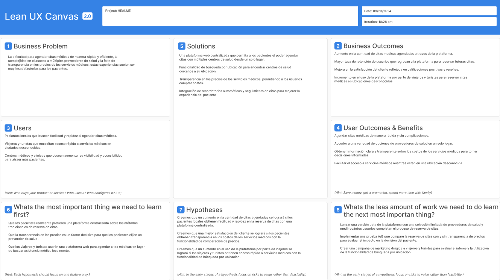

## Business problem
¿Qué problema de negocio hemos identificado que necesita ayuda?

La dificultad para agendar citas médicas de manera rápida y eficiente, la complejidad en el acceso a múltiples proveedores de salud y la falta de transparencia en los precios de los servicios médicos, estas experiencias suelen ser muy insatisfactorias para los pacientes.

## Solution ideas

Una plataforma web centralizada que permita a los pacientes el poder agendar citas con múltiples centros de salud desde un solo lugar.

Funcionalidad de búsqueda por ubicación para encontrar centros de salud cercanos a su ubicación.

Transparencia en los precios de los servicios médicos, permitiendo a los usuarios comprar costos.

Integración de recordatorios automáticos y seguimiento de citas para mejorar la experiencia del paciente 

## Business outcomes

Aumento en la cantidad de citas medicas agendadas a traves de la plataforma

Mayor tasa de retención de usuarios que regresan a la plataforma para reservar futuras citas 

Mejora en la satisfacción del cliente reflejada en calificaciones positivas y reseñas

Incremento en el uso de la plataforma por parte de viajeros y turistas para reservar citas médicas en ubicaciones desconocidas.

## Users and costumers:

Pacientes locales que buscan facilidad y rapidez al agendar citas médicas.

Viajeros y turistas que necesitan acceso rápido a servicios médicos en ciudades desconocidas.

Centros médicos y clínicas que desean aumentar su visibilidad y accesibilidad para atraer más pacientes.

## User Benefits

Agendar citas médicas de manera rápida y sin complicaciones.

Acceder a una variedad de opciones de proveedores de salud en un solo lugar.

Obtener información clara y transparente sobre los costos de los servicios médicos para tomar decisiones informadas.

Facilitar el acceso a servicios médicos mientras están en una ubicación desconocida.

## Hypotheses

Creemos que un aumento en la cantidad de citas agendadas se logrará si los pacientes locales obtienen facilidad y rapidez en la reserva de citas con una plataforma centralizada.

Creemos que una mayor satisfacción del cliente se logrará si los pacientes obtienen transparencia en los costos de los servicios médicos con la funcionalidad de comparación de precios.

Creemos que un aumento en el uso de la plataforma por parte de viajeros se logrará si los viajeros y turistas obtienen acceso rápido a servicios médicos con la funcionalidad de búsqueda por ubicación.

## Whats the most important thing we need to learn first?

Que los pacientes realmente prefieren una plataforma centralizada sobre los métodos tradicionales de reserva de citas.

Que la transparencia en los precios es un factor decisivo para que los pacientes elijan un proveedor de salud.

Que los viajeros y turistas usarán una plataforma web para agendar citas médicas en lugar de buscar asistencia médica localmente.

## Whats the leas amount of work we need to do learn the next most importan thing?

Lanzar una versión beta de la plataforma con una selección limitada de proveedores de salud y medir cuántos usuarios completan el proceso de reserva de citas.

Implementar una prueba A/B que compare la reserva de citas con y sin transparencia de precios para evaluar el impacto en la decisión del paciente.

Crear una campaña de marketing dirigida a viajeros y turistas para evaluar el interés y la utilización de la funcionalidad de búsqueda por ubicación.


1.3. Segmentos objetivo

Viajeros/Turistas: Personas que se encuentran en una ciudad o país diferente y necesitan acceso rápido a servicios médicos sin conocimiento previo del área. Las características clave para este segmento incluyen la búsqueda basada en la ubicación y la transparencia en los precios para ayudarles a tomar decisiones informadas rápidamente.

Centros medicos /doctores : Centros medicos y profesionales de salud los cuales busquen obtener mas pacientes para atender, pues a la hora que turistas busquen centros medicos no logren encontrar uno optimo para ellos haciendo que varios centros medicos y doctores no puedan encontrar pacientes


## Capítulo II: Requirements Elicitation & Analysis

2.1. Competidores

En el contexto de un mercado peruano en constante cambio y evolución, la gestión eficiente de los procesos en HealMe es una necesidad primordial en el sector sanitario. HealMe enfrenta el desafío urgente de comprender y abordar a sus competidores para asegurar una posición sólida y garantizar la satisfacción de sus usuarios.

**1. Thaniy**
Thaniy es una asociación sin fines de lucro fundada por profesionales de la salud peruanos para mejorar el acceso a servicios médicos en Perú. A través de un sistema informático, Thaniy conecta a los peruanos con atención médica sin costos adicionales. 


**2. HelpMed**
HelpMed es una empresa con años de experiencia en el mercado y con enfoque a responder rápidamente a emergencias médicas prehospitalarias. Su equipo está compuesto por médicos generales y especialistas, licenciados y paramédicos.


**3. Sanna**
Sanna es una de las redes privadas de salud más grandes de Perú, con una amplia capacidad de atención a nivel nacional. Su infraestructura abarca clínicas, centros clínicos y una variedad de servicios de asistencia médica, como ambulancias, nutricionistas, entre otros. Entre algunos de los servicios que ofrecen se encuentran la opción de solicitar un medico a domicilio y realizar una teleconsulta médica.


**4. Sanitas**
Es un servicio de salud privado brindado EPS que complementa la cobertura de EsSalud. Entre uno de los servicios que ofrece se encuentra la teleconsulta y una cobertura de salud internacional.


2.1.1. Análisis competitivo

<table>
    <thead>
        <tr>
            <th colspan="7">Competitive Analysis Landscape</th>
        </tr>
        <tr>
            <td colspan="3"><b>¿Por qué llevar a cabo este análisis?</b></td>
            <td colspan="4">Este análisis nos permitirá reconocer a las compañias competidoras y sus respectivos servicios similares a HealMe y resaltar las funcionalidades y carencias que estas mismas posean para comparar con nuestra propuesta. </td>
        </tr>
        <tr class="nombres-competidores">
        <td style="font-weight: bold; text-align:center;" colspan="2">Punto de análisis</td>
        <td style="font-weight: bold;">HealMe</td>
        <td style="font-weight: bold;">Thaniy</td>
        <td style="font-weight: bold;">HelpMed</td>
        <td style="font-weight: bold;">Sanna</td>
        <td style="font-weight: bold;">Sanitas</td>
        </tr>
        <tr class="logos-competidores">
        <td style="font-weight: bold; text-align:center;" colspan="2">Logo</td>
        <td>Logo de HealMe</td>
        <td></td>
        <td></td>
        <td></td>
        <td></td>
        </tr>
    </thead>
    <tbody>
    <tr>
        <td rowspan="2" style="font-weight: bold;">Perfil</td>
        <td style="font-weight: bold;">Overview</td>
        <td>HealMe es una plataforma digital diseñada para turistas y viajeros que necesitan acceso rápido a servicios médicos en destinos desconocidos. La aplicación permite a los usuarios buscar, comparar y reservar citas médicas en una amplia variedad de especialidades y centros de salud locales. Su misión es facilitar la atención médica al ofrecer transparencia en precios y ubicación. HealMe se posiciona como la solución global para la gestión de citas médicas durante los viajes, integrando funcionalidades como reseñas de usuarios, precios de consultas y recomendaciones para destinos con condiciones especiales.</td>
        <td>Thaniy es una asociación sin fines de lucro creada por profesionales de la salud peruanos para mejorar el acceso a servicios médicos en Perú. Utiliza un sistema informático para conectar a los peruanos con atención médica de manera gratuita, sin costos adicionales. Thaniy se enfoca en ofrecer una plataforma accesible y eficiente para facilitar el acceso a la salud en todo el país</td>
        <td>HelpMed es una empresa con años de experiencia en el mercado y con enfoque a responder rápidamente a emergencias médicas prehospitalarias. Su equipo está compuesto por médicos generales y especialistas, licenciados y paramédicos.</td>
        <td>Sanna es una de las redes privadas de salud más grandes de Perú, con una amplia capacidad de atención a nivel nacional. Su infraestructura abarca clínicas, centros clínicos y una variedad de servicios de asistencia médica, como ambulancias, nutricionistas, entre otros. Entre algunos de los servicios que ofrecen se encuentran la opción de solicitar un medico a domicilio y realizar una teleconsulta médica.</td>
        <td>Es un servicio de salud privado brindado EPS que complementa la cobertura de EsSalud. Entre uno de los servicios que ofrece se encuentra la teleconsulta y una cobertura de salud internacional.</td>
    </tr>
    <tr>
        <td style="font-weight: bold;">Ventaja competitiva ¿Que valor ofrece a los clientes?</td>
        <td>HealMe conecta a turistas con centros de salud cercanos, ofreciendo una plataforma fácil de usar para visualizar ubicación, costos y reseñas. Además, proporciona consejos personalizados basados en condiciones climáticas y tiene un enfoque transaccional eficiente con comisiones, beneficiando tanto a usuarios como a centros de salud.</td>
        <td>Thaniy ofrece atención médica a domicilio sin costos adicionales, gracias a su red de médicos y cirujanos voluntarios. Su enfoque sin fines de lucro permite brindar un servicio accesible para aquellos que no pueden cubrir gastos médicos, aunque no está asociado con centros de salud específicos.</td>
        <td>HelpMed destaca por su rápida respuesta en emergencias médicas prehospitalarias, con una flota de vehículos y equipos especializados para atención urgente, incluyendo servicios médicos y pediátricos a domicilio. Sin embargo, su presencia aún es limitada en algunas áreas del país.</td>
        <td>Sanna cuenta con una extensa red de centros de salud y ofrece servicios como teleconsultas y atención a domicilio. No obstante, puede ser menos ágil en la programación de consultas. Su capacidad de ofrecer atención médica variada es un punto fuerte, aunque la experiencia puede ser lenta.</td>
        <td>Sanitas ofrece una cobertura extensa en clínicas y hospitales, además de incluir servicios de teleconsulta y seguro para medicamentos según el plan. Su asociación con varias clínicas permite una cobertura más amplia y accesible. Sin embargo, su alto costo y posibles dificultades para hacer valer el seguro es uno de sus puntos debiles.</td>
    </tr>
    <tr>
        <td rowspan="2" style="font-weight: bold;">Plan de Marketing</td>
        <td style="font-weight: bold;">Mercado Objetivo</td>
        <td><ul>
            <li>Turistas y viajeros peruanos que requieran atención médica en areas desconocidas</li>
            <li>Extranjeros en Perú que no estan familiarizados con el sistema de salud local</li>
            </ul></td>
        <td><ul>
            <li>Pacientes que requieran atención a domicilio</li>
            <li>Profesionales ocupados</li>
            <li>Pacientes que necesiten una consulta rapida en linea</li>
            </ul></td>
        <td><ul>
            <li>Personas en situaciones de emergencia médica</li>
            <li>Usuarios que Necesitan Servicios Médicos a Domicilio</li>
            </ul></td>
        <td><ul>
            <li>Pacientes que Buscan Atención Médica Variada</li>
            <li>Usuarios de Teleconsultas</li>
            </ul></td>
        <td><ul>
            <li>Usuarios de EPS</li>
            <li>Personas que Necesitan Seguro para Medicamentos o cobertura internacional</li>
            </ul></td>
    </tr>
    <tr>
        <td style="font-weight: bold;">Estrategias de Marketing</td>
        <td><ul>
            <li>Tiktok Ads</li>
            <li>Facebook Ads</li>
            <li>Marketing de contenidos</li>
            <li>Email Marketing</li>
            <li>SEM (Search Engine Marketing)</li>
            <li>Colaboraciones con Influencers y Bloggers de Viajes</li>
            <li>Publicidad en Plataformas de Turismo y Viajes</li>
            </ul></td>
        <td><ul>
            <li>Marketing de redes sociales</li>
            <li>Marketing de contenidos</li>
            <li>Email Marketing</li>
            </ul></td>
        <td><ul>
            <li>Email Marketing</li>
            <li>Marketing de contenidos</li>
            <li>Social Ads</li>
            <li>Publicidad en medios locales</li>
            </ul></td>
        <td><ul>
            <li>Social Ads</li>
            <li>SEO</li>
            <li>Email Marketing</li>
            <li>Marketing de contenidos</li>
            </ul></td>
        <td><ul>
            <li>Social Ads</li>
            <li>SEO</li>
            <li>Email Marketing</li>
            <li>Marketing de contenidos</li>
            <li>Colaboración con influencers</li>
            <li>Publicidad en medios de comunicacion</li>
            </ul></td>
    </tr>
    <tr>
        <td rowspan="3" style="font-weight: bold;">Perfil de producto</td>
        <td style="font-weight: bold;">Productos & Servicios</td>
        <td><ul>
            <li>Consulta Médica en Centros de Salud Cercanos
</li>
            <li>Exámenes Médicos en Centros de Salud Cercanos
</li>
            <li>Reservas de Citas Médicas en Línea
</li>
<li>Información sobre Ubicación y Costos de Servicios Médicos
</li>   
            <li>Reseñas y Valoraciones de Centros de Salud
</li>
            <li>Consejos Médicos Personalizados Basados en Condiciones Climáticas
</li>
            </ul></td>
        <td><ul>
            <li>Atención médica a domicilio</li>
            <li>Consulta Médica General y Especializada a Domicilio</li>
            <li>Servicios de Emergencia Médica a Domicilio
            <li>Orientación y Apoyo Médico General</li>
            </ul></td>
        <td><ul>
            <li>Atención Médica de Emergencia Prehospitalaria
</li>
            <li>Servicio de Ambulancias para Emergencias y Eventos
</li>
            <li>Consulta Médica a Domicilio
</li>
            <li>Consulta Pediátrica a Domicilio
</li>
            <li>Servicios de Primeros Auxilios
</li>
            </ul></td>
        <td><ul>
            <li>Consultas Médicas en Clínicas y Centros Clínicos
</li>
            <li>Servicios de Atención a Domicilio
</li>
            <li>Teleconsultas Médicas
</li>
            <li>Atención de Urgencias y Emergencias
</li>
            <li>Servicios de Ambulancias
</li>
            <li>Consultas con Especialistas y Nutricionistas
</li>
            </ul></td>
        <td><ul>
            <li>Cobertura Médica en Clínicas Privadas y Asociadas
</li>
            <li>Teleconsultas Médicas
</li>
            <li>Seguros para Medicamentos
</li>
            <li>Servicios de Atención Médica en Clínicas
</li>
            <li>Cobertura Internacional de Salud
</li>
            </ul></td>
    </tr>
    <tr>
        <td style="font-weight: bold;">Precios & Costos</td>
        <td>HealMe funcionará con un modelo transaccional, cobrando al centro de salud un 5% del costo total del servicio por cada cliente que se conecte a través de la plataforma.</td>
        <td>
Thaniy ofrece atención médica en línea a partir de S/ 20, con precios que incrementan según la complejidad del servicio. Además, también disponen de atención médica a domicilio, con tarifas que comienzan en S/ 50. </td>
        <td>HelpMed ofrecen medicos a domicilio desde los S/140, ademas de ofrecer ambulancias a domicilio desde los S/700.</td>
        <td>Sanna ofrece consultas médicas a partir de S/79, además de una variedad de planes de salud que van desde S/95 hasta S/329 al mes.</td>
        <td>Sanitas ofrece seguros médicos privados con precios que van desde S/90 hasta S/410 mensuales.
</td>
    </tr>
    <tr>
        <td style="font-weight: bold;">Canales de distribución (Web y/o Móvil)</td>
        <td>
HealMe contará con una aplicación web en donde el usuario podrá disfrutar de todas sus funcionalidades.</td>
        <td>
Thaniy cuenta con un formulario de contacto en su sitio web para redirigir a sus clientes a su canal de WhatsApp.</td>
        <td>
HelpMed cuenta con un formulario de contacto , numeros de contacto y direcciones de referencia, además de un canal de WhatsApp para atender a todas sus consultas.</td>
        <td>
Sanna de igual manera tiene un formulario de contacto y canales de contacto en su sitio web.</td>
        <td>
Sanitas cuenta con un sitio web que ofrece múltiples canales de contacto, los cuales redirigen a los clientes potenciales hacia medios de comunicación tradicionales para continuar con el proceso de adquisición.</td>
    </tr>
    <tr>
        <td rowspan="4" style="font-weight: bold;">Análisis SWOT</td>
        <td style="font-weight: bold;">Fortalezas</td>
        <td><ul>
            <li>Plataforma que combina salud y turismo, un nicho de mercado poco explotado.
</li>
            <li>Los usuarios pueden visualizar la ubicación, costos, reseñas y reservar citas con anticipación, todo en una misma plataforma</li>
            <li>Amplia accesibilidad con la capacidad de reservar citas y realizar pagos en línea.
</li>
            <li>Provisión de información sobre condiciones climáticas y consejos médicos para turistas.
</li>
            <li>Genera ingresos recurrentes a través de comisiones cobradas a los centros de salud, manteniendo la plataforma accesible para los usuarios.
</li>
            <li>HealMe está diseñada para atender las necesidades específicas de turistas y ciudadanos en Perú, con un conocimiento profundo del mercado local.</li>
            </ul></td>
        <td>
            <ul>
                <li>Cuenta con una red de médicos y especialistas</li>
                <li>Ofrece atención médica a precios muy accesibles</li>
                <li>Especialización en servicios médicos a domicilio</li>
            </ul>
        </td>
        <td><ul>
            <li>Alta capacidad de respuesta en situaciones de emergencia, con una flota de vehículos equipada para primeros auxilios</li>
            <li>Ofrece una gama de servicios que incluye médico a domicilio, pediatra a domicilio, y cobertura para eventos.</li>
            <li>Varios años de experiencia en el mercado</li>
            <li>Equipos médicos y paramédicos entrenados para manejar emergencias prehospitalarias.</li>
            </ul></td>
        <td><ul>
            <li> Cuenta con una extensa red de clínicas y centros médicos en todo el país</li>
            <li> Ofrece desde atención en clínicas hasta teleconsultas y servicios de nutricionistas.</li>
            <li>Puede manejar grandes volúmenes de pacientes debido a su infraestructura y personal médico especializado.</li>
            </ul></td>
        <td><ul>
            <li>Ofrece seguros con cobertura médica internacional, lo que es atractivo para clientes que viajan con frecuencia.</li>
            <li>Amplia red de clínicas privadas asociadas, lo que permite una mayor cobertura de atención.</li>
            <li>Diversos planes de seguros que pueden adaptarse a las necesidades específicas de los usuarios</li>
            </ul></td>
    </tr>
    <tr>
        <td style="font-weight: bold;">Debilidades</td>
        <td><ul>
            <li>Dependencia de la conectividad.
</li>
            <li>Necesidad de establecer relaciones sólidas con centros de salud para garantizar la calidad del servicio.
</li>
            <li>Costos de Adquisición de Usuarios</li>
</li>
            </ul></td>
        <td><ul>
            <li>Limitada Cobertura Geográfica</li>
            <li>No está asociado a centros de salud, lo que limita la variedad de servicios que puede ofrecer.</li>
            <li>Puede tener limitaciones en cuanto a la cantidad de pacientes que pueden atender simultáneamente.</li>
            </ul></td>
        <td><ul>
            <li>Posicionamiento Geográfico Limitado</li>
            <li>Falta de Diversificación en Servicios</li>
            <li>Dependencia de Vehículos y Equipos</li>
            <li>Precios altos para el mercado</li>
            </ul></td>
        <td><ul>
            <li>Lentitud en el Proceso de Consulta</li>
            <li>Servicios en Línea Limitados</li>
            <li>Altos Costos Operativos</li>
            <li>Dependencia de la Infraestructura Física</li>
            </ul></td>
        <td><ul>
            <li>Altos Costos para el Usuario</li>
            <li>Trabas en la Utilización del Seguro</li>
            <li>Dependencia de Clínicas Asociadas</li>
            </ul></td>
    </tr>
    <tr>
        <td style="font-weight: bold;">Oportunidades</td>
        <td><ul>
            <li>Expansión a otros países de América Latina con alta afluencia de turismo.
                <li>Crecimiento en la demanda de servicios médicos a domicilio y telemedicina.
</li>
            <li>Posible colaboración con agencias de viajes y aerolíneas para atraer más usuarios.
</li>
            </ul></td>
        <td><ul>
            <li>Expansión Regional: Ampliar su cobertura a más áreas del país y colaborar con otras organizaciones para aumentar su impacto.</li>
            <li>Formar alianzas con entidades gubernamentales y empresas para obtener más fondos y recursos.</li>
            <li> Integrar herramientas tecnológicas para optimizar la coordinación y la gestión de pacientes.</li>
            </ul></td>
        <td><ul>
            <li>Aumentar su presencia en todo el país para ofrecer servicios de emergencia en más localidades.</li>
            <li> Establecer acuerdos con organizadores de eventos y empresas para ofrecer servicios de emergencia en grandes reuniones y actividades.</li>
            <li>Ampliar su oferta para incluir servicios médicos regulares y programas de salud preventiva.</li>
            </ul></td>
        <td><ul>
            <li>Mejorar y expandir sus servicios en línea, como la telemedicina y la gestión de citas, para atraer a un público más amplio.</li>
            <li>Ampliar su red de clínicas y centros médicos para cubrir más regiones y ofrecer servicios en áreas no atendidas.</li>
            <li>Establecer acuerdos con compañías de seguros para ofrecer paquetes combinados y atraer a más clientes.</li>
            </ul></td>
        <td><ul>
            <li>Ampliar su cobertura a nivel internacional para atraer a clientes que viajan o residen fuera del país.</li>
            <li>Crear nuevos planes de seguros con opciones más flexibles y accesibles para diferentes segmentos de mercado.</li>
            <li>Colaborar con empresas tecnológicas para integrar soluciones avanzadas en sus servicios y mejorar la experiencia del usuario.</li>
            </ul></td>
    </tr>
    <tr>
        <td style="font-weight: bold;">Amenazas</td>
        <td><ul>
            <li>Competencia directa de otras plataformas de salud con modelos similares.
</li>
            <li>Factores económicos o políticos que afecten el turismo y, por ende, la demanda de servicios médicos.</li>
            <li>Posible resistencia de algunos centros de salud a adoptar nuevas tecnologías.
</li>
            </ul></td>
        <td><ul>
            <li>Competencia con Servicios de Salud Establecidos</li>
            <li>Poca Presencia en el Mercado</li>
            <li>Ausencia de Infraestructura Médica</li>
            <li>Falta de Médicos Especializados</li>
            </ul></td>
        <td><ul>
            <li>Altos Costos Operativos</li>
            <li>Desafíos en la Expansión Geográfica</li>
            </ul></td>
        <td><ul>
            <li>Desafíos en la Atención Eficiente</li>
            <li>Costos Operativos Altos</li>
            <li>Competencia con Servicios Digitales</li>
            </ul></td>
        <td><ul>
            <li>Altos Costos para los Usuarios</li>
            <li>Trabas en el Uso de Seguros</li>
            <li>Competencia con Servicios Públicos de Salud:</li>
            <li>Cambios en Políticas de Seguros</li>
            </ul></td>
    </tr>
    </tbody>
</table>

2.1.2. Estrategias y tácticas frente a competidores

<cite>Según Michael Porter, la estrategia competitiva implica cómo una empresa compite en su mer- cado específico. Porter identificó tres estrategias generales que las empresas pueden emplear para competir con éxito: liderazgo en costos, diferenciación y enfoque. La estrategia de liderazgo en costos implica ofrecer productos o servicios a precios más bajos que los de los competidores, mientras que la diferenciación se basa en ofrecer productos y servicios únicos y distintivos. Por otro lado, una estrategia de enfoque se centra en un segmento de mercado específico. Para llevar a cabo eficazmente estas estrategias, las empresas necesitan tener un profundo conoci- miento de sus mercados y competidores para desarrollar y mantener una ventaja competitiva sostenible a largo plazo.</cite>

Teniendo en cuenta el análisis SWOT previamente presentado para HealMe, proponemos las siguientes estrategias competitivas:

**Estrategias competitivas para HealMe**

**1. Estrategia de Liderazgo en Costos**
Estrategia: Optimizar los costos operativos de HealMe para ofrecer un servicio de alta calidad a precios competitivos y sin costos iniciales para los usuarios. Tácticas:

Tecnología Eficiente: Implementar tecnologías de vanguardia para mejorar la eficiencia operativa y reducir costos asociados a la infraestructura.

Negociaciones Favorables: Establecer acuerdos ventajosos con centros de salud para minimizar costos iniciales y gastos operativos.

Modelo de Cero Costo Inicial: Ofrecer acceso gratuito a la plataforma para los usuarios, atrayendo así a una base de clientes más amplia.

**2. Diferenciación a través de la Innovación**
Estrategia: Desarrollar y promover características únicas de HealMe que resalten la plataforma como la opción más innovadora para la búsqueda de atención médica.

Tácticas:

Funcionalidades Exclusivas: Incorporar características innovadoras como la integración de información sobre condiciones climáticas y recomendaciones médicas personalizadas.
Inversión en I+D: Continuar invirtiendo en investigación y desarrollo para mejorar la plataforma y ofrecer nuevas funcionalidades.
Promoción Activa: Utilizar campañas de marketing para destacar las características avanzadas y los beneficios únicos de HealMe.

**3. Enfoque en Segmentos Específicos del Mercado**
Estrategia: Especializarse en atender a turistas y viajeros en Perú, ofreciendo soluciones adaptadas a sus necesidades particulares. 

Tácticas:

Identificación de Segmentos Clave: Focalizarse en turistas y viajeros que requieren atención médica durante su estancia en Perú.
Desarrollo de Paquetes Especializados: Crear paquetes y servicios personalizados para este segmento, como información sobre atención médica en destinos específicos.
Colaboraciones Locales: Establecer alianzas con operadores turísticos y agencias de viaje para promocionar HealMe entre sus clientes.

**4.Estrategia de Alianzas Estratégicas**
Estrategia: Formar alianzas estratégicas con centros de salud y organizaciones locales para expandir la red de servicios y aumentar el alcance de HealMe.

Tácticas:

Asociaciones con Centros de Salud: Colaborar con una amplia gama de centros de salud, asegurando cobertura en diversas áreas y aumentando la oferta de servicios.
Colaboraciones con Organizaciones de Turismo: Asociarse con empresas de turismo y agencias de viajes para integrarse en sus servicios y ofrecer HealMe como una solución recomendada.
Programas de Referencias: Implementar programas de referencia con centros de salud y otras entidades para atraer nuevos usuarios y centros asociados.

**5. Estrategia de Marketing Diferenciado**
Estrategia: Desarrollar campañas de marketing que resalten las ventajas únicas de HealMe y sus beneficios para los usuarios. 

Tácticas:

Contenido Educativo: Crear y distribuir contenido educativo que informe a los usuarios sobre cómo HealMe puede resolver sus necesidades específicas de atención médica durante sus viajes.
Testimonios y Casos de Éxito: Utilizar testimonios de usuarios satisfechos y casos de éxito para demostrar la efectividad y valor de HealMe.
Campañas en Redes Sociales: Aprovechar las redes sociales para llegar a un público más amplio y promover las características únicas de la plataforma.


2.2. Entrevistas

2.2.1. Diseño de entrevistas

Entrevista a personas referentes a nuestro segmentos objetivo, las preguntas varían dependiendo del segmento debido a las diferentes situaciones:

**Segmento 1:** Viajeros / Turistas

**Preguntas de Introducción:**
1. ¿Cuál es su nombre y a que se dedica?
2. ¿Qué destinos ha visitado recientemente y cuáles suele visitar con más frecuencia?
3. ¿Cuál es el propósito principal de sus viajes (por ejemplo, turismo, negocios, visitar familiares, estudios, etc.)?
4. ¿Suele viajar solo, en pareja, con familia o en grupo?
5. ¿Con qué frecuencia viaja fuera de su ciudad o país?

**Preguntas Principales:**

**1 - ¿Ha tenido alguna vez la necesidad de buscar atención médica mientras estaba de viaje? Si es así, ¿cómo fue su experiencia?**
Objetivo: Comprender las experiencias previas de los viajeros con la atención médica durante sus viajes, incluyendo desafíos y expectativas.

**2 - Cuando necesita atención médica en una ciudad o región que no conoce, ¿qué aspectos son los más importantes para usted al elegir un centro de salud o médico (ubicación, costos, calidad, etc.)?**
Objetivo: Identificar los criterios clave que los turistas y viajeros consideran al seleccionar servicios médicos en un área desconocida.

**3 - ¿Le resultaría útil una aplicación que le ofrezca múltiples opciones de centros de salud y médicos, con la posibilidad de comparar precios y servicios antes de tomar una decisión?**
Objetivo: Evaluar el interés en la funcionalidad principal de HealMe para comparar opciones de atención médica.

**4 - ¿Qué tan importante es para usted contar con información en su idioma sobre los servicios médicos disponibles?**
Objetivo: Determinar la importancia de la accesibilidad lingüística en la oferta de servicios médicos para turistas.

**5 - ¿Ha tenido dificultades para encontrar información confiable sobre centros de salud en áreas donde ha viajado? En caso afirmativo, ¿cuáles fueron los principales obstáculos?**
Objetivo: Identificar los desafíos comunes que enfrentan los turistas al buscar atención médica en áreas desconocidas.

**6 - ¿Qué tan importante considera la posibilidad de acceder a reseñas y valoraciones de otros pacientes al momento de elegir un servicio médico en una ciudad o provincia que no conoce?**
Objetivo: Evaluar la importancia de las reseñas y valoraciones en la toma de decisiones de los viajeros.

**7 - ¿Le gustaría que HealMe le proporcionara información sobre la calidad sanitaria del lugar al que viaja, basada en la experiencia de otros usuarios que ya han visitado la región?**
Objetivo: Evaluar el interés en recibir evaluaciones de calidad sanitaria de destinos turísticos, basadas en la retroalimentación de otros viajeros.

**8 - ¿Qué tan útil le resultaría tener acceso a una sección en HealMe con información sobre los costos aproximados de medicamentos esenciales en la región que va a visitar?**
Objetivo: Determinar la necesidad y el valor de contar con información anticipada sobre el costo de medicamentos comunes en destinos turísticos.

**9 - Si viajara a destinos exóticos en la selva o a áreas con alta concentración de mosquitos, ¿consideraría útil que HealMe le recomendara cremas o sprays repelentes específicos, incluyendo información sobre su costo y disponibilidad?**
Objetivo: Explorar el interés en recibir recomendaciones de productos para la salud y su costo, adaptadas a las condiciones particulares de destinos con riesgos específicos como la selva.

**10 - Al planificar un viaje a destinos de gran altitud, ¿le parecería conveniente que HealMe le sugiriera productos para prevenir el mal de altura, junto con información sobre su costo y dónde adquirirlos?**
Objetivo: Evaluar la utilidad de recomendaciones personalizadas de productos de salud para prevenir problemas comunes en destinos de gran altitud.

**11 - ¿Qué sugerencias tendría para mejorar una aplicación diseñada para facilitar el acceso a servicios médicos en una región desconocida para turistas como usted?**
Objetivo: Recopilar recomendaciones para optimizar la usabilidad y efectividad de HealMe 

 **12 -  ¿Cuánto estaría dispuesto/a a pagar por una aplicación que le permita gestionar y agendar citas médicas o exámenes de manera rápida y sencilla durante su viaje?**
Objetivo: Explorar la disposición a pagar por los servicios de HealMe y el valor percibido por los viajeros.

**13 - ¿Qué recomendaciones o sugerencias tendría para el equipo de HealMe en términos de diseño, implementación o uso de la plataforma para maximizar su efectividad en la mejora de la experiencia del turista?**
     - Objetivo: Recopilar ideas y sugerencias prácticas para optimizar la funcionalidad y usabilidad de la plataforma HealMe.

**Segmento 2:** Doctores o centros de salud

**Preguntas de Introducción:**
1. ¿Cuál es su nombre y el nombre del centro de salud que trabaja?
2. ¿Cuántos años lleva en el sector de la salud?
3. ¿En qué ciudad o región del Perú se encuentra su centro de salud?
4. ¿Cuál es el tamaño de su centro de salud en términos de capacidad y número de empleados?
5. ¿Qué tipo de servicios médicos son los más demandados en su centro de salud?

**Preguntas Principales:**

**1.¿Cuáles son los principales desafíos que enfrenta su centro de salud al atraer y retener pacientes, especialmente aquellos que son turistas o viajeros?**
Objetivo: Identificar las dificultades actuales para captar pacientes externos, especialmente turistas, y explorar cómo HealMe podría ayudar a superar estos desafíos.
**2. ¿Cómo considera que la visibilidad en una plataforma como HealMe, que conecta a turistas con centros de salud, podría beneficiar a su negocio?**
Objetivo: Explorar las percepciones sobre el valor agregado que HealMe podría ofrecer a su centro de salud, en términos de atraer nuevos pacientes.

**3.¿Qué tan importante considera la posibilidad de ofrecer precios competitivos y transparentes en HealMe para atraer a pacientes, especialmente aquellos que buscan opciones médicas mientras están de viaje?**
Objetivo: Evaluar la relevancia de la transparencia en precios como un factor clave para atraer pacientes a través de la plataforma.

**4.¿En qué aspectos cree que HealMe podría mejorar o qué funcionalidades adicionales serían importantes para que considere unirse a la plataforma?**
Objetivo: Recopilar sugerencias para el desarrollo y mejora de la plataforma, basadas en las necesidades y expectativas de los centros de salud.

**5.¿Estaría dispuesto a formar parte de HealMe si esto implica una mayor exposición a pacientes turistas que necesitan exámenes o citas médicas? ¿Qué tipo de acuerdos o incentivos le harían más propenso a unirse?**
Objetivo: Evaluar la disposición a colaborar con HealMe y explorar posibles incentivos que podrían hacer más atractiva la propuesta.


**6.¿Cree que la implementación de reseñas y valoraciones de pacientes en la plataforma HealMe sería beneficiosa o perjudicial para su centro de salud? ¿Por qué?**
Objetivo: Explorar percepciones sobre la transparencia y retroalimentación de pacientes como herramienta de mejora continua y atracción de nuevos clientes.

2.2.2. Registro de entrevistas

### Entrevista con Elmer Alcántara
Entrevista 1:
- **Edad**: 48
- **Departamento**: 
- **Duración**: 11:51
- **URL**: https://drive.google.com/file/d/1mgK6X_oyVk5wCBiQ--dpR2yQBdxdIa3c/view?usp=sharing

**Resumen**:
Elmer Alcántara un abogado nos comenta que suele viajar fuera de lima, el ha experimentado varios casos donde necesitaba encontrar atencion medica y dependía de preguntar a lo hoteles o hostales si habia boticas cerca para comprar medicamentos, nos comentó que sería bueno implementar un boton donde podamos cambiar el idioma para asi facilitar a los turistas extranjeros.

### Entrevista con Ignacio Peveri

- **Edad**: 20 años
- **Departamento**: Buenos Aires Argentina
- **Duración**: 14:31
- **URL**: https://drive.google.com/file/d/1lRRY6Hn-y8Jt5_uSEHY-FB6Vc6-PSJ-g/view?usp=sharing

**Resumen**:
En esta entrevista Ignacio Peveri, más conocido como Tuti (Nombre Artistico), nos cuenta como son sus experiencias en el extranjero y que dificultades presenta con su equipo de trabajo en algunas situaciones. El entrevistado manifiesta que le gustaría bastante la idea sobre una aplicación que le ahorre el tiempo en busqueda sobre asistencia médica confiable. 

### Entrevista con Diego Alonso

- **Edad**: 39 años
- **Departamento**: Lima,Perú
- **Duración**: 5:12
- **URL**: https://drive.google.com/file/d/1xV81P4bnQntprdNo2z4iFV5Ffz_Y6Qdg/view?usp=sharing

**Resumen**: 

Diego Alonso, con 15 años de experiencia en el sector salud, trabaja en la Clínica San Rafael en Lima, que cuenta con capacidad para 50 pacientes y 80 empleados. Los principales desafíos para atraer a turistas incluyen la falta de visibilidad y barreras como el idioma y la información de precios. Ve a HealMe como una oportunidad para conectar con pacientes viajeros, mejorando la visibilidad y confianza a través de precios claros y competitivos. Sugiere funcionalidades como traducción automática y reservas en tiempo real para mejorar la plataforma y está dispuesto a unirse si se ofrecen incentivos atractivos. Considera que las reseñas pueden ser beneficiosas para construir reputación si se gestionan de manera justa.


###    2.2.3. Análisis de entrevistas. 
Entrevista 1: Elmer Alcántara un abogado nos comenta que suele viajar fuera de lima, el ha experimentado varios casos donde necesitaba encontrar atencion medica y dependía de preguntar a lo hoteles o hostales si habia boticas cerca para comprar medicamentos, nos comentó que sería bueno implementar un boton donde podamos cambiar el idioma para asi facilitar a los turistas extranjeros.

Entrevista 2:

Entrevista 3:
Diego Alonso, médico en Lima, identifica la falta de visibilidad y la poca claridad en los precios como los principales desafíos para atraer a turistas en su centro de salud. Ve a HealMe como una plataforma con gran potencial para conectar con pacientes viajeros, mejorar la reputación y facilitar el acceso a servicios médicos locales. Destaca la importancia de la transparencia en precios y sugiere añadir funciones como traducción automática y pago en línea para optimizar la experiencia del usuario. Diego está dispuesto a unirse a HealMe, especialmente si se ofrecen incentivos claros, como tarifas promocionales y mayor visibilidad en la plataforma. Considera que las reseñas, si se gestionan de manera justa, pueden beneficiar la reputación del centro. HealMe debe enfocarse en ofrecer estas funcionalidades y beneficios para atraer a centros de salud locales.

2.3. Needfinding

2.3.1. User Personas

En Lean UX, las **User Personas** son representaciones semi-ficticias de nuestros usuarios clave, creadas a partir de investigaciones y datos reales. Estas personas nos ayudan a entender mejor las expectativas, necesidades, comportamientos y objetivos de nuestros usuarios.

**Persona 1:**
- **Nombre:** Laura Gómez
- **Edad:** 33 años
- **Profesión:** Doctora
- **Motivaciones:** Necesita una plataforma para promover su trabajo.
- **Frustraciones:** No encuentra una plataforma donde pueda encontrar pacientes
- **Objetivos:** Poder atender a pacientes que lo necesiten.
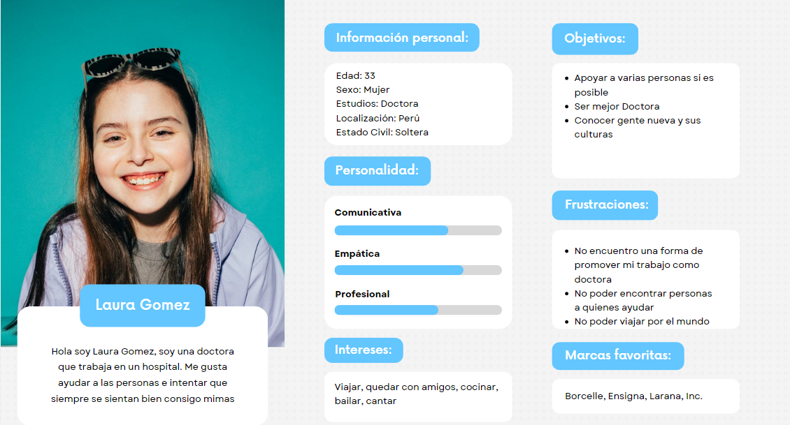


**Persona 2:**
- **Nombre:** Juan Pérez
- **Edad:** 35 años
- **Profesión:** Ejecutivo de negocios
- **Motivaciones:** Mantener su salud durante viajes frecuentes de negocios.
- **Frustraciones:** Tiempo limitado para buscar y reservar citas médicas cuando está en una ciudad desconocida.
- **Objetivos:** Encontrar y reservar citas médicas de manera eficiente y en un solo lugar.


2.3.2. User Task Matrix

La **User Task Matrix** nos permite visualizar las tareas clave que nuestros usuarios realizan al interactuar con nuestra plataforma y cómo estas tareas se alinean con las necesidades identificadas.

| TASK                                           | Doctor/Centro de salud FREQUENCY | Doctor/Centro de salud IMPORTANCE | Turista/viajero FREQUENCY | Turista/viajero IMPORTANCE |
|------------------------------------------------|--------------------|---------------------|---------------------|----------------------|
| Log in en la plataforma                        | Always             | High                | Always              | High                 |
| Crear perfil                                   | Always             | High                | Always              | High                 |
| Solicitar/Reservar una cita                    | Never              | low                 | Always              | High                 |
| Visualizar reseñas                             | Always             | High                | Always              | High                 |
| Ver historial de citas                         | Never              | Low                 | Always              | High                 |
| Pagos en línea                                 | Never              | Low                 | Always              | High                 |
| Ver citas pendientes                           | Always             | High                | Never               | Low                  |

2.3.3. User Journey Mapping

El **User Journey Mapping** nos permite mapear el recorrido de los usuarios a lo largo de su interacción con la plataforma, identificando los puntos de contacto clave y las posibles fricciones.


### 2.3.4. Empathy Mapping

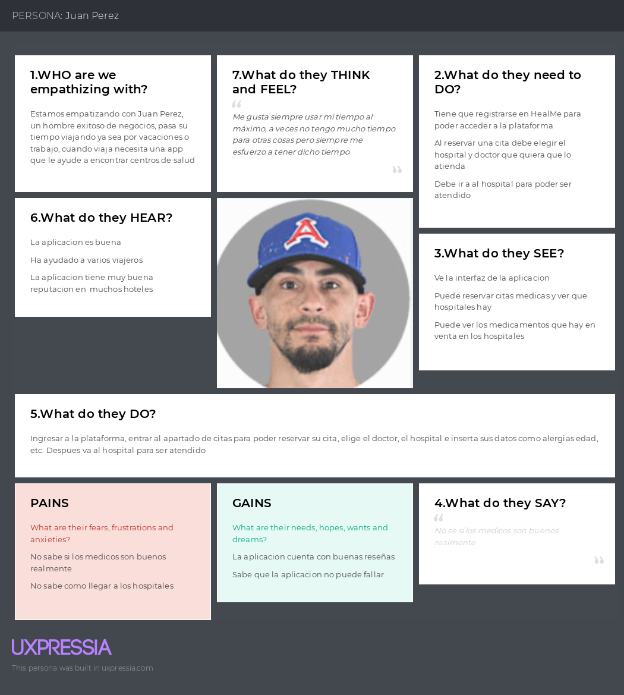
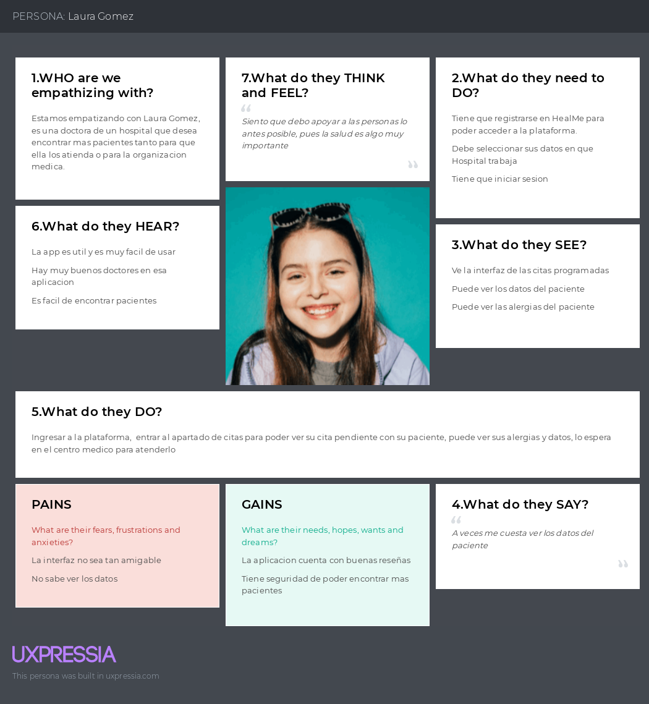

2.3.5. As-Is Scenario Mapping

El **As-is Scenario Mapping** describe el escenario actual de cómo los usuarios intentan resolver sus problemas sin nuestra solución, destacando las ineficiencias y puntos de dolor.

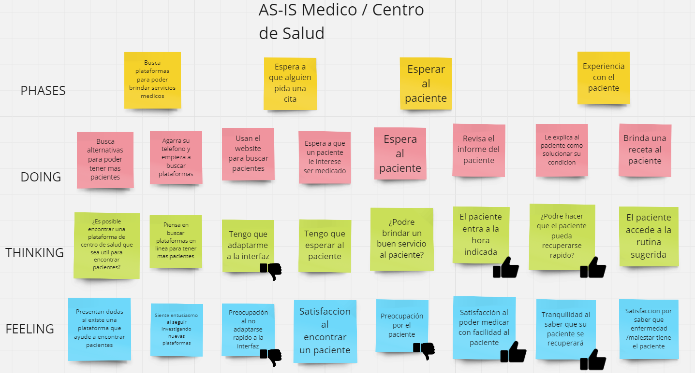
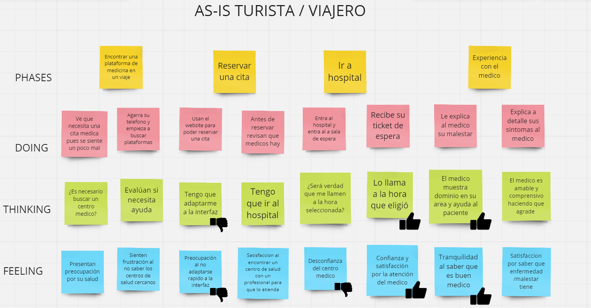

2.4. Ubiquitous Language

- **Usuario**: Cualquier persona que utiliza la plataforma, ya sea paciente, turista, viajero, o profesional de la salud.
- **Paciente**: Usuario que busca atención médica a través de la plataforma.
- **Proveedor de servicios médicos**: Centros médicos, clínicas, hospitales o médicos individuales que ofrecen servicios a través de la plataforma.
- **Especialidad médica**: Área específica de la medicina en la que un proveedor ofrece servicios, como cardiología, dermatología, pediatría, etc.
  
- **Cita médica**: Una reserva realizada por un paciente para consultar a un médico en una fecha y hora específica.
  
- **Disponibilidad**: Horarios en los que un proveedor de servicios médicos está disponible para atender citas.
  
- **Comparación de precios**: Funcionalidad que permite a los usuarios ver y comparar los costos de consultas y procedimientos médicos ofrecidos por diferentes proveedores.
  
- **Reseñas**: Opiniones y valoraciones dejadas por usuarios anteriores sobre un proveedor de servicios médicos.
  
- **Perfil médico**: Página detallada de un proveedor de servicios médicos que incluye información sobre su experiencia, especialidades, ubicación, y reseñas de pacientes.
  
- **Reserva instantánea**: Opción de confirmar una cita médica en tiempo real a través de la plataforma, sin necesidad de contacto adicional.
  
- **Telemedicina**: Servicio que permite consultas médicas a distancia mediante videollamadas a través de la plataforma.
  
- **Historial médico**: Registro de las citas pasadas de un usuario, incluyendo diagnósticos, tratamientos, y notas del proveedor.
  
- **Mapa interactivo**: Herramienta que muestra la ubicación de los proveedores de servicios médicos en un área determinada y permite filtrar por especialidad y disponibilidad.
  
- **Seguridad y privacidad**: Normas y prácticas que garantizan la protección de los datos personales y médicos de los usuarios.


## Capítulo III: Requirements Specification

3.1. To-Be Scenario Mapping

El **To-Be Scenario Mapping** describe el escenario actual de cómo los usuarios resuelven sus problemas con nuestra solución, subsanando las ineficiencias y puntos de dolor.

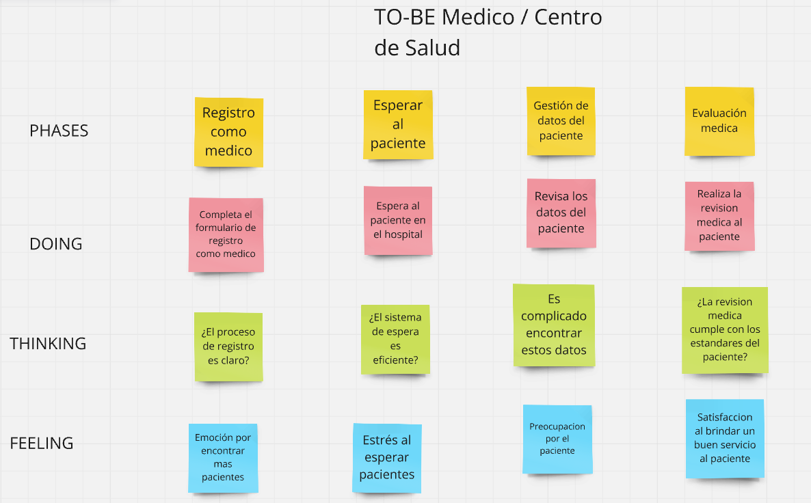


3.2. User Stories

| Epic ID | Título                                                  | Descripción                                                                                              |
|---------|----------------------------------------------------------|----------------------------------------------------------------------------------------------------------|
| EP-01   | Comprar medicinas en la aplicación                       | Como turista quiero comprar medicamentos en la aplicación web                                             |
| EP-02   | Elegir el doctor que desea                               | Como turista quiero poder elegir el doctor que desee para que me atienda en el centro médico/hospital/clínica. |
| EP-03   | Reserva de citas médicas                                 | Como turista quiero reservar citas médicas para que pueda ser medicado                                    |
| EP-04   | Registrarme en la aplicación como turista                | Como turista quiero poder registrarme en la aplicación para poder acceder a la aplicación                 |
| EP-05   | Elegir el centro médico disponible                       | Como turista quiero elegir el centro médico disponible para mi zona                                       |
| EP-06   | Poder ver las citas pendientes de los pacientes          | Como doctor quiero poder ver las citas pendientes que tengo con mis pacientes                             |
| EP-07   | Poder visualizar el historial de citas terminadas        | Como doctor quiero ver el historial de citas                                                              |
| EP-08   | Poder iniciar sesión como turista                        | Como turista quiero iniciar sesión en la plataforma para poder acceder a las funcionalidades de la aplicación |
| EP-09   | Poder iniciar sesión como doctor                         | Como doctor quiero iniciar sesión en la plataforma para poder acceder a las funcionalidades de la aplicación |
| EP-10   | Poder ver una descripción de la plataforma en el landing page | Como usuario quiero ver una descripción de la plataforma                                                   |
| EP-11   | Poder ver reseñas de otros usuarios                      | Como usuario quiero ver reseñas de otros usuarios a la plataforma para así tener una idea de la calidad del servicio |
| EP-12   | Ponerse en contacto con el equipo Heal Me                | Como usuario quiero ponerme en contacto con la plataforma Heal Me para si solicitar información detallada de la plataforma |
| EP-13   | Poder cambiar de idioma como turista                     | Como turista quiero cambiar de idioma para estar más cómodo en la plataforma                               |
| EP-14   | Poder cambiar de idioma como doctor                      | Como doctor quiero cambiar de idioma para estar más cómodo en la plataforma                                |
| EP-15   | Poder ver todos los doctores de la plataforma            | Como turista quiero ver todos los doctores disponibles en la plataforma                                   |
| EP-16   | Poder ver todas las clínicas/centros médicos/hospitales de la plataforma | Como turista quiero ver todos los centros médicos/hospitales/clínicas de la plataforma                   |
| EP-17   | Poder regresar a la página principal de la plataforma con un botón | Como usuario quiero volver a la pestaña principal de la plataforma con un botón                          |
| EP-18   | Poder manejar la base de datos de los productos          | Como desarrollador backend quiero poder manipular o editar la base de datos de los productos              |
| EP-19   | Poder manejar la base de datos de los doctores           | Como desarrollador backend quiero poder manipular o editar la base de datos de los doctores               |
| EP-20   | Poder manejar la base de datos de los centros médicos/hospitales/clínicas | Como desarrollador backend quiero poder manipular o editar la base de datos de los centros médicos/hospitales/clínicas |


| User Story ID | Epic ID | Descripción                                                                                              | Criterios de Aceptación                                                                                                                                                        |
|---------------|---------|----------------------------------------------------------------------------------------------------------|---------------------------------------------------------------------------------------------------------------------------------------------------------------------------------|
| US-01         | EP-01   | Como turista, quiero buscar medicamentos por nombre o categoría, para encontrar el producto que necesito.  | - El turista puede buscar por categorías como "antibióticos", "analgésicos", etc. <br> - La búsqueda muestra resultados relevantes con nombre, precio, y disponibilidad.         |
| US-02         | EP-01   | Como turista, quiero ver la información de cada medicamento (precio y descripción), para tomar una decisión informada antes de comprar. | - Cada medicamento muestra el precio, descripción detallada. <br> - El turista puede ver la disponibilidad del producto.                                                         |
| US-03         | EP-01   | Como turista, quiero agregar medicamentos a mi carrito de compras, para poder comprar varios artículos a la vez. | - El turista puede agregar múltiples productos al carrito. <br> - El carrito muestra el número de artículos y el costo total acumulado.                                           |
| US-04         | EP-01   | Como turista, quiero recibir una confirmación de compra y detalles de envío, para saber cuándo recibiré mis productos. | - La plataforma muestra un mensaje de confirmación de la compra. <br> - La notificación es visible para el usuario.                                                              |
| US-05         | EP-02   | Como turista, quiero buscar doctores por especialidad y ubicación, para encontrar un profesional que me pueda atender. | - El turista puede buscar doctores filtrando por especialidad y ubicación. <br> - La lista de doctores se actualiza de acuerdo con los filtros aplicados.                        |
| US-06         | EP-02   | Como turista, quiero ver el perfil de cada doctor, con información como calificaciones y reseñas, para seleccionar al mejor doctor disponible. | - Cada perfil de doctor muestra su nombre, especialidad, calificaciones, y reseñas de otros pacientes. <br> - El turista puede elegir el doctor que desee con cualquier calificación. |
| US-07         | EP-02   | Como turista, quiero ver la disponibilidad de citas de un doctor, para poder reservar una cita acorde a mi horario. | - El turista puede ver las fechas y horarios disponibles para cada doctor. <br> - El sistema actualiza la disponibilidad en tiempo real.                                         |
| US-08         | EP-03   | Como turista, quiero seleccionar una fecha y hora para mi cita, para elegir el momento que más me convenga. | - El turista puede elegir una fecha y hora de una lista de opciones disponibles. <br> - La plataforma no permite seleccionar fechas/hora en el pasado.                           |
| US-09         | EP-03   | Como turista, quiero recibir una confirmación de la cita reservada, para tener la certeza de que la cita está programada correctamente. | - Se envía una confirmación automática de la cita. <br> - La cita aparece en el panel de "Historial de citas" para el usuario.                                                    |
| US-10         | EP-04   | Como turista, quiero poder registrarme proporcionando mi correo electrónico, contraseña y datos personales básicos, para crear una cuenta en la plataforma. | - El formulario de registro pide correo electrónico, contraseña, y datos básicos (nombre, apellido, teléfono). <br> - El sistema valida que el correo electrónico no esté ya registrado. |
| US-11         | EP-04   | Como turista, quiero poder iniciar sesión después de registrarme, para acceder a la plataforma sin tener que registrarme nuevamente. | - El turista puede iniciar sesión con el correo electrónico y contraseña registrados. <br> - La plataforma guarda la sesión para el acceso rápido en futuras visitas.            |
| US-12         | EP-05   | Como turista quiero elegir centros médicos disponibles para ser atendido                                    | - El turista puede seleccionar el centro médico de su agrado para ser medicado. <br> - El sistema permite al usuario elegir el centro médico de su agrado.                        |
| US-13         | EP-05   | Como turista quiero ver todos los centros médicos disponibles                                               | - El turista puede ver todos los centros médicos a la hora de reservar una cita.                                                                                                |
| US-14         | EP-06   | Como doctor, quiero ver una lista de mis pacientes con citas pendientes, para estar preparado para las consultas que vienen. | - El doctor puede ver una lista de citas pendientes ordenada por fecha. <br> - Cada cita incluye detalles como el nombre del paciente, motivo de la consulta, y la hora programada. |
| US-15         | EP-06   | Como doctor, quiero ver los detalles de cada cita (fecha, hora, motivo de la visita), para saber qué esperar de cada consulta. | - Al hacer clic en una cita pendiente, se muestran todos los detalles relevantes (nombre del paciente, edad, motivo de la consulta).                                              |
| US-16         | EP-07   | Como doctor, quiero ver un historial de las citas pasadas, para hacer seguimiento de los tratamientos aplicados a mis pacientes. | - El doctor puede acceder a un historial de citas anteriores con pacientes. <br> - Cada entrada en el historial incluye la fecha de la cita, motivo de la visita, y notas del tratamiento realizado. |
| US-17         | EP-08   | Como turista, quiero poder iniciar sesión utilizando mi correo electrónico y contraseña, para acceder a mi cuenta y mis datos personales. | - El turista puede iniciar sesión con el correo electrónico registrado.                                                                                                         |
| US-18         | EP-09   | Como doctor, quiero poder iniciar sesión con mi correo electrónico y contraseña, para acceder a mi cuenta y gestionar mis citas. | - El doctor puede iniciar sesión usando el correo electrónico y contraseña registrados.                                                                                          |
| US-19         | EP-09   | Como doctor, quiero ver un resumen de las citas pendientes y mis pacientes al iniciar sesión, para estar al tanto de mi agenda. | - Tras iniciar sesión, el doctor puede ver un resumen de las citas pendientes y los pacientes asignados para el día.                                                             |
| US-20         | EP-10   | Como usuario, quiero ver una descripción clara y detallada de la plataforma y sus servicios, para entender cómo funciona y qué beneficios me ofrece. | - La landing page muestra una descripción clara de los servicios ofrecidos.                                                                                                      |
| US-21         | EP-10   | Como usuario, quiero poder ver las características principales de la plataforma, como reservas de citas, compra de medicinas, etc., para entender cómo usar cada funcionalidad. | - Las características principales están descritas con texto representativo.                                                                                                      |
| US-22         | EP-11   | Como usuario, quiero ver las reseñas de otros usuarios sobre la plataforma, para tomar una decisión informada antes de seleccionar un servicio. | - Las reseñas de doctores y centros médicos son visibles en sus respectivos perfiles.                                                                                           |
| US-23         | EP-12   | Como usuario, quiero acceder a un formulario de contacto para enviar mis preguntas o inquietudes al equipo de soporte de Heal Me, para obtener asistencia en caso de problemas o dudas. | - El formulario de contacto está disponible con campos obligatorios (nombre, correo electrónico, mensaje).                                                                      |
| US-24         | EP-12   | Como usuario, quiero ver el correo y los números de contacto del equipo de soporte en la página de contacto, para tener una opción de contacto directo si lo prefiero. | - La página de contacto muestra los correos electrónicos y números de teléfono disponibles para atención al cliente. <br> - La información de contacto es clara y accesible en la página. |
| US-25         | EP-13   | Como turista, quiero poder seleccionar el idioma de mi preferencia (español, inglés, etc.) en la aplicación, para utilizar la plataforma de manera más cómoda. | - El turista puede cambiar el idioma de la plataforma desde el toolbar. <br> - Todos los textos de la plataforma se actualizan inmediatamente según el idioma seleccionado.        |
| US-26         | EP-14   | Como doctor, quiero poder cambiar el idioma de la plataforma (español, inglés, etc.), para navegar por la aplicación de forma más sencilla. | - El doctor puede cambiar el idioma de la plataforma desde el toolbar. <br> - Todos los textos de la plataforma se actualizan inmediatamente según el idioma seleccionado.         |
| US-27         | EP-15   | Como turista, quiero ver una lista completa de doctores disponibles en la plataforma, para poder elegir al profesional que mejor se adapte a mis necesidades. | - La lista de doctores incluye nombre y calificaciones. <br> - El turista puede ver detalles adicionales del doctor al ver su especialidad.                                        |
| US-28         | EP-16   | Como turista, quiero ver una lista de todos los centros médicos disponibles en la plataforma, para elegir el que más me convenga según su ubicación y servicios. | - La lista de centros médicos incluye nombre, dirección, servicios ofrecidos, y horario. <br> - El usuario puede hacer clic en cada centro para ver más información detallada.    |
| US-29         | EP-16   | Como turista, quiero poder filtrar centros médicos por servicios ofrecidos y ubicación, para encontrar el centro adecuado según mis necesidades. | - La lista se actualiza instantáneamente al aplicar los filtros.                                                                                                                |
| US-30         | EP-17   | Como usuario, quiero poder volver a la página principal de la plataforma con un solo clic, para navegar fácilmente si me pierdo en el sitio. | - El botón "Inicio" está siempre visible en la barra superior de navegación. <br> - Al hacer clic, el usuario es redirigido a la página de inicio.                               |
| TS-01             | EP-18       | Como desarrollador backend, quiero agregar nuevos productos a la base de datos, para mantener el catálogo actualizado.                                                                                                                               | - El desarrollador puede agregar productos con campos requeridos como nombre, categoría, precio y descripción. <br> - Los productos agregados aparecen de inmediato en la plataforma para los usuarios.         |
| TS-02             | EP-18       | Como desarrollador backend, quiero editar los detalles de los productos existentes, para actualizar precios o descripciones según sea necesario.                                                                                                     | - El desarrollador puede modificar cualquier campo de un producto existente. <br> - Los cambios se reflejan instantáneamente en la plataforma para los usuarios.                                               |
| TS-03             | EP-18       | Como desarrollador backend, quiero eliminar productos que ya no están disponibles en la plataforma, para mantener el catálogo limpio y preciso.                                                                                                     | - El desarrollador puede eliminar productos de la base de datos. <br> - Los productos eliminados ya no aparecen en la lista pública para los usuarios.                                                        |
| TS-04             | EP-19       | Como desarrollador backend, quiero agregar nuevos doctores a la base de datos, para mantener la lista de profesionales actualizada.                                                                                                                 | - El desarrollador puede agregar nuevos doctores con campos como nombre, especialidad, calificaciones, y ubicación. <br> - Los doctores añadidos son visibles de inmediato en la plataforma.                   |
| TS-05             | EP-19       | Como desarrollador backend, quiero editar la información de los doctores existentes, para corregir errores o actualizar información relevante.                                                                                                       | - El desarrollador puede modificar cualquier campo de un doctor existente (especialidad, calificaciones, etc.). <br> - Los cambios se actualizan en tiempo real en la plataforma.                              |
| TS-06             | EP-19       | Como desarrollador backend, quiero eliminar doctores que ya no están disponibles en la plataforma, para mantener la base de datos limpia y actualizada.                                                                                              | - El desarrollador puede eliminar doctores de la base de datos. <br> - Los doctores eliminados ya no aparecen en la lista pública de doctores.                                                                |
| TS-07             | EP-20       | Como desarrollador backend, quiero agregar nuevos centros médicos a la base de datos, para mantener la lista de centros actualizada.                                                                                                                | - El desarrollador puede agregar centros médicos con campos como nombre, dirección, servicios ofrecidos, y horario de atención. <br> - Los centros médicos añadidos son visibles de inmediato en la plataforma. |
| TS-08             | EP-20       | Como desarrollador backend, quiero editar la información de los centros médicos existentes, para asegurar que los detalles sean precisos.                                                                                                           | - El desarrollador puede modificar la información de un centro médico existente. <br> - Los cambios se reflejan de inmediato en la plataforma para los usuarios.                                               |
| TS-09             | EP-20       | Como desarrollador backend, quiero eliminar centros médicos que ya no están disponibles, para mantener la base de datos precisa.                                                                                                                   | - El desarrollador puede eliminar centros médicos de la base de datos. <br> - Los centros eliminados ya no aparecen en la lista pública de la plataforma.                                                     |


3.3. Impact Mapping

### Business goal 1

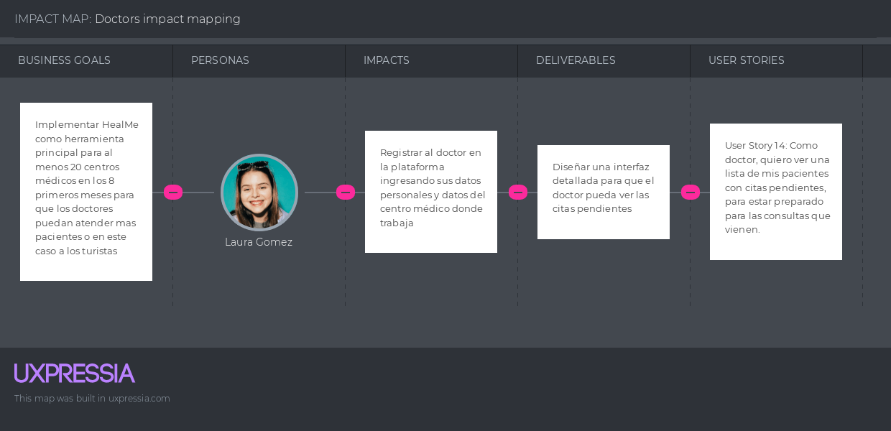

### Business goal 2

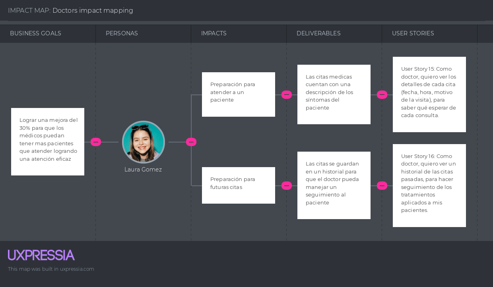

### Business goal 3

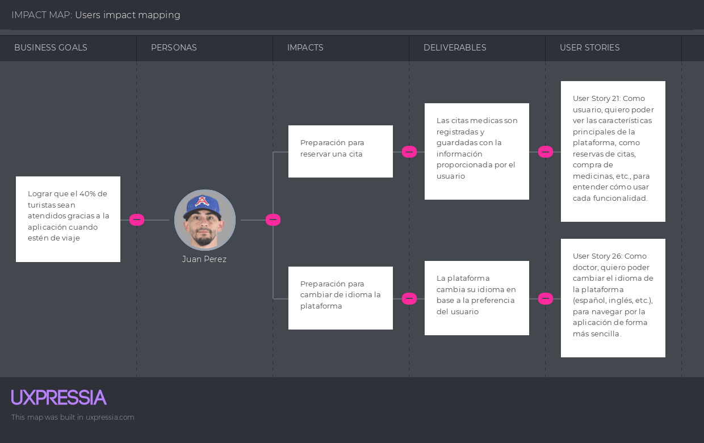

3.4. Product Backlog


### **Historias de Usuario para HealMeApp**

| **# Orden** | **User Story ID** | **Título**                            | **Descripción**                                                                                                           | **Story Points** |
|-------------|-------------------|---------------------------------------|---------------------------------------------------------------------------------------------------------------------------|------------------|
| 1           | US-01             | Buscar medicamentos                   | Como turista, quiero buscar medicamentos por nombre o categoría, para encontrar el producto que necesito.                  | 5                |
| 2           | US-02             | Ver información de medicamentos       | Como turista, quiero ver la información de cada medicamento (precio y descripción), para tomar una decisión informada antes de comprar. | 5                |
| 3           | US-03             | Agregar medicamentos al carrito       | Como turista, quiero agregar medicamentos a mi carrito de compras, para poder comprar varios artículos a la vez.           | 3                |
| 4           | US-04             | Confirmación de compra                | Como turista, quiero recibir una confirmación de compra y detalles de envío, para saber cuándo recibiré mis productos.     | 3                |
| 5           | US-05             | Buscar doctores                       | Como turista, quiero buscar doctores por especialidad y ubicación, para encontrar un profesional que me pueda atender.     | 5                |
| 6           | US-06             | Ver perfil de doctores                | Como turista, quiero ver el perfil de cada doctor, con información como calificaciones y reseñas, para seleccionar al mejor doctor disponible. | 3                |
| 7           | US-07             | Ver disponibilidad de citas           | Como turista, quiero ver la disponibilidad de citas de un doctor, para poder reservar una cita acorde a mi horario.        | 5                |
| 8           | US-08             | Seleccionar fecha y hora de cita      | Como turista, quiero seleccionar una fecha y hora para mi cita, para elegir el momento que más me convenga.                | 3                |
| 9           | US-09             | Confirmación de cita                  | Como turista, quiero recibir una confirmación de la cita reservada, para tener la certeza de que la cita está programada correctamente. | 3                |
| 10          | US-10             | Registro de usuario                   | Como turista, quiero poder registrarme proporcionando mi correo electrónico, contraseña y datos personales básicos, para crear una cuenta en la plataforma. | 2                |
| 11          | US-11             | Inicio de sesión                      | Como turista, quiero poder iniciar sesión después de registrarme, para acceder a la plataforma sin tener que registrarme nuevamente. | 2                |
| 12          | US-12             | Seleccionar centros médicos           | Como turista quiero elegir centros médicos disponibles para ser atendido.                                                  | 2                |
| 13          | US-13             | Ver centros médicos                   | Como turista quiero ver todos los centros médicos disponibles.                                                            | 6                |
| 14          | US-14             | Ver pacientes con citas pendientes    | Como doctor, quiero ver una lista de mis pacientes con citas pendientes, para estar preparado para las consultas que vienen. | 2                |
| 15          | US-15             | Ver detalles de cada cita             | Como doctor, quiero ver los detalles de cada cita (fecha, hora, motivo de la visita), para saber qué esperar de cada consulta. | 5                |
| 16          | US-16             | Ver historial de citas                | Como doctor, quiero ver un historial de las citas pasadas, para hacer seguimiento de los tratamientos aplicados a mis pacientes. | 4                |
| 17          | US-17             | Inicio de sesión para turistas        | Como turista, quiero poder iniciar sesión utilizando mi correo electrónico y contraseña, para acceder a mi cuenta y mis datos personales. | 4                |
| 18          | US-18             | Inicio de sesión para doctores        | Como doctor, quiero poder iniciar sesión con mi correo electrónico y contraseña, para acceder a mi cuenta y gestionar mis citas. | 2                |
| 19          | US-19             | Resumen de citas para doctores        | Como doctor, quiero ver un resumen de las citas pendientes y mis pacientes al iniciar sesión, para estar al tanto de mi agenda. | 1                |
| 20          | US-20             | Ver descripción de la plataforma      | Como usuario, quiero ver una descripción clara y detallada de la plataforma y sus servicios, para entender cómo funciona y qué beneficios me ofrece. | 3                |
| 21          | US-21             | Ver características principales       | Como usuario, quiero poder ver las características principales de la plataforma, como reservas de citas, compra de medicinas, etc., para entender cómo usar cada funcionalidad. | 3                |
| 22          | US-22             | Ver reseñas de la plataforma          | Como usuario, quiero ver las reseñas de otros usuarios sobre la plataforma, para tomar una decisión informada antes de seleccionar un servicio. | 5                |
| 23          | US-23             | Formulario de contacto                | Como usuario, quiero acceder a un formulario de contacto para enviar mis preguntas o inquietudes al equipo de soporte de Heal Me, para obtener asistencia en caso de problemas o dudas. | 2                |
| 24          | US-24             | Información de contacto               | Como usuario, quiero ver el correo y los números de contacto del equipo de soporte en la página de contacto, para tener una opción de contacto directo si lo prefiero. | 1                |
| 25          | US-25             | Seleccionar idioma                    | Como turista, quiero poder seleccionar el idioma de mi preferencia (español, inglés, etc.) en la aplicación, para utilizar la plataforma de manera más cómoda. | 2                |
| 26          | US-26             | Cambiar idioma de la plataforma       | Como doctor, quiero poder cambiar el idioma de la plataforma (español, inglés, etc.), para navegar por la aplicación de forma más sencilla. | 1                |
| 27          | US-27             | Ver lista de doctores                 | Como turista, quiero ver una lista completa de doctores disponibles en la plataforma, para poder elegir al profesional que mejor se adapte a mis necesidades. | 1                |
| 28          | US-28             | Ver lista de centros médicos          | Como turista, quiero ver una lista de todos los centros médicos disponibles en la plataforma, para elegir el que más me convenga según su ubicación y servicios. | 2                |
| 29          | US-29             | Filtrar centros médicos               | Como turista, quiero poder filtrar centros médicos por servicios ofrecidos y ubicación, para encontrar el centro adecuado según mis necesidades. | 2                |
| 30          | US-30             | Volver a la página principal          | Como usuario, quiero poder volver a la página principal de la plataforma con un solo clic, para navegar fácilmente si me pierdo en el sitio. | 3                |
| 31          | TS-01             | Agregar nuevos productos              | Como desarrollador backend, quiero agregar nuevos productos a la base de datos, para mantener el catálogo actualizado. | 3                |
| 32          | TS-02             | Editar productos                      | Como desarrollador backend, quiero editar los detalles de los productos existentes, para actualizar precios o descripciones según sea necesario. | 1                |
| 33          | TS-03             | Eliminar productos                    | Como desarrollador backend, quiero eliminar productos que ya no están disponibles en la plataforma, para mantener el catálogo limpio y preciso. | 5                |
| 34          | TS-04             | Agregar nuevos doctores               | Como desarrollador backend, quiero agregar nuevos doctores a la base de datos, para mantener la lista de profesionales actualizada. | 2                |
| 35          | TS-05             | Editar doctores                       | Como desarrollador backend, quiero editar la información de los doctores existentes, para corregir errores o actualizar información relevante. | 3                |
| 36          | TS-06             | Eliminar doctores                     | Como desarrollador backend, quiero eliminar doctores que ya no están disponibles en la plataforma, para mantener la base de datos limpia y actualizada. | 3                |
| 37          | TS-07             | Agregar centros médicos               | Como desarrollador backend, quiero agregar nuevos centros médicos a la base de datos, para mantener la lista de centros actualizada. | 6                |
| 38          | TS-08             | Editar centros médicos                | Como desarrollador backend, quiero editar la información de los centros médicos existentes, para asegurar que los detalles sean precisos. | 3                |
| 39          | TS-09             | Eliminar centros médicos              | Como desarrollador backend, quiero eliminar centros médicos que ya no están disponibles, para mantener la base de datos precisa. | 4                |


## Capítulo IV: Product Design

4.1. Style Guidelines

4.1.1. General Style Guidelines

Las **Guías Generales de Estilo** establecen las bases para mantener una apariencia y sensación coherente en toda la plataforma "HEALME". Estas directrices aseguran que todos los elementos visuales y de comunicación estén alineados con la identidad de la marca y proporcionen una experiencia de usuario óptima.

### Elementos Clave:

- **Identidad de Marca:**
  - **Logo:** El logo de HEALME debe ser claro y reconocible, utilizando los colores principales de la marca.
  - **Paleta de Colores:** Se utilizarán tonos verdes claros para títulos importantes, tonos oscuros para los fondos y tonos blancos para el texto, asegurando un contraste adecuado para una lectura fácil.
  


- **Tipografía:**
  - **Fuente Principal:** Utilizar una fuente sans-serif moderna y legible, como **Roboto** o **Open Sans**.
  - **Jerarquía Tipográfica:** Establecer tamaños y pesos de fuente distintos para títulos, subtítulos, cuerpo de texto y elementos destacados.

- **Espaciado y Layout:**
  - **Márgenes y Padding:** Mantener un espaciado consistente entre elementos para una apariencia limpia y ordenada.
  - **Grid System:** Utilizar un sistema de cuadrícula para alinear y organizar el contenido de manera coherente.

- **Iconografía y Gráficos:**
  - **Estilo de Iconos:** Usar iconos simples y lineales que se integren con el diseño general.
  - **Imágenes:** Utilizar imágenes de alta calidad que reflejen la diversidad de los usuarios y proveedores de servicios médicos.

- **Tono y Voz:**
  - **Comunicación:** Mantener un tono profesional, amigable y accesible.
  - **Lenguaje Claro:** Evitar jerga técnica innecesaria y asegurar que la información sea comprensible para todos los usuarios.

4.1.2. Web Style Guidelines

Las **Guías de Estilo Web** se enfocan en los aspectos específicos del diseño para la plataforma digital, asegurando una experiencia de usuario consistente y atractiva.


### Elementos Específicos:

- **Colores:**
  - **Títulos Importantes:** Verde claro (#A8D5BA) para resaltar títulos y llamadas a la acción.
  - **Fondos:** Tonos oscuros (#2C3E50, #34495E) para crear un contraste elegante y profesional.
  - **Texto:** Blanco puro (#FFFFFF) para garantizar legibilidad sobre fondos oscuros.

- **Tipografía Web:**
  - **Fuente Principal:** Roboto, Open Sans o similar para una lectura fluida en pantallas.
  - **Tamaños:**
    - **Título Principal (H1):** 32px
    - **Subtítulos (H2, H3):** 24px, 20px
    - **Cuerpo de Texto:** 16px
    - **Pequeños Detalles:** 14px

- **Botones y Elementos Interactivos:**
  - **Botones Primarios:** Verde claro con texto blanco, borde redondeado.
  - **Botones Secundarios:** Tonos oscuros con texto blanco.
  - **Estados de Botón:** Hover, activo y deshabilitado deben estar claramente diferenciados.

- **Imágenes y Multimedia:**
  - **Formato:** Preferentemente JPEG o PNG para imágenes estáticas, y MP4 para videos.
  - **Optimización:** Comprimir imágenes para mejorar tiempos de carga sin sacrificar calidad.

- **Responsividad:**
  - **Diseño Adaptable:** Asegurar que la plataforma se visualice correctamente en dispositivos móviles, tablets y desktops.
  - **Breakpoints:** Definir puntos de quiebre para ajustar el layout según el tamaño de la pantalla.

- **Accesibilidad:**
  - **Contraste de Colores:** Asegurar que el contraste entre el texto y el fondo cumpla con los estándares de accesibilidad.
  - **Etiquetas Alt:** Incluir descripciones alternativas en todas las imágenes para usuarios con discapacidades visuales.
  - **Navegación con Teclado:** Garantizar que todos los elementos interactivos sean accesibles mediante el teclado.
4.2. Information Architecture
    
  La **Arquitectura de la Información** define cómo se organiza y estructura el contenido dentro de la plataforma "HEALME", facilitando la navegación y el acceso a la información por parte de los usuarios.

4.2.1. Organization Systems

**Sistemas de Organización** determinan la manera en que se agrupan y categorizan los contenidos en la plataforma.

### Estructura Principal:

- **Home/Landing Page:** Introducción a HEALME, características principales, testimonios y llamadas a la acción.
- **Buscar Servicios Médicos:** Herramienta de búsqueda avanzada por ubicación, especialidad y precio.
- **Perfil del Proveedor:** Página individual para cada centro médico con detalles, horarios, precios y reseñas.
- **Reservas/Citas:** Sección para gestionar reservas de citas médicas.
- **Historial Médico:** Registro de citas pasadas y detalles de tratamientos.
- **Sobre Nosotros:** Información sobre la startup, misión, visión y equipo.
- **Contacto y Soporte:** Formulario de contacto, preguntas frecuentes y soporte en línea.
- **Blog/Recursos:** Artículos y recursos relacionados con la salud y viajes.

### Modelos de Organización Utilizados:

- **Jerárquico:** Estructura de árbol donde la información se organiza de lo general a lo específico.
- **Secuencial:** Flujo lógico de pasos para completar tareas, como reservar una cita.
- **Red:** Conexiones entre diferentes secciones para facilitar el acceso rápido a información relacionada.
  
4.2.2. Labeling Systems

**Sistemas de Etiquetado** se refieren a cómo se nombran y categorizan los elementos dentro de la plataforma para asegurar claridad y coherencia.

### Directrices de Etiquetado:

- **Consistencia:** Utilizar términos uniformes en todas las secciones (e.g., "Cita Médica" en lugar de "Reserva" o "Cita").
- **Claridad:** Los nombres deben ser descriptivos y fáciles de entender para los usuarios.
- **Concisión:** Evitar etiquetas largas; mantener los nombres breves pero informativos.
- **Relevancia:** Asegurarse de que las etiquetas reflejen fielmente el contenido o la función correspondiente.

### Ejemplos de Etiquetas:

- **Inicio**
- **Buscar Médicos**
- **Mis Citas**
- **Perfil del Médico**
- **Comparar Precios**
- **Reseñas**
- **Contacto**
- **Soporte**
- **Blog**
- **Acerca de**

4.2.3. SEO Tags and Meta Tags

**Etiquetas SEO y Meta** son fundamentales para mejorar la visibilidad de la plataforma en motores de búsqueda y para proporcionar información esencial a los navegadores y redes sociales.

### Directrices para SEO y Meta Tags:

- **Title Tags:**
  - Descriptivos y únicos para cada página.
  - Incluir palabras clave relevantes (e.g., "Reservar Cita Médica en el Extranjero | HEALME").

- **Meta Descriptions:**
  - Resumen conciso de la página (150-160 caracteres).
  - Incluir palabras clave y un llamado a la acción.

- **Header Tags (H1, H2, H3):**
  - Usar H1 para el título principal de la página.
  - Utilizar H2 y H3 para subtítulos y secciones.

- **Alt Text para Imágenes:**
  - Descripciones claras y precisas de las imágenes.
  - Incluir palabras clave cuando sea relevante.

- **URL Amigables:**
  - URLs cortas y descriptivas (e.g., `healmé.com/buscar-medicos`).

- **Keywords:**
  - Investigación y selección de palabras clave relevantes para cada sección.
  - Integrar de manera natural en el contenido.

- **Open Graph Tags:**
  - Optimizar la apariencia de las páginas cuando se comparten en redes sociales.
  - Incluir título, descripción, imagen y URL.

### Ejemplo de Meta Tags para la Página de Inicio:

```html
<head>
  <title>HEALME | Reserva Citas Médicas en el Extranjero</title>
  <meta name="description" content="HEALME te permite buscar, comparar y reservar citas médicas en cualquier parte del mundo de manera rápida y transparente.">
  <meta property="og:title" content="HEALME | Reserva Citas Médicas en el Extranjero">
  <meta property="og:description" content="Accede a servicios médicos de calidad en tus destinos de viaje con HEALME.">
  <meta property="og:image" content="URL_de_la_imagen">
  <meta property="og:url" content="https://healmé.com">
</head>
```
4.2.4. Searching Systems

4.2.5. Navigation Systems

4.3. Landing Page UI Design


4.3.1. Landing Page Wireframe


4.3.2. Landing Page Mock-up

%20(1).jpg)
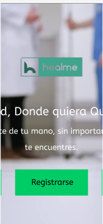
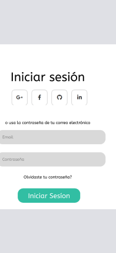

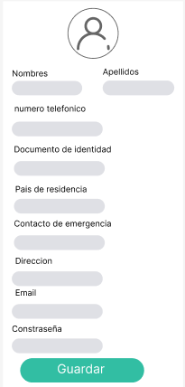


4.4. Web Applications UX/UI Design


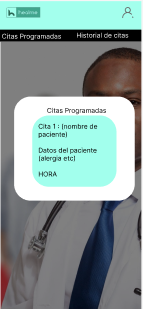
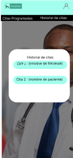


4.4.1. Web Applications Wireframes


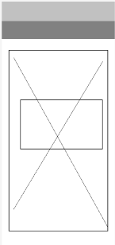
    


4.4.2. Web Applications Wireflow Diagrams

link [lucidchart](https://lucid.app/lucidchart/894ea71f-a5fb-4f49-918a-7a3ba6b6542b/edit?viewport_loc=-1420%2C4811%2C5935%2C2778%2C0_0&invitationId=inv_79013474-b8a7-4bb2-913b-9eedaeeac46f)

## User Goal Log in:
El usuario inicia sesión para poder usar la aplicación
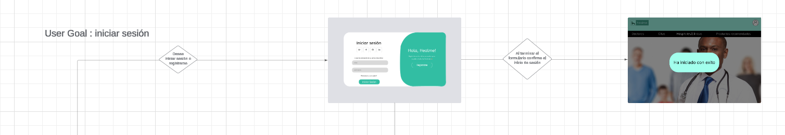

## User Goal Register:
El usuario se registra para poder usar la aplicación
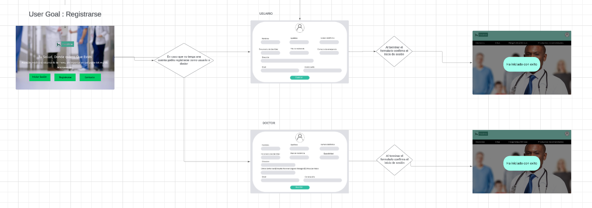

## User Goal Reservar cita:
El usuario Reserva una cita eligiendo el doctor y hospital para poder asistir para que sea atendido


## User Goal ver historial de citas:
El usuario despues de reservar su cita desea revisar el historial de citas para ver que su cita se registro correctamente

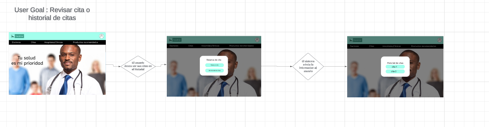

## User Goal ver citas programadas como doctor:
El doctor desea ver las citas programadas del paciente que lo eligió para asi poder prepararse para antenderlo

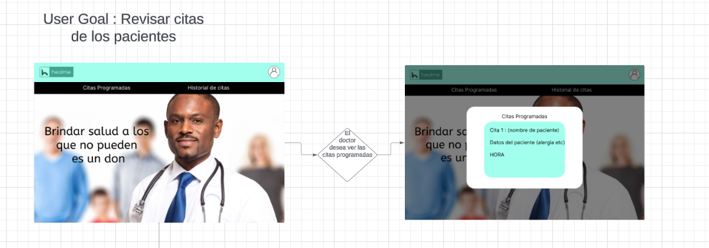

## User Goal ver historial de citas como doctor:
El doctor puede visualizar el historial de citas que atendio a los pacientes

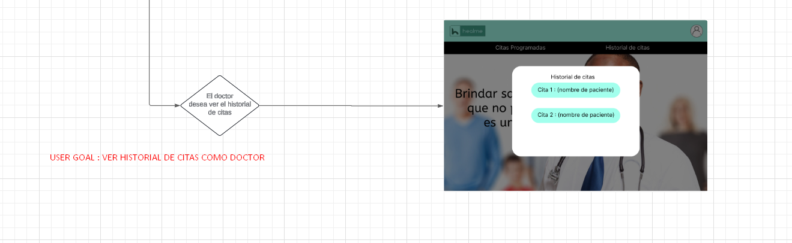

4.4.3. Web Applications Mock-ups


4.4.4. Web Applications User Flow Diagrams


4.5. Web Applications Prototyping


4.6. Domain-Driven Software Architecture

4.6.1. Software Architecture Context Diagram
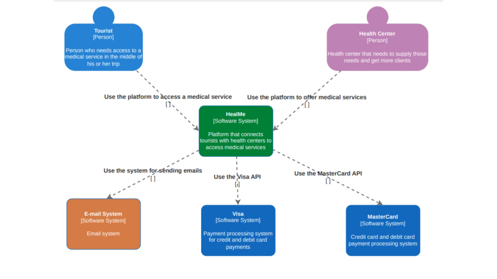
4.6.2. Software Architecture Container Diagrams

4.6.3. Software Architecture Components Diagrams
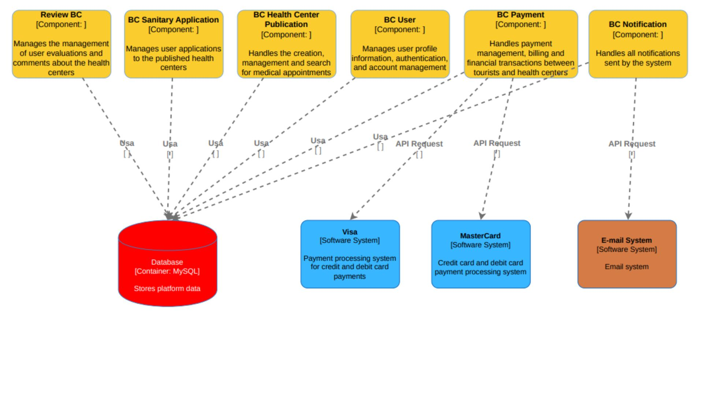
4.7. Software Object-Oriented Design
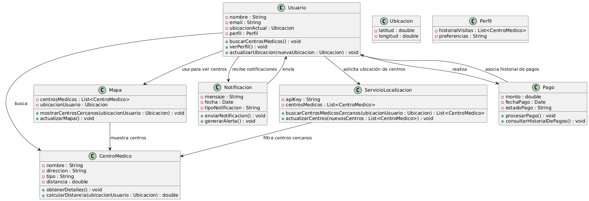
4.7.1. Class Diagrams

4.7.2. Class Dictionary

1. Componentes Principales (Vue.js)
src/App.vue: Es el componente principal de la aplicación, en el que se integran otros componentes secundarios como:
Footer
Header
Toolbar
Estos subcomponentes se importan en el archivo App.vue, lo que indica que este archivo gestiona la estructura básica de la interfaz.

layouts/MainLayout.component.vue: Probablemente se encarga de definir la estructura global del diseño de la aplicación, utilizando otros componentes como el Toolbar.

Doctors/Doctors.component.vue: Maneja la funcionalidad relacionada con la gestión de doctores, como enDoctors y esDoctors, sugiriendo que admite múltiples idiomas. También hay un observador (watch) para detectar cambios en las propiedades.

Hospitals/Hospitals.component.vue: Similar al de doctores, pero centrado en hospitales. Maneja variables como enHospitals y esHospitals para gestionar datos hospitalarios en diferentes idiomas.

Products/RecommendedProducts.component.vue: Gestiona la lógica para productos recomendados, con soporte multilingüe (enRecommendedProducts, esRecommendedProducts).

2. Archivos de Internacionalización (i18n)
El diagrama muestra un soporte claro para la internacionalización (i18n):

Archivos JSON como locales/en.doctors.json, locales/es.doctors.json, locales/en.hospitals.json, y locales/es.hospitals.json contienen traducciones o datos en diferentes idiomas.
src/i18n.js: Este archivo probablemente inicializa y configura la funcionalidad de i18n en la aplicación, permitiendo la alternancia entre idiomas (en, es).
Los archivos de locales están vinculados a componentes específicos, asegurando que los datos se muestren en el idioma correcto según el contexto.

3. Rutas (Vue Router)
src/router.js: Define las rutas de la aplicación, conectando vistas como:
DoctorView
DoctorViewHistory
Hospitals
MainImage
RecommendedProducts
El archivo gestiona tanto la creación de rutas como el historial de navegación (createRouter, createWebHistory), lo que permite la navegación entre las diferentes vistas de la aplicación.

4. Dependencias y Estilos
assets/main.css: Hoja de estilos CSS que contiene las reglas visuales para el proyecto.
primeicons/primeicons.css: Se refiere a una biblioteca de iconos, probablemente utilizada en los botones o menús de la aplicación.
assets/profile-pic.png y assets/main-image.png: Son recursos de imágenes que probablemente se utilizan en la interfaz de usuario, en componentes como el Header o Footer.
5. Otros Componentes y Elementos Notables
LanguageSwitcher/LanguageSwitcher.vue: Un componente que permite cambiar entre idiomas, haciendo referencia al archivo i18n.js.
Header/Header.component.vue: Se encarga de la cabecera de la aplicación, donde también se incluye el selector de idiomas.
Footer/Footer.component.vue: Define el pie de página de la aplicación, que podría contener enlaces importantes o información de contacto.
Toolbar/Toolbar.component.vue: Un menú o barra de herramientas que incluye botones (Button) y un diálogo (Dialog) para la interacción con los usuarios.
6. Gestión de Vistas y Datos
DoctorView/DoctorViewHistory.vue y DoctorView.vue: Estas vistas están relacionadas con la visualización de información de doctores y su historial.
Hospitals/Hospitals.component.vue: Maneja las vistas y datos relacionados con los hospitales.
RecommendedProducts.component.vue: Se centra en la visualización y recomendación de productos.
Conexiones Generales:
Los componentes están bien estructurados, organizados por funcionalidad (Doctores, Hospitales, Productos).
Se utiliza una clara estructura de rutas y manejo de datos internacionales mediante archivos de locales JSON.
Los componentes comparten estilos comunes mediante archivos CSS y bibliotecas de iconos (primeicons).
4.8. Database Design

4.8.1. Database Diagram
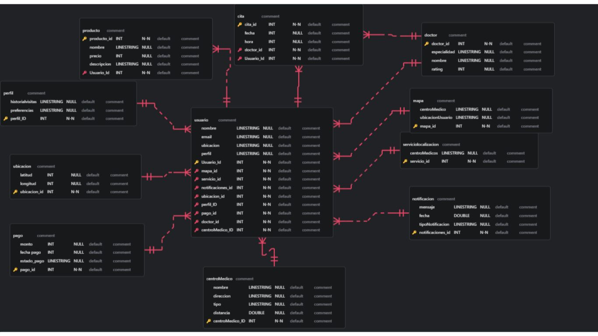
## Capítulo V: Product Implementation, Validation & Deployment

5.1. Software Configuration Management

5.1.1. Software Development Environment Configuration

Para el desarrollo de nuestro proyecto Usaremos webstorm, lo hemos dividido en 2 partes, uno el landing page donde se usará javascript, html y css , en la aplicación web utilizaremos Vue.js como framework de javascript, también se utilizará HTML ya que principalmente se encarga de este tipo de proyectos y completamos con CSS para agregar estética.

5.1.2. Source Code Management

Github Desktop es una aplicación de código abierto que ayuda a trabajar con código hospedado en github u otros servicios de hospedaje de Git. Contamos con 2 repositorios en Github , el primero es donde está el landing page y el segundo es donde están los criterios de aceptación.

Repositorio donde esta el landing page y la documentacion (https://github.com/HealMe-Team/HealMe)

Repositorio donde esta la aplicación web (https://github.com/HealMe-Team/Heal-Me-APP)


5.1.3. Source Code Style Guide & Conventions

En nuestro proyecto basado en Vue.js es esencial establecer un estilo de codificación para tener coherencia y código limpio en el proyecto. Nos apoyaremos con la guía oficial de Vue, tomando esto en cuenta cumpliremos con tener un código limpio y coherente.

5.1.4. Software Deployment Configuration

Evidencia del deploy
 


5.2. Landing Page, Services & Applications Implementation

5.2.1. Sprint 1

5.2.1.1. Sprint Planning 1

| Sprint | Date       | Time      | Location                    | Prepared by       | Attendees                                                                 |
|--------|------------|-----------|-----------------------------|-------------------|---------------------------------------------------------------------------|
| 1      | 28/08/2024 | 3:22 pm  | Reunión Virtual en Discord   | Rodrigo Alcántara | Diego Alonso, Luis Cisneros                   |

| Sprint 1 - Review Summary                                                                 |
|-------------------------------------------------------------------------------------------|
| Avanzar el landing page y brindar sugerencias para el estilo de la página                   |

| Sprint 1 - Retrospective Summary                                                          |
|-------------------------------------------------------------------------------------------|
| Se destacó la importancia de completar el landing page para nuestro proyecto                                            |

| Sprint 1 Goal                                                                            | Sprint 1 Velocity | Sum of Story Points |
|------------------------------------------------------------------------------------------|-------------------|---------------------|
|  El objetivo que tenemos es mejorar las funcionalidades de la página web, por ahora hemos agregado el contactenos, nos falta el log in y register                    | 5                 | 13                  |


### Objetivo Principal del Sprint

El objetivo principal del Sprint 1 es implementar las funcionalidades básicas de la plataforma HealMe, que incluyen el inicio de sesión de usuarios, la capacidad de reservar citas médicas, y la visualización del historial de citas. Además, se busca implementar las notificaciones de confirmación de reserva.


5.2.1.2. Sprint Backlog 1

| **User Story ID** | **Título**                                | **Work-Item/Task ID** | **Título**                          | **Descripción**                                                                                                                     | **Estimación (Horas)** | **Asignado a** | **Estado**            |
|-------------------|-------------------------------------------|-----------------------|-------------------------------------|-------------------------------------------------------------------------------------------------------------------------------------|------------------------|----------------|-----------------------|
| US-01             | Buscar y agregar medicinas al carrito      | TSK-001               | Crear funcionalidad de búsqueda     | Implementar la funcionalidad de búsqueda de medicinas y la capacidad de agregar productos al carrito de compra.                      | 6                     | Rodrigo            | In-Process            |
| US-02             | Realizar el pago de las medicinas          | TSK-002               | Integrar sistema de pagos           | Configurar e integrar un sistema de pagos seguro para la compra de medicinas.                                                        | 8                      | Rodrigo         | To-Do                 |
| US-03             | Buscar y seleccionar un doctor             | TSK-003               | Crear pantalla de selección de doctor | Desarrollar la interfaz para que los usuarios puedan buscar, ver perfiles y seleccionar doctores disponibles para consultas.          | 10                     | Diego          | In-Process            |
| US-04             | Ver el historial de citas                  | TSK-004               | Crear pantalla de historial de citas | Implementar la funcionalidad que permite a los usuarios visualizar su historial de citas, con detalles como fecha, hora y doctor.     | 8                      | Diego           | To-Do                 |
| US-05             | Reservar una cita médica                   | TSK-005               | Crear sistema de reserva            | Implementar la interfaz y backend para que los usuarios puedan reservar citas médicas seleccionando fecha y hora.                    | 4                     | Diego          | In-Process            |
| US-05             | Reservar una cita médica                   | TSK-006               | Mostrar mensaje de confirmacion       | Implementar el sistema de mensaje de confirmacion de la cita medica                   | 4                      | Diego          | To-Do                 |
| US-07             | Registrarme en la aplicación               | TSK-007               | Crear formulario de registro        | Desarrollar la funcionalidad para que los usuarios puedan registrarse con sus datos personales, correo electrónico y contraseña.     | 4                     | Luis           | To-Do                 |
| US-09             | Ver y elegir un centro médico              | TSK-008               | Mostrar lista de centros médicos    | Implementar la pantalla que muestra la lista de centros médicos con detalles y filtros como ubicación y especialidades disponibles.   | 4                      | Luis        | In-Process            |
| US-10             | Ver citas pendientes del doctor            | TSK-009               | Crear vista de citas pendientes     | Desarrollar la funcionalidad que permite al doctor visualizar las citas pendientes y filtrar por fechas.                             | 5                      | Diego          | In-Process            |
| US-11             | Ver historial de citas terminadas del doctor| TSK-010               | Mostrar historial de citas          | Implementar la funcionalidad que permite al doctor ver el historial de citas completadas, con detalles de cada paciente atendido.     | 6                      | Luis          | To-Do                 |


5.2.1.3. Development Evidence for Sprint Review

### Sprint 1

En este Sprint, hemos logrado implementar las funcionalidades principales de la plataforma HealMe, como la reserva de citas médicas, la confirmación de reservas, y la visualización del historial de citas. Estas implementaciones corresponden a las secciones críticas de la plataforma, permitiendo a los usuarios acceder a servicios médicos en ubicaciones desconocidas. A continuación, se presentan los avances en la implementación a través de los commits realizados en los repositorios involucrados en el desarrollo de estas funcionalidades.


| **Repository**   | **Branch**   | **Commit ID** | **Commit Message**             | **Commit Message Body**                                                       | **Committed on (Date)** |
|------------------|--------------|---------------|--------------------------------|--------------------------------------------------------------------------------|-------------------------|
|  Healme  |  main  |    index.html   |      index.html file added           |       Landing Added      | 2024-09-01              |


5.2.1.4. Testing Suite Evidence for Sprint Review

Durante este Sprint, se realizaron pruebas automatizadas para asegurar el correcto funcionamiento de los Web Services relacionados con los User Stories especificados. Se desarrollaron Unit Tests, Integration Tests, y Acceptance Tests utilizando el enfoque BDD. Las pruebas abarcaron funcionalidades como búsqueda de clínicas, reserva de citas médicas y manejo del perfil de usuario.

| **Repository**      | **Branch**           | **Commit ID** | **Commit Message**                              | **Commit Message Body**                                                                  | **Committed on (Date)** |
|---------------------|----------------------|---------------|-------------------------------------------------|------------------------------------------------------------------------------------------|-------------------------|
| Healme      | main         | US-003.feature       | Create US-003.feature          | Añadido del Acceptance-Test.                      | 2024-09-03              |
| Healme      | main         | US-005.feature       | Create US-005.feature          | Añadido del Acceptance-Test.                      | 2024-09-04              |
| Healme      | main         | US-006.feature       | Create US-006.feature          | Añadido del Acceptance-Test.                      | 2024-09-05              |
| Healme      | main         | US-009.feature       | Create US-009.feature          | Añadido del Acceptance-Test.                      | 2024-09-05              |


5.2.1.5. Execution Evidence for Sprint Review

Aqui mostramos la evidencia del landing page
En el landing page tenemos un about us para poder informar al usuario que servicio ofrecemos, el landing page tambien cuenta con un sistema de reseñas para que el usuario pueda ver comentarios de otros usuarios.


5.2.1.6. Services Documentation Evidence for Sprint Review

## Servicios Documentación Evidencia para la Revisión del Sprint

### Introducción
Durante este Sprint, hemos logrado documentar los servicios web relacionados con la plataforma "HEALME". La documentación incluye los endpoints que pronto se implemetarán, describiendo las acciones soportadas, verbos HTTP, parámetros, y ejemplos de respuestas. Esta sección proporciona una visión general de los endpoints desarrollados y su integración con la plataforma. (estan en proceso)

| **Endpoint**       | **Acción Implementada**          | **Verbo HTTP** | **Sintaxis de Llamada**                         | **Parámetros**                    | **Ejemplo de Response**          | **Explicación del Response**                                               |
|--------------------|---------------------------------|----------------|-------------------------------------------------|----------------------------------|----------------------------------|---------------------------------------------------------------------------|
| /clinics/search    | Buscar clínicas cercanas         | GET            | `/clinics/search?location={location}`           | location (string)                | `{ "clinics": [ ... ] }`         | Lista de clínicas cercanas con detalles básicos.                           |
| /clinics/filter    | Filtrar clínicas por especialidad| GET            | `/clinics/filter?specialty={specialty}`         | specialty (string)               | `{ "clinics": [ ... ] }`         | Lista de clínicas que ofrecen la especialidad seleccionada.                |
| /clinics/compare   | Comparar clínicas                | POST           | `/clinics/compare`                              | clinic_ids (array of strings)    | `{ "comparison": { ... } }`      | Comparación de clínicas seleccionadas basada en calificaciones y precios. |
| /clinics/{id}      | Detalles de la clínica           | GET            | `/clinics/{id}`                                 | id (string)                      | `{ "clinic": { ... } }`          | Detalles completos de la clínica específica.                              |
| /appointments      | Reservar cita médica             | POST           | `/appointments`                                 | clinic_id (string), date (string), time (string) | `{ "appointment": { ... } }` | Confirmación de la reserva de cita médica.                                |
| /appointments/{id} | Confirmación de la reserva       | GET            | `/appointments/{id}`                            | id (string)                      | `{ "appointment": { ... } }`     | Confirmación de detalles de la cita médica.                               |
| /clinics/{id}/map  | Ver ubicación de la clínica      | GET            | `/clinics/{id}/map`                             | id (string)                      | `{ "map_url": "url" }`           | URL del mapa con la ubicación de la clínica.                               |
| /navigation        | Navegar hasta la clínica          | GET            | `/navigation?clinic_id={clinic_id}&current_location={current_location}` | clinic_id (string), current_location (string) | `{ "directions": [ ... ] }`  | Instrucciones de navegación desde la ubicación actual hasta la clínica.    |
| /profile           | Crear perfil de usuario           | POST           | `/profile`                                      | user_info (object)               | `{ "profile": { ... } }`         | Confirmación de la creación del perfil del usuario.                        |
| /profile/{id}      | Actualizar perfil de usuario      | PUT            | `/profile/{id}`                                 | id (string), user_info (object)  | `{ "profile": { ... } }`         | Confirmación de la actualización del perfil del usuario.                   |                 |

### Capturas de Pantalla


5.2.1.7. Software Deployment Evidence for Sprint Review

## Software Deployment Evidencia para la Revisión del Sprint
Aqui hay una evidencia de que se ha hecho un deploy, se adjunta el link: https://roiander.github.io/HealMe/

Se evidencia las funcionalidades del landing page y se muestra la informacion del producto.


5.2.1.8. Team Collaboration Insights during Sprint

Para el desarrollo de la primera versión de la plataforma, el equipo realizó el trabajo de forma colaborativa y equitativa. En la siguiente tabla se mostrará la relación que posee cada integrante y las estadísticas de sus commits.

| Integrantes                           | Usuario          | Rol        |
|---------------------------------------|------------------|------------|
| Alonso Garay, Diego Jesus             | DiegoAlonso04    | Colaborador|
| Cisneros Salas, Luis Angel    | LuisCS341 | Colaborador|
| Alcántara Cruz, Rodrigo Alonso    | Roiander | Admin |


### 5.2.2. Sprint 2 

5.2.2.1. Sprint Planning 2

| Sprint 2                           |                                     |
|------------------------------------|-------------------------------------|
| **Sprint Planning Background**     |                                     |
| Date                               | 28/08/2024                                     |
| Time                               | 10:12 am                                     |
| Location                           | Reunión Virtual en Discord                                    |
| Prepared By                        | Rodrigo Alcántara                                     |
| Attendees (to planning meeting)    | Diego Alonso, Luis Cisneros                                      |
| Sprint n - 2 Review Summary        | Avanzar la primera version de HealMe                                     |
| Sprint n - 2 Retrospective Summary | Se destacó la importancia de avanzar la app web para nuestro proyecto                                      |
| **Sprint Goal & User Stories**     |                                     |
| Spring 2 Goal                      | El objetivo que tenemos es implementar los routes para que el toolbar redirija a otras funcionalidades de la app                                    |
| Sprint 2 Velocity                  |  Estimamos para este Sprint tener 5 Story Points                                    |
| Sum of Story Points                |  Cumplimos con la cantidad de 13 Story Points                                   |


### 5.2.2.2. Sprint Backlog 2. 

### Sprint 2

### Objetivo Principal del Sprint

El objetivo principal del Sprint 2 es implementar las funcionalidades básicas de la plataforma HealMe, que incluyen el inicio de sesión de usuarios, la capacidad de reservar citas médicas, y la visualización del historial de citas. Además, se busca implementar las notificaciones de confirmación de reserva.

Enlace del sprint en Trello: https://trello.com/invite/b/66da07a121d7f4b87735bab5/ATTI5580c46e73dbba23538e9fcb71477cfdBCAAB835/sprint-healme

### Tabla del Sprint Backlog

## Sprint Backlog 2

| **User Story ID** | **Título**                                | **Work-Item/Task ID** | **Título**                          | **Descripción**                                                                                                                     | **Estimación (Horas)** | **Asignado a** | **Estado**            |
|-------------------|-------------------------------------------|-----------------------|-------------------------------------|-------------------------------------------------------------------------------------------------------------------------------------|------------------------|----------------|-----------------------|
| US-01             | Buscar y agregar medicinas al carrito     | TSK-001               | Crear funcionalidad de búsqueda     | Implementar la funcionalidad de búsqueda de medicinas y la capacidad de agregar productos al carrito de compra.                      | 5                     | Rodrigo        | Done                  |
| US-01             | Buscar y agregar medicinas al carrito     | TSK-002               | Crear interfaz de búsqueda          | Diseñar la interfaz de usuario para la búsqueda de medicinas, incluyendo filtros y opciones de búsqueda avanzada.                   | 3                     | Rodrigo        | Pending               |
| US-01             | Buscar y agregar medicinas al carrito     | TSK-003               | Pruebas de funcionalidad de carrito | Realizar pruebas para asegurar que las medicinas se añaden correctamente al carrito.                                                | 2                     | Rodrigo        | Pending               |
| US-02             | Realizar el pago de las medicinas         | TSK-004               | Integrar sistema de pagos           | Configurar e integrar un sistema de pagos seguro para la compra de medicinas.                                                        | 8                     | Rodrigo        | Done                  |
| US-02             | Realizar el pago de las medicinas         | TSK-005               | Crear interfaz de pago              | Diseñar la pantalla de pago que permita seleccionar el método y confirmar la compra de las medicinas.                                | 4                     | Rodrigo        | Pending               |
| US-02             | Realizar el pago de las medicinas         | TSK-006               | Pruebas de integración de pagos     | Realizar pruebas para asegurar la correcta integración y funcionamiento del sistema de pagos.                                       | 3                     | Rodrigo        | Pending               |
| US-03             | Buscar y seleccionar un doctor            | TSK-007               | Crear pantalla de selección de doctor | Desarrollar la interfaz para que los usuarios puedan buscar, ver perfiles y seleccionar doctores disponibles para consultas.          | 8                     | Diego          | Done                  |
| US-03             | Buscar y seleccionar un doctor            | TSK-008               | Filtrar y ordenar doctores          | Implementar filtros por especialidad y ordenar la lista de doctores para facilitar la selección.                                    | 4                     | Diego          | Pending               |
| US-03             | Buscar y seleccionar un doctor            | TSK-009               | Pruebas de selección de doctor      | Realizar pruebas para asegurar que el usuario puede seleccionar un doctor correctamente y que se guarda su elección.                | 2                     | Diego          | Pending               |
| US-04             | Ver el historial de citas                 | TSK-010               | Crear pantalla de historial de citas | Implementar la funcionalidad que permite a los usuarios visualizar su historial de citas, con detalles como fecha, hora y doctor.    | 8                     | Diego          | Done                  |
| US-04             | Ver el historial de citas                 | TSK-011               | Filtrar y ordenar historial         | Permitir a los usuarios ordenar y filtrar el historial de citas por fecha y tipo de consulta.                                       | 3                     | Diego          | Pending               |
| US-05             | Reservar una cita médica                  | TSK-012               | Crear sistema de reserva            | Implementar la interfaz y backend para que los usuarios puedan reservar citas médicas seleccionando fecha y hora.                   | 4                     | Diego          | Done                  |
| US-05             | Reservar una cita médica                  | TSK-013               | Mostrar mensaje de confirmación     | Implementar el sistema de mensaje de confirmación de la cita médica.                                                                 | 4                     | Diego          | Done                  |
| US-05             | Reservar una cita médica                  | TSK-014               | Recordatorio de citas               | Crear una función para enviar recordatorios a los usuarios sobre sus citas próximas.                                                | 2                     | Diego          | Pending               |
| US-07             | Registrarme en la aplicación              | TSK-015               | Crear formulario de registro        | Desarrollar la funcionalidad para que los usuarios puedan registrarse con sus datos personales, correo electrónico y contraseña.    | 5                     | Luis           | Done                  |
| US-07             | Registrarme en la aplicación              | TSK-016               | Validación de datos de registro     | Implementar validaciones para los campos del formulario de registro, como formato de correo y fuerza de contraseña.                 | 3                     | Luis           | Pending               |
| US-09             | Ver y elegir un centro médico             | TSK-017               | Mostrar lista de centros médicos    | Implementar la pantalla que muestra la lista de centros médicos con detalles y filtros como ubicación y especialidades disponibles. | 8                     | Luis           | Done                  |
| US-09             | Ver y elegir un centro médico             | TSK-018               | Filtrar centros médicos             | Agregar funcionalidad de filtro para que los usuarios puedan buscar centros médicos según la ubicación y especialidad.             | 4                     | Luis           | Pending               |
| US-09             | Ver y elegir un centro médico             | TSK-019               | Pruebas de selección de centro      | Realizar pruebas para confirmar que los usuarios pueden seleccionar un centro médico correctamente.                                 | 2                     | Luis           | Pending               |
| US-10             | Ver citas pendientes del doctor           | TSK-020               | Crear vista de citas pendientes     | Desarrollar la funcionalidad que permite al doctor visualizar las citas pendientes y filtrar por fechas.                           | 5                     | Diego          | Done                  |
| US-10             | Ver citas pendientes del doctor           | TSK-021               | Pruebas de citas pendientes         | Realizar pruebas para asegurar que el doctor puede ver y gestionar las citas pendientes correctamente.                             | 3                     | Diego          | Pending               |
| US-11             | Ver historial de citas terminadas del doctor | TSK-022            | Mostrar historial de citas          | Implementar la funcionalidad que permite al doctor ver el historial de citas completadas, con detalles de cada paciente atendido.  | 6                     | Luis           | Done                  |
| US-11             | Ver historial de citas terminadas del doctor | TSK-023            | Filtrar y ordenar historial de citas | Permitir al doctor filtrar y ordenar el historial de citas por fecha y tipo de consulta.                                            | 3                     | Luis           | Pending               |


### 5.2.2.3. Development Evidence for Sprint Review. 

### Sprint 2

En este Sprint, hemos logrado implementar las funcionalidades principales de la plataforma HealMe de forma completa, como la reserva de citas médicas, la confirmación de reservas, y la visualización del historial de citas. Estas implementaciones corresponden a las secciones críticas de la plataforma, permitiendo a los usuarios acceder a servicios médicos en ubicaciones desconocidas. A continuación, se presentan los avances en la implementación a través de los commits realizados en los repositorios involucrados en el desarrollo de estas funcionalidades.


| **Repository**   | **Branch**   | **Commit ID** | **Commit Message**             | **Commit Message Body**                                                       | **Committed on (Date)** |
|------------------|--------------|---------------|--------------------------------|--------------------------------------------------------------------------------|-------------------------|
|  Heal-Me-APP  |  main  |   update app  |      proyect          |       App finished     | 2024-09-24              |

### 5.2.2.4. Testing Suite Evidence for Sprint Review. 

Durante este Sprint, se realizaron pruebas automatizadas para asegurar el correcto funcionamiento de los Web Services relacionados con los User Stories especificados. Se desarrollaron Unit Tests, Integration Tests, y Acceptance Tests utilizando el enfoque BDD. Las pruebas abarcaron funcionalidades como búsqueda de clínicas, reserva de citas médicas y manejo del perfil de usuario.

| **Repository**      | **Branch**           | **Commit ID** | **Commit Message**                              | **Commit Message Body**                                                                  | **Committed on (Date)** |
|---------------------|----------------------|---------------|-------------------------------------------------|------------------------------------------------------------------------------------------|-------------------------|
| Healme      | main         | US-003.feature       | Create US-003.feature          | Añadido del Acceptance-Test.                      | 2024-09-03              |
| Healme      | main         | US-005.feature       | Create US-005.feature          | Añadido del Acceptance-Test.                      | 2024-09-04              |
| Healme      | main         | US-006.feature       | Create US-006.feature          | Añadido del Acceptance-Test.                      | 2024-09-05              |
| Healme      | main         | US-009.feature       | Create US-009.feature          | Añadido del Acceptance-Test.                      | 2024-09-05              |

### 5.2.2.5. Execution Evidence for Sprint Review. 
Aqui mostramos la evidencia de la aplicacion web
En la aplicacion cumplimos con las funcionalidades de reservar cita, ver historial de citas, confirmacion de la cita reservada, venta de productos medicos, reseñas de hospitales y doctores, eleccion de horarios, hospitals y doctores para la cita medica. En caso de los doctores tambien cumplimos todo, se ha implementado el poder visualizar las citas reservadas por los usuarios y se puede ver la hora, fecha , detalles del paciente y tambien se ha implementado el boton para poder ver el historial de citas como doctor.

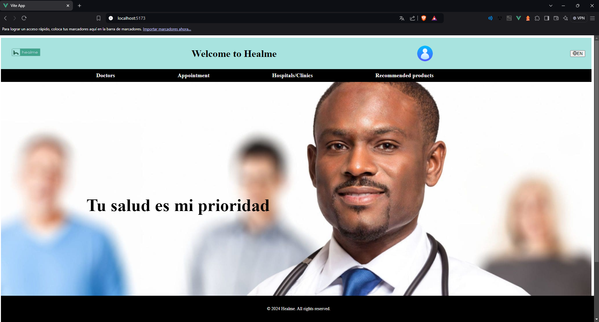

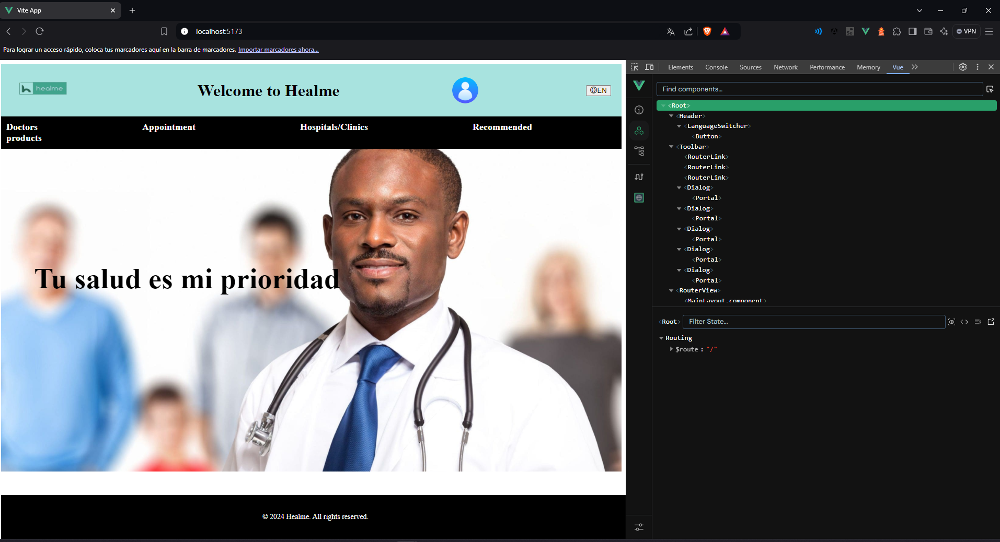


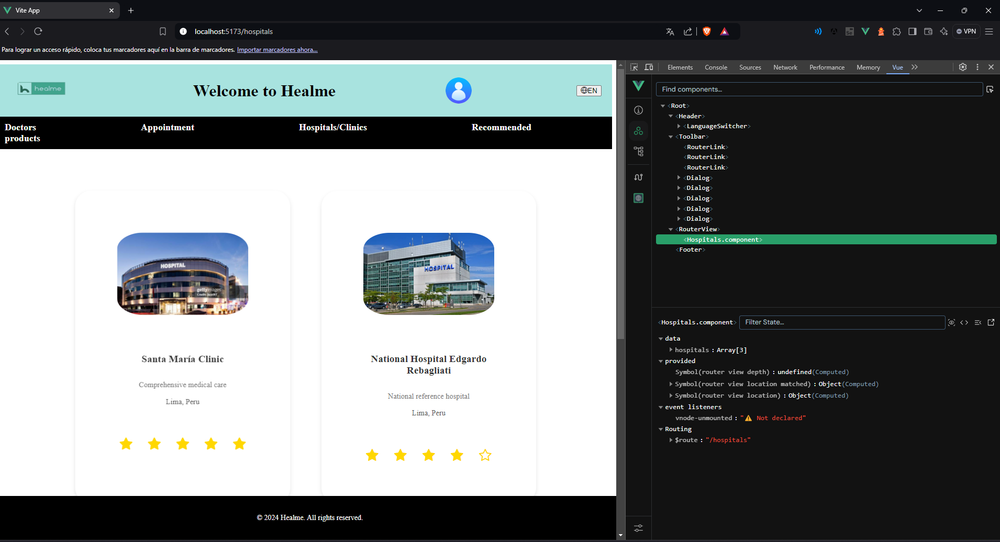

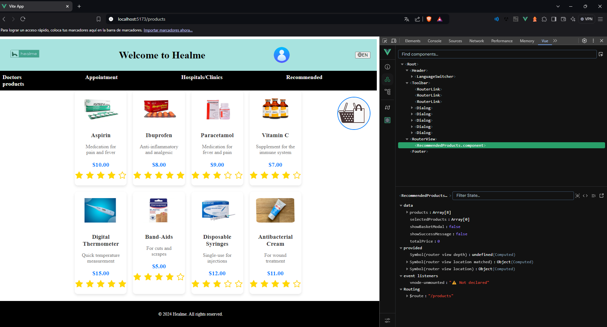

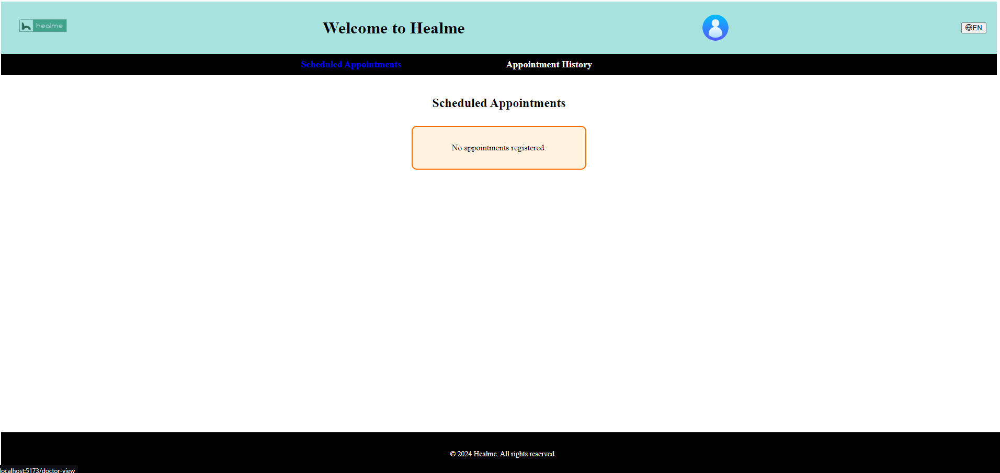

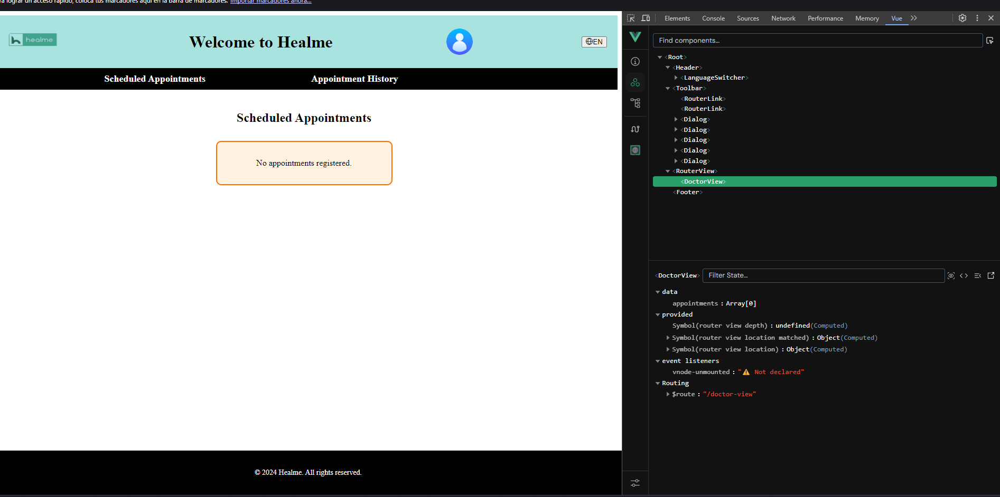

### 5.2.2.6. Services Documentation Evidence for Sprint Review. 
## Servicios Documentación Evidencia para la Revisión del Sprint

### Introducción
Durante este Sprint, hemos logrado documentar los servicios web relacionados con la plataforma "HEALME". La documentación incluye los endpoints que pronto se implemetarán, describiendo las acciones soportadas, verbos HTTP, parámetros, y ejemplos de respuestas. Esta sección proporciona una visión general de los endpoints desarrollados y su integración con la plataforma. (estan en proceso)

| **Endpoint**                | **Acción Implementada**                          | **Verbo HTTP** | **Sintaxis de Llamada**                                      | **Parámetros**                                     | **Ejemplo de Response**              | **Explicación del Response**                                                   |
|-----------------------------|--------------------------------------------------|----------------|--------------------------------------------------------------|---------------------------------------------------|--------------------------------------|-------------------------------------------------------------------------------|
| /doctor                     | Ver lista de doctores                           | GET            | `/doctor`                                                    | -                                                 | `{ "doctors": [ ... ] }`             | Lista de doctores disponibles con detalles básicos.                           |
| /hospitals                  | Visualizar hospitales o clínicas disponibles    | GET            | `/hospitals`                                                 | -                                                 | `{ "hospitals": [ ... ] }`           | Lista de hospitales o clínicas disponibles.                                   |
| /appointments               | Reservar cita médica                            | POST           | `/appointments`                                              | clinic_id (string), date (string), time (string)  | `{ "appointment": { ... } }`         | Confirmación de la reserva de una cita médica.                                |
| /products                   | Ver productos disponibles para la compra        | GET            | `/products`                                                  | -                                                 | `{ "products": [ ... ] }`            | Lista de productos disponibles para la compra.                                |
| /appointments/{id}          | Ver confirmación de la reserva de cita          | GET            | `/appointments/{id}`                                         | id (string)                                      | `{ "appointment": { ... } }`         | Detalles de la cita médica confirmada.                                        |
| /doctor-view                | Ver vista del doctor                            | GET            | `/doctor-view?clinic_id={clinic_id}&current_location={current_location}` | clinic_id (string), current_location (string)   | `{ "directions": [ ... ] }`          | Instrucciones de navegación desde la ubicación actual hasta la clínica.       |
| /doctor-view/history        | Ver historial de citas de sus pacientes         | GET            | `/doctor-view/history`                                       | -                                                 | `{ "history": [ ... ] }`             | Historial de citas de los pacientes del doctor.                               |
| /doctor-view/appointments   | Ver las citas programadas por sus pacientes     | GET            | `/doctor-view/appointments`                                  | -                                                 | `{ "appointments": [ ... ] }`        | Lista de citas programadas por los pacientes del doctor.                      |

Commits of the team :

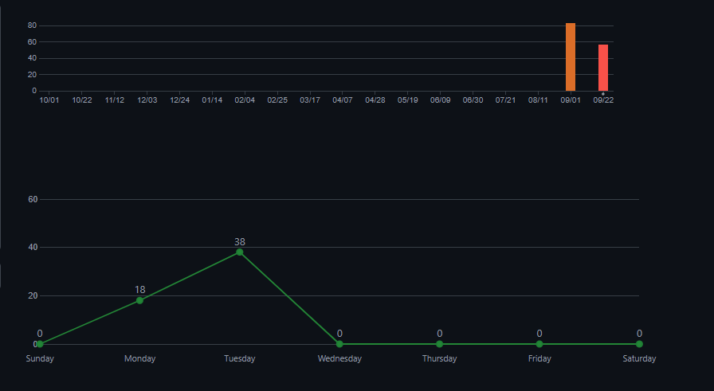

## 5.2.3. Sprint 3 

## 5.2.3.1. Spring Planning 3. 

| Sprint 3                           |                                     |
|------------------------------------|-------------------------------------|
| **Sprint Planning Background**     |                                     |
| Date                               | 20/10/2024                                     |
| Time                               | 9:31 am                                     |
| Location                           | Reunión Virtual en Discord                                    |
| Prepared By                        | Rodrigo Alcántara                                     |
| Attendees (to planning meeting)    | Diego Alonso, Luis Cisneros                                      |
| Sprint n - 3 Review Summary        | Se logró corregir la documentación en base a la retroalimentación que brindo el profesor en la entrega del trabajo parcial                                     |
| Sprint n - 3 Retrospective Summary | Se logró cumplir con el objetivo del Sprint 3.                                      |
| **Sprint Goal & User Stories**     |                                     |
| Spring 3 Goal                      | Corregir la documentacion del proyecto y terminar la primera version del backend de la plataforma HealMe                                    |
| Sprint 3 Velocity                  |  Estimamos para este Sprint tener 5 Story Points                                    |
| Sum of Story Points                |  Cumplimos con la cantidad de 13 Story Points                                   |


5.2.3.2. Sprint Backlog 3. 

| **User Story ID** | **Título**                        | **Work-Item/Task ID** | **Título**                                 | **Descripción**                                                                                                                  | **Estimación (Horas)** | **Asignado a**        | **Estado** |
|-------------------|-----------------------------------|-----------------------|--------------------------------------------|----------------------------------------------------------------------------------------------------------------------------------|------------------------|-----------------------|------------|
| TS-01             | Agregar nuevos productos          | TSK-001               | Crear funcionalidad de agregar productos   | Implementar la funcionalidad para añadir nuevos productos a la base de datos, manteniendo el catálogo actualizado.              | 4                      | Diego Alonso          | Done       |
| TS-01             | Agregar nuevos productos          | TSK-002               | Crear interfaz de usuario para productos   | Diseñar la interfaz para que los usuarios puedan agregar productos de forma intuitiva y fácil.                                  | 3                      | Diego Alonso          | Pending    |
| TS-01             | Agregar nuevos productos          | TSK-003               | Pruebas de funcionalidad de productos      | Realizar pruebas para asegurar que la funcionalidad de agregar productos funcione correctamente.                                | 2                      | Diego Alonso          | Pending    |
| TS-02             | Editar productos                  | TSK-004               | Integrar edición de productos              | Desarrollar la funcionalidad que permite editar los detalles de productos existentes, como precios o descripciones.             | 5                      | Rodrigo Alcantara     | Pending    |
| TS-02             | Editar productos                  | TSK-005               | Pruebas de edición de productos            | Realizar pruebas para confirmar que los cambios en la edición de productos se actualizan en la base de datos.                    | 3                      | Rodrigo Alcantara     | Pending    |
| TS-03             | Eliminar productos                | TSK-006               | Implementar eliminación de productos       | Implementar la funcionalidad para eliminar productos no disponibles en la plataforma, manteniendo el catálogo limpio y preciso. | 4                      | Diego Alonso          | Done       |
| TS-03             | Eliminar productos                | TSK-007               | Pruebas de eliminación de productos        | Asegurarse de que los productos eliminados no sean visibles para los usuarios y se reflejen en la base de datos.                 | 2                      | Diego Alonso          | Done       |
| TS-04             | Agregar nuevos doctores           | TSK-008               | Implementar funcionalidad de agregar doctores | Desarrollar la funcionalidad para agregar nuevos doctores a la base de datos, asegurando una lista de profesionales actualizada. | 4                      | Diego Alonso          | Done       |
| TS-04             | Agregar nuevos doctores           | TSK-009               | Crear interfaz de usuario para doctores    | Diseñar la interfaz para la administración de doctores, permitiendo agregar y visualizar información de doctores fácilmente.    | 3                      | Diego Alonso          | Done       |
| TS-04             | Agregar nuevos doctores           | TSK-010               | Pruebas de funcionalidad para doctores     | Realizar pruebas para asegurar que la adición de doctores funcione como se espera.                                               | 2                      | Diego Alonso          | Done       |
| TS-05             | Editar doctores                   | TSK-011               | Crear funcionalidad de edición de doctores | Desarrollar la funcionalidad que permite editar la información de los doctores existentes, corrigiendo errores o actualizando datos. | 5                      | Diego Alonso          | Pending    |
| TS-05             | Editar doctores                   | TSK-012               | Pruebas de edición de doctores             | Realizar pruebas para confirmar que los cambios en la edición de doctores se actualizan en la base de datos.                      | 3                      | Diego Alonso          | Pending    |
| TS-06             | Eliminar doctores                 | TSK-013               | Eliminar doctores de la base de datos      | Implementar la funcionalidad para eliminar doctores no disponibles, manteniendo la base de datos limpia y precisa.             | 5                      | Rodrigo Alcantara     | Done       |
| TS-06             | Eliminar doctores                 | TSK-014               | Pruebas de eliminación de doctores         | Asegurarse de que los doctores eliminados no sean visibles y se reflejen correctamente en la base de datos.                     | 2                      | Rodrigo Alcantara     | Done       |
| TS-07             | Agregar centros médicos           | TSK-015               | Crear funcionalidad de agregar centros médicos | Implementar la funcionalidad para añadir nuevos centros médicos a la base de datos, manteniendo una lista actualizada de centros. | 4                      | Luis Cisneros         | Done       |
| TS-07             | Agregar centros médicos           | TSK-016               | Crear interfaz para centros médicos        | Diseñar una interfaz de usuario que permita la gestión de centros médicos fácilmente.                                            | 3                      | Luis Cisneros         | Pending    |
| TS-07             | Agregar centros médicos           | TSK-017               | Pruebas de funcionalidad para centros médicos | Asegurarse de que los centros médicos añadidos se visualicen correctamente en la plataforma.                                    | 2                      | Luis Cisneros         | Pending    |
| TS-08             | Editar centros médicos            | TSK-018               | Editar centros médicos existentes          | Desarrollar la funcionalidad que permite editar detalles de centros médicos ya existentes, asegurando la precisión de la información. | 5                      | Luis Cisneros         | Pending    |
| TS-08             | Editar centros médicos            | TSK-019               | Pruebas de edición de centros médicos      | Confirmar que los cambios en los centros médicos se actualizan correctamente en la base de datos.                               | 3                      | Luis Cisneros         | Pending    |
| TS-09             | Eliminar centros médicos          | TSK-020               | Eliminar centros médicos del sistema       | Implementar la funcionalidad para eliminar centros médicos no disponibles, manteniendo la base de datos actualizada y precisa.  | 4                      | Rodrigo Alcantara     | Done       |
| TS-09             | Eliminar centros médicos          | TSK-021               | Pruebas de eliminación de centros médicos  | Confirmar que los centros médicos eliminados ya no son visibles y se reflejan en la base de datos.                              | 2                      | Rodrigo Alcantara     | Done       |


A continuacion se adjunta el link del trello y una imagen del mismo: https://trello.com/invite/b/66da07a121d7f4b87735bab5/ATTI845eebf98df3653b23b258ecacab5db972EB4070/sprint-healme

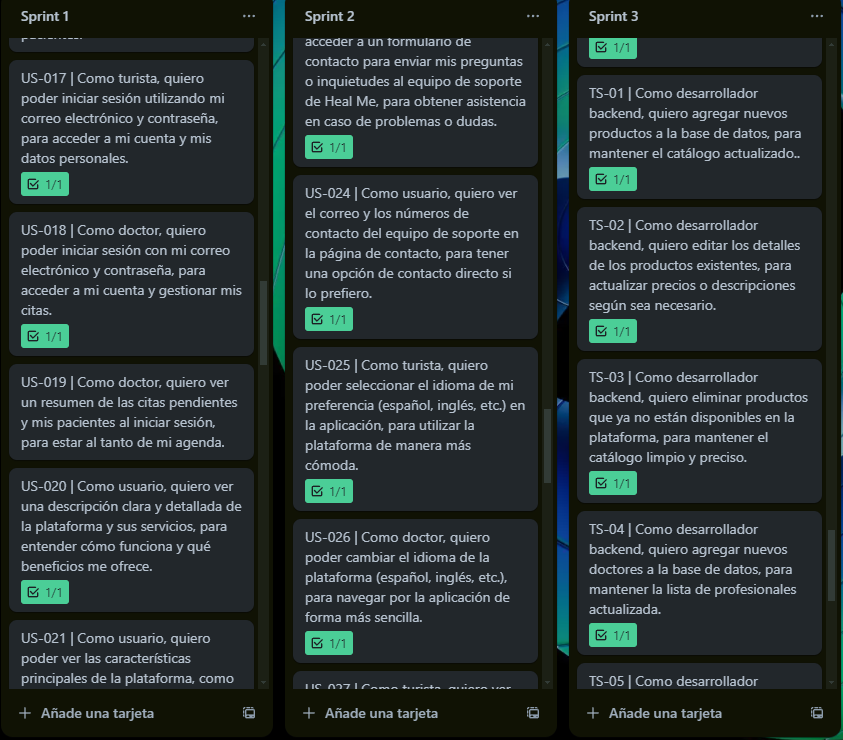

## 5.2.3.3. Development Evidence for Sprint Review. 

En este Sprint, hemos logrado presentar el primer avance del backend de la plataforma Heal-Me, hemos cumplido con algunos user stories pues es el primer avance, respetando las peticiones de los usuarios.


| **Repository**   | **Branch**   | **Commit ID** | **Commit Message**             | **Commit Message Body**                                                       | **Committed on (Date)** |
|------------------|--------------|---------------|--------------------------------|--------------------------------------------------------------------------------|-------------------------|
|  Heal-Me-Backend  |  master  |  1e0b6c2   | initial comm   |  initial commit      |    30/10/2024           |
|  Heal-Me-Backend  |  master  |  24ccfe4   |    add launch settings             |  add launch settings          |     30/10/2024          |
|  Heal-Me-Backend  |  master  |  29dcc15   |     add command and query services          |  add command and query services           |     30/10/2024          |
|  Heal-Me-Backend  |  master  |  5cd93dd   |      add feature Products Domain          |   add feature Products Domain          |     30/10/2024          |
|  Heal-Me-Backend  |  master  |  6094820   |    add Products Bounded context            |   add Products Bounded context         |      30/10/2024         |
|  Heal-Me-Backend  |  master  |  870bc70   |     add Doctors Bounded context           |    add Doctors Bounded context        |       30/10/2024        |
|  Heal-Me-Backend  |  master  |  754312c   |      add shared          |    add shared        |      30/10/2024         |
|  Heal-Me-Backend  |  master  |  7243ee2   |     add Hospitals bounded context           |     add Hospitals bounded context       |     30/10/2024          |


## 5.2.3.4. Testing Suite Evidence for Sprint Review. 

Se realizó un deploy en azure del siguiente repositorio: 

| **Repository**   | **Branch**   | **Commit ID** | **Commit Message**             | **Commit Message Body**                                                       | **Committed on (Date)** |
|------------------|--------------|---------------|--------------------------------|--------------------------------------------------------------------------------|-------------------------|
|  Heal-Me-Backend  |  master  |  1e0b6c2   | initial comm   |  initial commit      |    30/10/2024           |

Link del repositorio del frontend: https://github.com/HealMe-Team/HealMe-Frontend

Link del repositorio del backend: https://github.com/HealMe-Team/Heal-Me-Backend

[Accede al web app desplegado](https://heal-me-app.netlify.app/) 

Explicacion Bounded Context:

### Doctores
Este contexto se encarga de la gestión de los doctores. Incluye las siguientes responsabilidades:  
Repositorios: IDoctorRepository, DoctorRepository
Servicios de Aplicación: IDoctorCommandService, DoctorCommandService, IDoctorQueryService, DoctorQueryService

### Hospitales
Este contexto se encarga de la gestión de los hospitales. Incluye las siguientes responsabilidades:  
Repositorios: IHospitalRepository, HospitalRepository
Servicios de Aplicación: IHospitalCommandService, HospitalCommandService, IHospitalQueryService, HospitalQueryService

### Productos
Este contexto se encarga de la gestión de los productos. Incluye las siguientes responsabilidades:  
Repositorios: IProductRepository, ProductRepository
Servicios de Aplicación: IProductCommandService, ProductCommandService, IProductQueryService, ProductQueryService

### Shared
Este contexto incluye componentes y servicios que son compartidos entre los diferentes bounded contexts. Incluye las siguientes responsabilidades:  
Repositorios: IUnitOfWork, UnitOfWork
Configuración de Persistencia: AppDbContext


## 5.2.3.5. Execution Evidence for Sprint Review. 

En resumen se ha implementado todas las historias de usuario de la app web.

App web evidence:

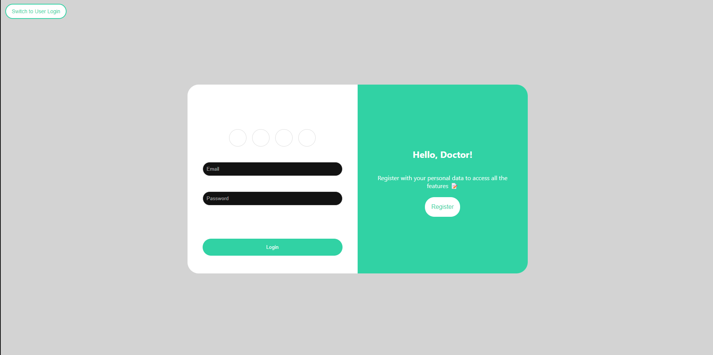

Backend evidence:

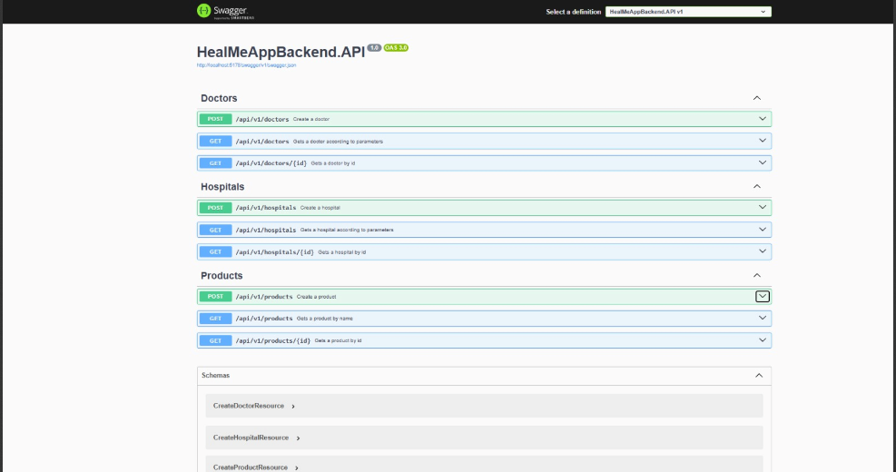

## 5.2.3.6. Services Documentation Evidence for Sprint Review. 

| Endpoint | Acciones Soportadas |
| --- | --- |
| `/api/v1/doctors` | **POST**<br>Registro de un doctor |
| `/api/v1/doctors` | **GET**<br>Obtiene doctores |
| `/api/v1/doctors/{id}` | **GET**<br>Obtiene doctores por la id |
| `/api/v1/hospitals` | **POST**<br>Registro de un hospital |
| `/api/v1/hopitals` | **GET**<br>Obtiene los hospitales |
| `/api/v1/hospitals/{id}` | **GET**<br>Obtiene los hospitales por la id |
| `/api/v1/products` | **POST**<br>Registro de un producto |
| `/api/v1/products` | **GET**<br>Obtiene los productos |
| `/api/v1/products/{id}` | **GET**<br>Obtiene productos por la id |


## 5.2.3.7. Software Deployment Evidence for Sprint Review. 

Aqui se deja evidencia de la App service creada en azure:

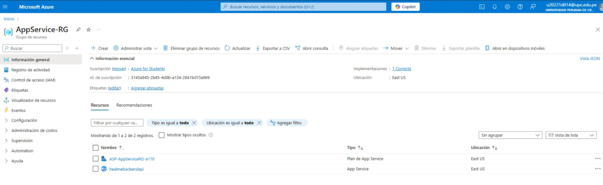

A continuacion se adjunta evidencia del deploy del backend

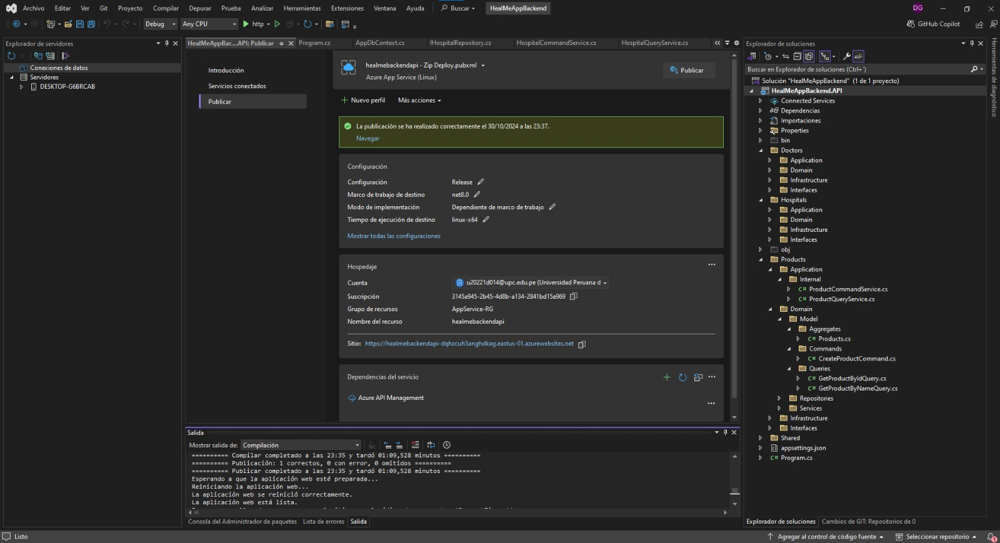

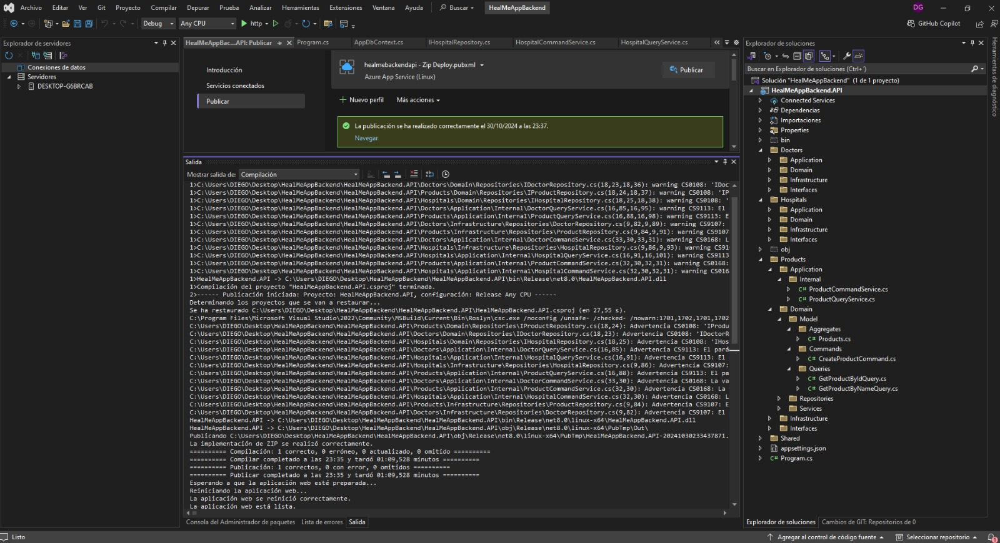


## 5.2.3.8. Team Collaboration Insights during Sprint. 

Se adjunta evidencia del trabajo en equipo:

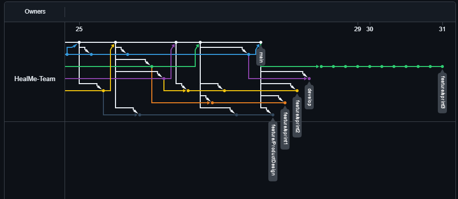

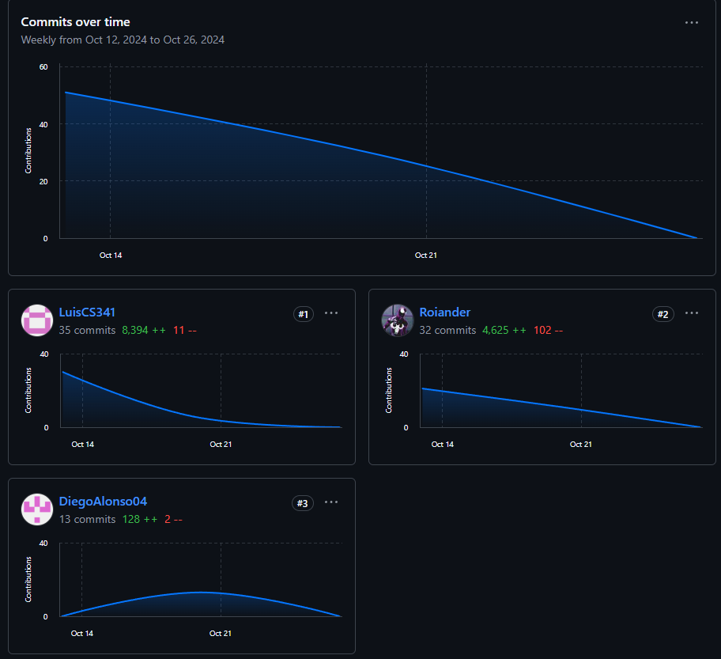

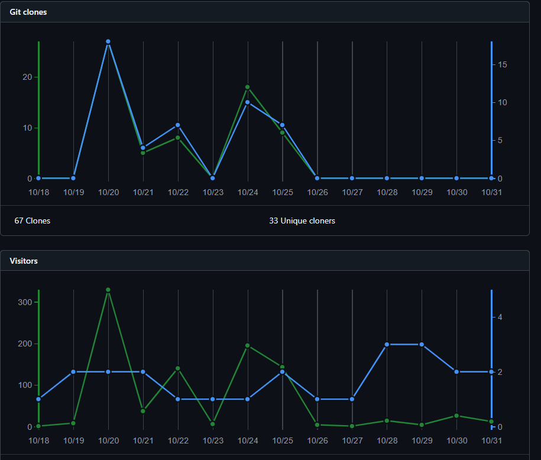

## 5.3. Validation Interviews. 

## 5.3.1. Diseño de Entrevistas. 

¿Cuál es su nombre?

¿Dónde trabaja?

Preguntas del landing page:

¿Qué impresión general tienes de la Landing page de HealMe?

¿La información presentada en la Landing page te parece clara y fácil de entender? ¿Por qué?

¿Qué elementos cambiarías o mejorarías en la Landing page para mejorar tu experiencia de usuario? 

Preguntas de la aplicación web:

¿Cómo describirías tu experiencia en la aplicación web de HealMe?

¿Cómo calificarías la facilidad de uso de las herramientas en la aplicación web?

¿Qué funcionalidades adicionales te gustaría ver en la aplicación web de HealMe?

¿Tuviste algún problema o dificultad al usar la aplicación web? 

Preguntas sobre el proyecto:

¿Crees que HealMe cumple con su misión de proporcionar una plataforma completa para los turistas y doctores ?

¿Recomendarías HealMe a otros usuarios? ¿Por qué?


## 5.3.2. Registro de Entrevistas. 

## Entrevista a Doctor (a):

### Entrevista 1
Link: https://drive.google.com/file/d/1WKmSLa5Jlf0HkavBslUTaQoFbZgSIY-S/view?usp=sharing

Edad: 46

Nombre: Angelica Cruz

Análisis: Angelica Cruz, usuaria de HealMe, describe la landing page como intuitiva y clara, resaltando que comunica eficazmente la misión de la plataforma. Sugiere mejorar la interfaz de contacto e incluir un video explicativo para que los usuarios comprendan mejor el funcionamiento de la aplicación. En cuanto a la aplicación web, la califica con un 10/10 en facilidad de uso, destacando que le proporciona información esencial para atender a los pacientes. Como sugerencia, propone incorporar un historial de citas médicas para mejorar el seguimiento de tratamientos. Angelica considera que HealMe cumple con su misión de apoyar a turistas y doctores, y recomienda la aplicación, valorando su utilidad en situaciones de emergencia al viajar. Integrar sus recomendaciones podría fortalecer la experiencia del usuario y aumentar la fidelización y recomendaciones de la plataforma.

### Entrevista 2
Link: https://drive.google.com/file/d/1LjqCkwkZV88SleWFIQ-bUfl0Kp68v1lb/view?usp=sharing

Edad:48

Nombre Elmer Alcántara

Análisis: Elmer Alcántara, médico en la clínica Good Hope, valora la plataforma HealMe como elegante, clara y fácil de usar. Le gusta la visualización de reseñas y la facilidad para consultar citas, sugiriendo añadir un tutorial en video y un historial de citas para mejorar la experiencia. Considera que HealMe cumple su misión al ayudar a turistas y médicos a encontrar centros de salud, recomendándola por su utilidad y capacidad para brindar seguridad en situaciones de emergencia en lugares desconocidos.

## Entrevista a Usuario/paciente:

### Entrevista 1
Link: https://drive.google.com/file/d/1e8j_USHRYrOsBKdnVl0BCUEO_Q8GcQvE/view?usp=sharing

Edad:21

Nombre:Luis Arce

Análisis:Luis Arce , usuario de Healme,describe la landing page de HealMe como profesional y acogedora, resaltando que comunica efectivamente la prioridad de la salud del usuario. Sin embargo, sugiere mejorar el contraste del menú para facilitar la lectura y añadir una breve introducción o sección "Sobre Nosotros" para dar mayor contexto a nuevos usuarios. Sobre la aplicación web, Luis destaca su facilidad de uso y navegación intuitiva, especialmente útil para quienes buscan servicios médicos. Recomienda añadir una barra de búsqueda y filtros adicionales, así como funciones que optimicen la experiencia del usuario, como búsqueda por ubicación y especialidad, un sistema de calificaciones y una opción de chat para consultas rápidas o agendar citas. Finalmente, Luis considera que HealMe cumple con su misión de ser una plataforma útil para turistas y doctores, aunque sugiere que incluir detalles específicos para turistas podría fortalecer su valor. La incorporación de sus sugerencias podría mejorar la experiencia del usuario y aumentar la recomendación de la plataforma.

### Entrevista 2

Link: https://drive.google.com/file/d/1wA6F8umtCrqM0oSn0abACmKLS0gARIfV/view?usp=sharing

Edad:22

Nombre:Vasco Martínez

Análisis:Vasco Martínez,usuario de Healme, describe la landing page de HealMe como profesional y acogedora, señalando que transmite eficazmente la importancia de la salud para el usuario. No obstante, sugiere mejorar el contraste del menú para facilitar la visibilidad y agregar una breve introducción o una sección "Sobre Nosotros" que ofrezca más contexto a los nuevos usuarios. En cuanto a la aplicación web, Vasco destaca su facilidad de uso y navegación intuitiva, lo cual es especialmente útil para quienes buscan servicios médicos. Propone agregar una barra de búsqueda y filtros adicionales, junto con funciones que optimicen la experiencia del usuario, como opciones de búsqueda por ubicación y especialidad, un sistema de calificaciones y una opción de chat para consultas rápidas o agendar citas. Finalmente, Vasco considera que HealMe cumple su misión como plataforma para turistas y profesionales de la salud, aunque sugiere que añadir detalles específicos para turistas podría fortalecer su propuesta de valor. Incorporar sus recomendaciones podría mejorar la experiencia del usuario y hacer la plataforma más recomendable.

## 5.3.3. Evaluaciones según heurísticas. 


## 5.4. Video About-the-Product. 

Se adjunta video del producto: https://upcedupe-my.sharepoint.com/:v:/g/personal/u202216698_upc_edu_pe/Eb8E4rXyn9pLgSTmhNRGgIIBH1O7-FBtXnAcyUUhGr2bcg?nav=eyJyZWZlcnJhbEluZm8iOnsicmVmZXJyYWxBcHAiOiJPbmVEcml2ZUZvckJ1c2luZXNzIiwicmVmZXJyYWxBcHBQbGF0Zm9ybSI6IldlYiIsInJlZmVycmFsTW9kZSI6InZpZXciLCJyZWZlcnJhbFZpZXciOiJNeUZpbGVzTGlua0NvcHkifX0&e=kjTaho


### Conclusiones 
- Hemos llegado a la conslusion de que la elaboracion del proyecto de la aplicacion HealMe es fundamental para casi todo el mundo, pues estamos brindando informacion medica de calidad a extranjeros y locales para que no tengan dificultades al solicitar atencion medica por un viaje, etc.
- El trabajo en equipo es fundamental para la culminacion del trabajo , fomentando un buen ambiente para todos los integrantes.
- La implementacion de tecnologías usando la navegacion a internet para poder completar el trabajo es fundamental ya que debemos acostumbrarnos a mantener un aprendizaje continuo para poder alcanzar mejores metas como profesionales.
- Se llego a la conclusion que la medicina peruana y la programacion pueden trabajar en equipo para poder alcanzar una cantidad mayor de usuarios siende beneficiosa para ambos sectores.
- La implementacion del backend es fundamental para el desarrollo de aplicaciones web, ya que conecta una base de datos ya existente o recien creada con el frontend de la aplicacion, haciendo que la experiencia del usuario sea buena.
- La documentacion de lenguajes y foros son fundamentales ya que poseen información la cual puede servir para la investigacion de una solucion ante un problema de programación

Video About-the-Team

Link: https://upcedupe-my.sharepoint.com/:v:/g/personal/u202216698_upc_edu_pe/EeE18Zc4xKFOnvtXWj5DXU4BjCHQOPyA2D9sDucEq4rbww?nav=eyJyZWZlcnJhbEluZm8iOnsicmVmZXJyYWxBcHAiOiJPbmVEcml2ZUZvckJ1c2luZXNzIiwicmVmZXJyYWxBcHBQbGF0Zm9ybSI6IldlYiIsInJlZmVycmFsTW9kZSI6InZpZXciLCJyZWZlcnJhbFZpZXciOiJNeUZpbGVzTGlua0NvcHkifX0&e=ERRnMD

### Referencias bibliograficas

Vue.js. (s. f.). https://vuejs.org/guide/introduction.html

PrimeVue | Vue UI Component Library. (s. f.). https://primevue.org/introduction/

Stack Overflow - where developers learn, share, & build careers. (s. f.). Stack Overflow. https://stackoverflow.com/

BillWagner. (s. f.). C# docs - get started, tutorials, reference. Microsoft Learn. https://learn.microsoft.com/en-us/dotnet/csharp/tour-of-csharp/

SyntaxC. (s. f.). Azure App Service documentation - Azure App Service. Microsoft Learn. https://learn.microsoft.com/en-us/azure/app-service/


